[TOC]
# Data Modeling

## Basic items
- prime attribute,   
- non-primary attribute  
- multivalued attribute  
- composite attribute  
- derived attribute  

## Requirement session: 
### Documents
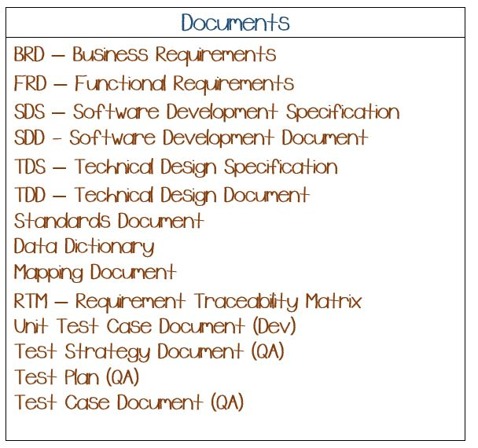 
1. JDR (Joint Requirement Definition)  
- Output: Business Required Document ( BRD )  
	Also some organizations call the same as "Scope Statement Specification"
- Who:Users, tech, managers, tech ceads, Sr.developers, BA, DA, PM.
- Users 
	- Internal(80%)  
	who making business (not tech) decision: Internal employees, team
	>e.g. Reporting Appliation for hospital  
	-Floor performance(head, manager)      
	-provider(doctor,nurse, how offer services)  
	-patient feedback  
	-appointment scheduling  
	-ER availability  
	- External  
	public ursers (out of orgnization)
	>e.g.  
	Patient portal  
	-Schedule appointment  
	-visit summary  
	-payments  
	Website: best buy
- Time: depend on scope of application
	- Small (2 weeks -- 2 months)
	- Huge (1 week -- 6 months)
- share by share point(SP), Team Foundation Server(TFS), Git
2. Joint Application Design (JAD) 
- Output: Function Requirement Document (FRD), also some organizations call the same as   
		1 SDS - Software Development Specification  
		2 TDD - Technical Design Document  
		3 TDS - Technical Design Specification  
3. Alternative Methods:
- Face to Face interviews
- Anonymous Questionnaires 
- Feedback Surveys or Equivalent
- Stakeholder Analysis  
Find all those involved
- Business Analysis Plan  
Budget, strategy
- Current State Analysis(same as BRD)
- Scope Statement Specification

### Why documents?
- Track changes
- Share information among all persons
- Finalize and find agreement on requirements
- Prevent changes or legal issues

### Variables to Monitor (How to choice methods):
- Requirements
- Schedule/Time of Year
- Budget
- Size of Project
- Size of Team

	
#### Research Questions:
1. What is your style of gathering requirements?
2. How do you prepare 
3. What is GAP analysis

#### Documents:
- FRD,SDS, SDD, TDS, TDD  
	- Naning conventions
	- Steps for deployment
	- Permission on a folder/DB/Server
- Data Dictionary
	- Information about database
	- Tables
	- Columns
	- Datatype
	- Sample
	- Application(Optional)
- Mapping Document
	1. ETL Process(Load data in separate DB into one large total DB)
	2. Upgrade DB Version (EX. ss2012--\>SS2017)
	3. Migrate From different DB System (EX.oracle--\>SS)
- QA Docs
- RTM (Requirement Traceability Matrix) : Map a requirement to a test case
- Unit test case document(Dev): **for developer** ETL package testing carried out on a particular unit of development such as procedure, function, report, ssis package
	Pre-requisites  
	1. Report is deployed correctly  
	2. Browser is available with required URL and permissions to run  
>EX

|-----|-----|--------------|------ ------|------|--------|  
|Case#|Steps|ExpectedResult|Actual Result|Status|Priority|  
|	1|1.Open report; 2.Click on drop down for report Month|User sees all 12 months with full names|Month Numbers|Failed|2|
- Test Strategy Document(QA): **for QA team** similar to FRD(Functional Requirements)
- Test Plan(QA): **for QA team** Plan for whole application testing
- Test Case Document(QA): **for QA team** More detailed and involved lot more scenarios + Case are for complete software/application

## Methodologies:
Methodologies: Step by step process to execute an application
- Waterfall  
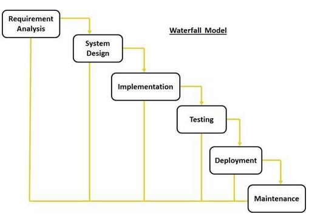 
	- Gather complete REQ (not flexible, time sensitive, Not visibility, cannot add new requirement later)
	- Steps: 
		1. RequirmentAnalysis
		2. SystemDesign
		3. Implementation
		4. Testing
		5. Deployment
		6. Maintenance
- Agile (Parallel)  
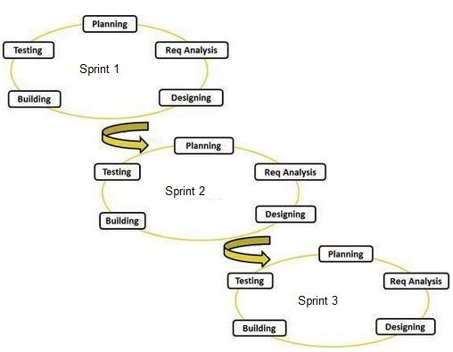   
	Not a specific method. It's a principle , guide lines, or rules
	1. Work is divided into **sprints**
		short -small ,portion of work developed at a fast pace ( < 4 weeks)
	2. Instead of documentation agile uses user **stories** (separate stories not the whole requirements)
	3. Each sprint provides **usable** delivery which improves **visibility** to users
	4. Because of earlier visibility to user, we can incorporate user **feedback**
- Scrum(one kind of Agile)
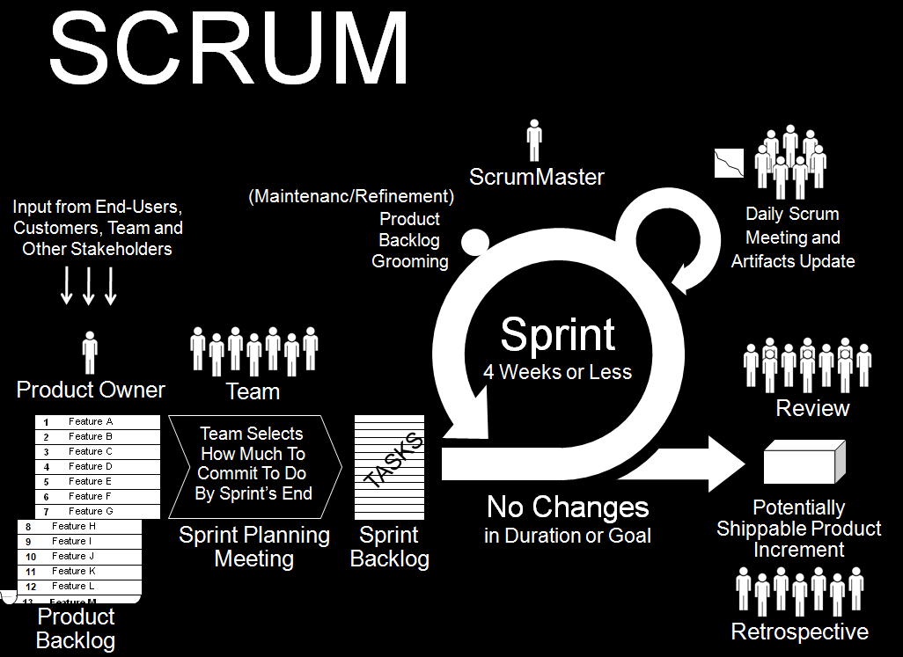 
	- Meetings:
		1. Sprint plan (Begining of the sprint,prepare and plan the sprint, set sprint goal and sprint backlog)
		2. Daliy scrum (what did you do yesterday? What will you do today? Are there any obstacles? Every day)
		3. Sprint review (users reviews, demo features, updated backlog)
		4. Restrospective (Do not have user, try to solve and avoid wrongs with team number, identify ways of improving, end of sprint)
		5. Product backlog grooming (Clarify product backlog items in preparation for sprint planning, before sprint planning)
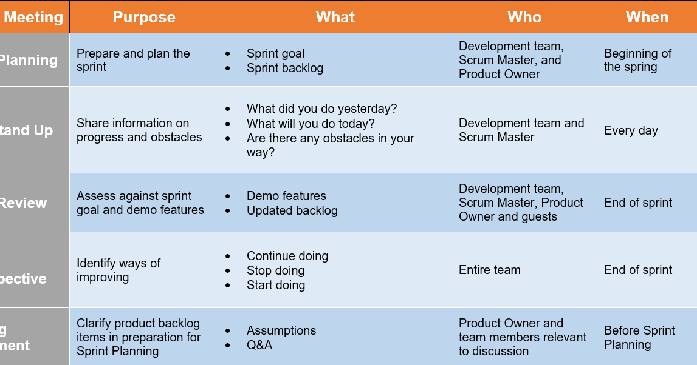 
	- Roles:  
		1. product owner (Part A)  
			- Gather user stories related to the project (product backlog)
			- Story points (How many hours will be cost for each stories, if product owner don't know about tech, scrum master or team make this)
			- Assign priority to the tasks
		2. Scrum master
			1. What did you do yesterday
			2. waht is the plan for today
			3. any road blockes
		3. scrum team
- Spiral  
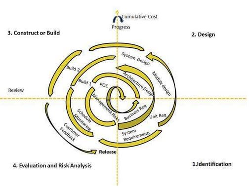 
For every long and complex projects; Waterfall many times  
1. Identification  
	Business requirments, System requirments, unit requirments
2. Design  
	System design, module design, architecture design
3. Construct or Build  
	Build poc
4. Evaluation and Risk Analysis    
	Management risks, schecule monitoring, customer feedback  
	if need to upgrade, go 1  
	if do not proceed, stop,abandon  
	if complete, stop

## Data Modeling Life Cycle
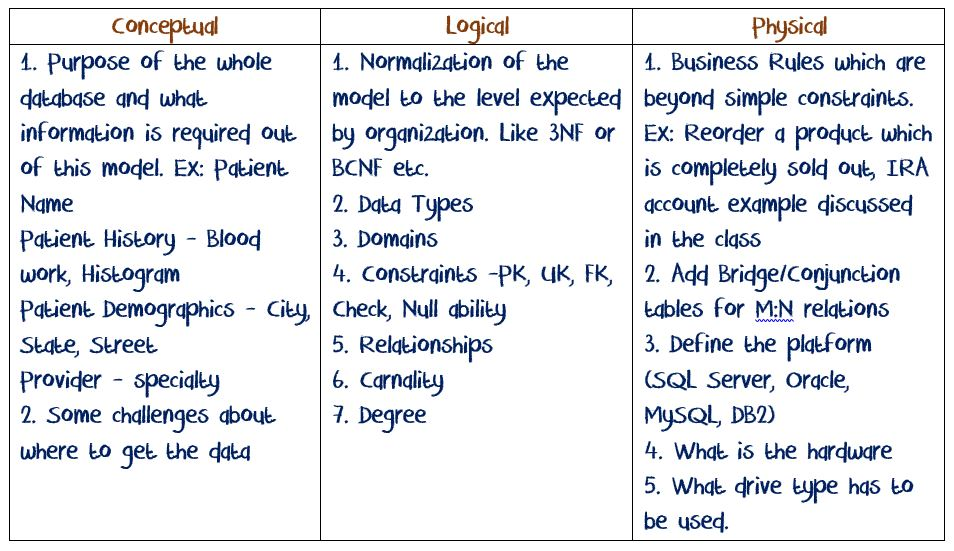 
### Conceptual  
- Task for conceptual phase
	1. Purpose of the whole database
	2. What information is required out of this model
	3. Some challenges about where to get data
Focus on information, not data  
	>EX. Book  
	Businness questions: How many books we sale, who is the fisrt pority  
	Book INFO(Name,price)  
	Author INFO(gender, DOB)  
	How Authors related to books  
	Order details(Date, costom, QTY, price,discount)  
	Author country details
### Logical  
- what to do in logical phase  
	- For total:  
	1. Normalization  
	- For attributes level:    
	1. Data Types,  
	2. Domains  
	3. Constraints (PK, UK, FK, CHECK, NULL ability)  
	- For relationship level:    
	1. Define the relationships  
	2. Cardinality  
	3. Degree
- Others	
	- Tools:ERWIN, ER Studio, Visio
	- Output: Logical model
	- Normalization here
	- Generate SQL scripts(Generally not, and will not use in the real system, maybe use to track change)
	- Relationship between tables  
	EX. 
		M : M
### Physical  
- Things to do in physical phase
	1. Business rules which are beyond simple constraints  
	EX. recorder a product which is completely sold out
	2. Add bridge (conjunction) tables for M:N relations
	3. Define the platform (SQL server, oracle, MySQL, BD2)
	4. What is the hardware
	5. what drive type has to be used
	
## KEYS:
- Primary key:  
	- Unique, and not null  
	- Only one primary key, becuase we want to only use one to identification( eliminate confusion)  

- Candidate Key  
	- unique and not null, can be primary key but not. Candidate > Primary key
	- when PK is decided, candidate key disappear and just PK and alternative key
	- primary key + alternate key = Candidate key
- Composite key  
	- combination is unique an not null
	- can be composite primary key or composite foreign key
- Foreign key  
	- can be duplicated
	- possible to be null (depend on business)
	- foreign key can reference to other table(parent table), can be primary key, candidate key, or alternate key, or composite key (unless unique and not null)
- Unique key  
	- must be unique, can have null
- Surrogate key  
	- in dimension tables in DWH, not much use in fact tables
	- unique + not null + Auto generated number
	- in OLAP, surrogate key

## Normalization
- Main goals of Normalization
	1. Avoid Data Anomalies (DELETE, INSERT, UPDATE)
	2. Reduce Data Redundancy
- in logical phase  
- Organizing the data efficiently in a DB to avoid data anomalies and reduce the redundancy  

1. 1NF
	1. Identify **Prime Attribute**
	2. Each attribute should have **atomic** values
	3. **No repeated** columns
	4. Make sure all non prime attributes are directly or indirectly **dependent** on Prime Attribute
2. 2NF
	1. is in the 1NF
	2. Avoid **partial dependency** (reduce the composite key, because if do not have composite key, there will not be partial dependency)
3. 3NF  
	1. is in the 2NF
	2. Avoid **transitive dependency**
4. BCNF
>A relational schema R is in Boyce–Codd normal form if and only if for every one of its dependencies X → Y, at least one of the following conditions hold
>X → Y is a trivial functional dependency (Y ⊆ X),
>X is a super key for schema R.
	>a dependency A → B, A cannot be a non-prime attribute, if B is a prime attribute.
	A 3NF table that does not have multiple overlapping candidate keys is guaranteed to be in BCNF
	Delete the multiple value dependency

5. 4NF
	
Usually organizations normalize DBs upto third normal form, because with 3NF there is a fine balance between READ(SELECT statement) performance and QUALITY of the data. If organizations go beyond 3rd NF, number of tables will be more and READ performance impacts drastically

## Dependency
It defines how a non prime attribute is associated or identified by a Prime Attribute
1. Full 
	- Non prime attribute is dependent on complete prime attribute. 
	- Ex: If CourseID and StudentID are prime attributes then GPA is dependent on both CourseID and StudentID. So GPA is fully dependent on Prime Attributes
2. Partial 
	- A Non Prime Attribute is dependent on portion of the Prime Attributes (Prime Key). 
	- Ex: If CourseID and StudentID are prime attributes and StdentName, SSN, DOB, Gender are dependent on StudentID not on CourseID. CourseName, NumberOfCredits are dependent on CourseID not on StudentID. In this case StdentName, SSN, DOB, Gender, CourseName, NumberOfCredits are partially dependent on Prime Attributes. 
	- If we don't have a composite PK, we don't have partial dependency.
3. Transitive 
	- A non prime attribute (say attribute A) depends on another non prime attribute (say attribute B) and this non prime attribute B is dependent on Prime Attribute, then Attribute A is transitively dependent on Prime Attribute. 
	- Ex: CourseID, CourseName, CourseType, CreditHourse. CreditHours depends on CourseType (online, in class) CourseType depends on CourseID. So CreditHours are transitively dependent on CourseID.

## Relationship
It defines how an entity is associated with itself or other entities  
- 1:1 one to one  
	One record from an entity is associated/related to only one record in the other entity.
	table a: primary key  
	table b: foreign key + unique key  
	EX. Employee and parking lot,
- 1:M one to many  
	 One record from an entity is associated/related to multiple records in the other entity.
	table a: primary key  
	table b: foreign key   
	EX. Customer have multiple order
- M:N many to many  
	Multiple records from an entity are associated/related to multiple records in other entity.
	conjuction/bridge table  
	break to 2 1:M relations  
	Student - Course, Author - Books
		
## Relationship Participation (optionality)
Defines the role of engagement of an entity in a relation. It should be defined from Table A to Table B and Table B to Table A, in both directions. We need to define participation of both entities in the relation.n two tables(entities)
- Two entities  
- both directions
- Match records
1. Fully Participating   
Every record from one entity has an association or matching record on the other Entity.

2. Partial Participating  
Some records from an entity have matching record/s in the other entity
## Cardinality 
Number of times an entity participates in a relation.
- Max Cardinality - Defines Max number of times an entity participates in relation.  
- Min Cardinality - Defines Min number of times an entity participates in relation.  
- Fixed Cardinality - Defines a mandated number of times an entity has to participate in a relation.  

## Strong-week
1. Week Entity  
- If an Entity cannot survive or stand by itself. So it depends on another entity for its survival. There are 2 types of dependency
	1. Key Dependent - In this case Primary Key from parent table is part of Primary Key of the child table, also the PK from Parent table acts a FK.
	2. Existence Dependent - In this case Primary Key from parent table acts as a FK and is NOT NULL, so we cannot have a record in the Child table unless we have a value from Parent table.  
- We talk this relation between a pair of parent and child tables, if this M:N, we break it to two relationship by bridge(conjunction)
		FK+NOT NULL = Exsistence Dependent
2. Weak Relationship (Non Identifying)- A relationship between 2 Strong Entities. 	
	- FK + Null
	- Bi-direction partial participating
3. Strong Relationship (Identifying) -  A relationship between a Strong Entity and Weak Entity.
	- == full participating(child table)
	- only child table can be week entity  
	>EX. table cust: 
		table order: week entity, relationship is strong

## Degrees
Number of entities involved in a relationship  
1. Unary 1: Fk in the same table depend on PK
	EX. Employee - manager
2. Binary 2: M:N many to many, still binary relation although should have bridge table
3. Ternary 3: more than 3 is not good in relation. The best is make binary
4. Quaternary - Four Entity involved in a relation. 

## ER Diagram

- Chen's Notation
	Easy to understand
	- Characteristics 
		1. Mostly for non-technical needs
		2. provide details about relationships
		3. More details at the attribute level
		4. Relationships and participation has to defined using annotations
		5. Other keys other than PK are not defined
		6. Mostly used in early logical phase
	- Usage  
		- Entity - Boxed
		- Attribute - Oval or circle
		- Relationship - Diamond (verb)
		- Tools: Visio
	- Notation
		- Entity – Boxed  
		- Attribute – Oval or Circle  
		- Relationship – Diamond    
		Use descriptive verb phrases  
		- Key Attribute
		- Multivalued Attribute
		- Composite Attribute
		- Derived Attribute
		- Weak Entity
		- Weak/Partial Relationship
	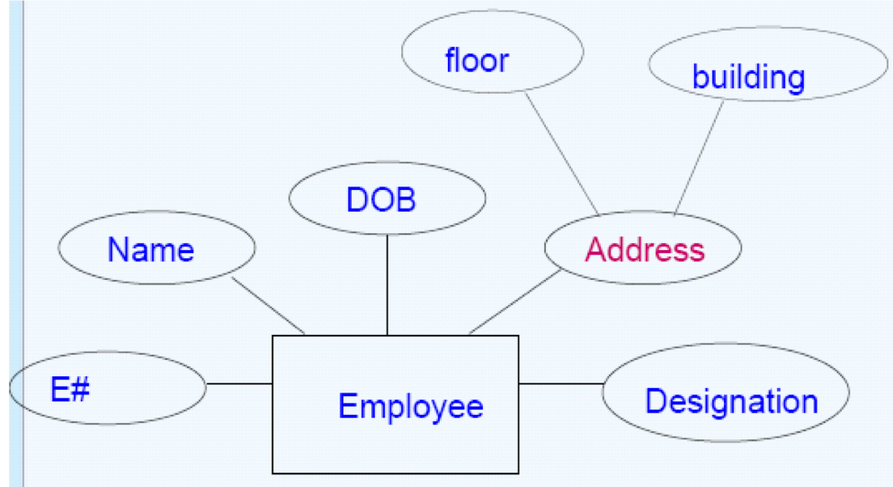
	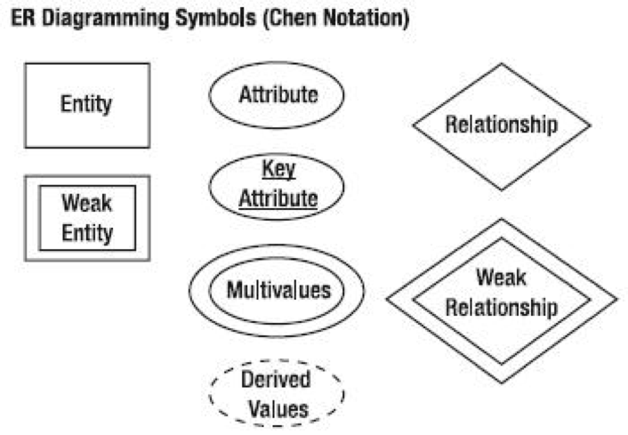 
- Crow's Feet Notation (INFORMATION ENGINEERING MODEL) (IE)  
ER-Diagram focusing more on analytical design for Database or Data Warehouse  
	- Notations
		- Uses crow feet like connecting points between tables
		- Each “foot” that connects one entity to another describes the technical relationship
		- Connection Symbols display Relationships
		- Entity and Attributes in Table like format
	

	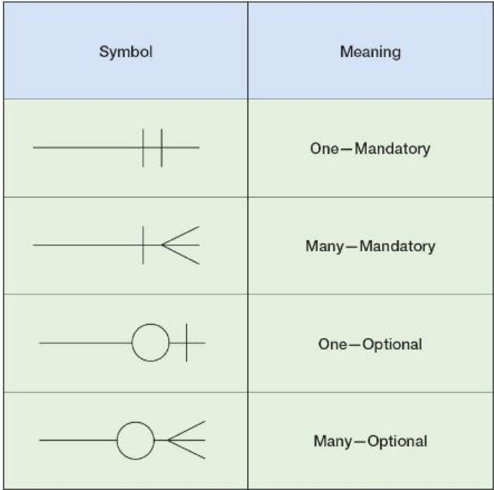
	- Characteristics  
		1. For technical purposes and people
		2. Limited details for attrubutes level (types of attributes)
		3. Relationships and participation does need annotations, but can be understood with the relationship symbols used
		4. All keys can be defined
		5. Mostly used in later logicl phase and physical phase
		Connection Symbols disply relationships
		Entity and Attributes in table like format
		Tools: ERwin
		Relationship:
			one -- Many
			Optional -- Mandatory
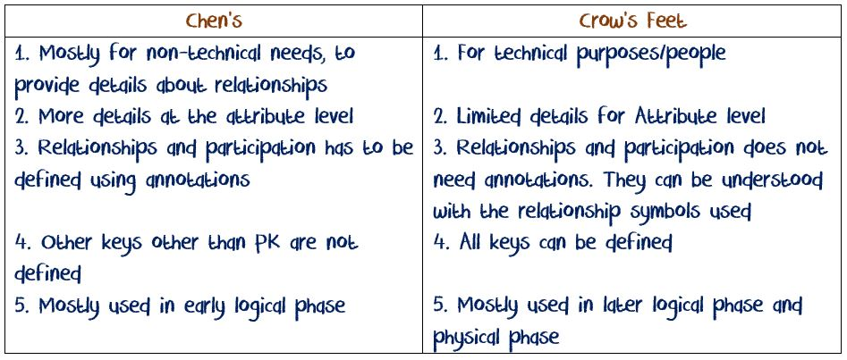 

## Reverse Engineering
It is a process of taking an existing physical database structure into a logical model, to make some structural changes in the model for supporting new business rules, or to support growing business.  
DB --> Logical model --> New DB
Data Migration methods: ETL, SQL Scripts, BCP-BULK-INSERT
- Scenarios for Reverse Engineering  
	1. **Upgrade** If some business established sometime back and were using a database developed. After few years if the business has grown and need to support changing requirements of customers they might need to modify the DB.
	2. **Migrate** If an organization wants to migrate to different platform with changed structure of database but still holding majority of structure same they can go for it.
	3. **Share DB with little change** Some organizations provide services to various other organizations and these services are similar Ex: Bill review, might use same structured databases for all their clients with some changes for each of the clients. In this case they can use reverse engineering concept.

- When to not use Reverse Engineering  
	1. When changes required in existing database are not major or less than 10-15%, reverse engineering is not a good idea.
	2. When changes required are huge around or over 80%

## Data Integrity 
Data integrity is the maintenance of, and the assurance of the accuracy and consistency of, data over its entire life-cycle, and is a critical aspect to the design, implementation and usage of any system which stores, processes, or retrieves data.  
It refers to maintenance of **data quality standards** according to business needs/rules including the rules defined by the domain (industry) or governing authorities.

1. Entity Level 
	- Every record in an entity can be uniquely identified.
	- We can achieve this using PK or UK+Not Null
2. Domain Integrity 
	- It defines what are the values that can be entered into a particular column.
	- We maintain this using Data Type and Check constraint is another option  
	Ex: SSN should be 9 characters and all of them has to be numbers. Same with phone number.
		Validating AGE, for selling smokes or liquor or some counter-top medication.
3. Referential Integrity 
	- It refers to the maintenance or implementation of relationship in which child table inherits values from parent table and values to child table are only allowed if they exist in parent table.
	- We maintain this using PK-FK combination. Same thing can be achieved using Triggers.
4. User Defined Integrity 
	- These are some complex business rules defined within the scope of business.
	- The "INSERT" action is not allowed (the entire row is not available)
	- We maintain this using Procedures, Functions and Triggers.
	- Ex: Re-ordering certain inventory which hits the order limit threshold
	- IRA account example
	- Notifying a team or admin based on certain activity in the database.

### Roles of BA
1. He/She acts like a **liaison (bridge)** between development (technical team) and users.
2. Responsible for **gathering requirements** along with developers. (in some cases all the requirements are gathered by BA)
3. Create **documentation** for developers (such as **mapping** doc) and for users (like **BRD**)
4. Organize **meetings** and in some cases acts like a **SCRUM master**.

### Roles of DA
1. Analyze **source systems** such as flat files, databases, excel files etc.
2. Identify data **anamolies** in data and suggest possible solutions
3. **Standardizing strategies** Ex: If ZIP code from a DB is 9 digits, and from a file it is 5 digits.
4. Develop SQL code or Excel file with required **calculations**.

## Assessment: Hospital Management, Health Insurance leases, Auto Insurance
1. BRD - No more than 2 paragraphs
