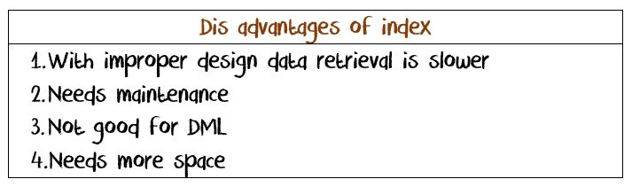
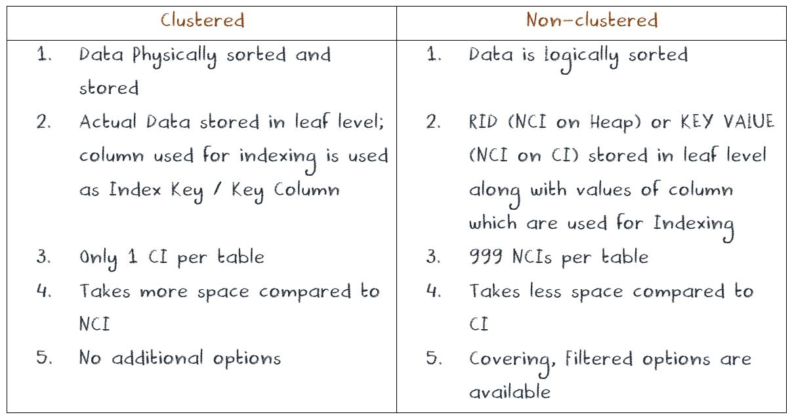
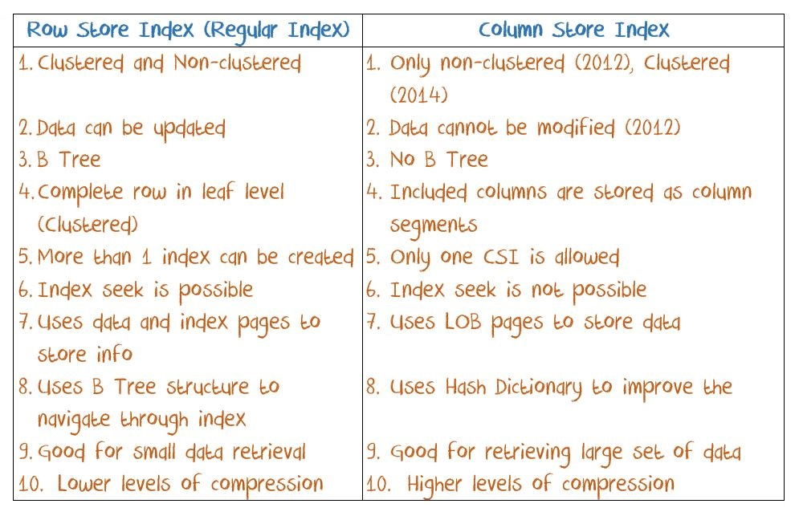
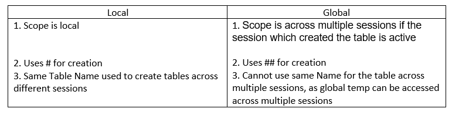
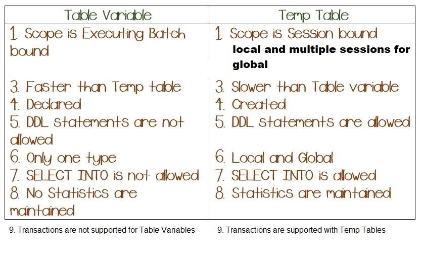
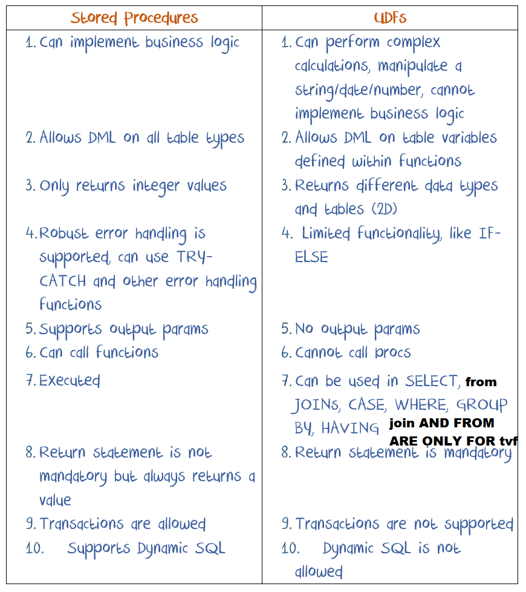

[TOC]
# SQL Server Environment And Concepts

## Why use SQL server?
1. Security
2. Parallel access
3. Back up
4. History
5. Generate reports
6. Encryption
7. Masking

## Tools
- SQL Server Management Studio: Client tool to connect data server, mostly connect to development 

## Machine and Environment
- Machine
	- OS
	- Processor
	- Memory
- Development Environment

## Basic Concepts
- Instance  
It is an installation of SQL Server on a machine (Windows/Linux).
	- 2 Types of Instances are possible 
		1. Default   
		Only 1 Default per machine  
		2. Named   
		Up to 50 instances per machine are possible   
	
- Session  
Session can be defined as an **interaction** of an application with SQL Server for a specific time (usually sessions time out if there is no activity after certain period) to perform an operation. User sessions start from 50 and above, system session will use SPID < 50.

- Authentication
1. Windows   
Use windows user who installed SQL to have access to the server as long as that acount is signed in . Information is passed from Windows system to SQL Server. This is most commonly used type.  
2. SQL Server   
Has to provide Login and Password		    

 - SCHEMA  
- It is a database **object**, which is a **subset of a database**. 
- Schema is like a container which **groups different objects** when they are created using a specific schema name (Ex: HumanResources, Person, Production etc), if a schema name is not used while creating object, object will be created under **default schema which is DBO**. 
- Schema provides more **granular control security** on the DB objects. **Every object needs a schema, object cannot created without a schema**. It provides convenience of more granular security than **at database level**. 
- When a table or other DBO is accessed using schema name and object name it is called 2 part naming convention  
2 Part	-	Schema.Object  
3 Part	-	Database.Schema.Object  
4 Part	-	LinkedServer.Database.Schema.Object  
	```sql
	ALTER TABLE [dbo].[B32_Candidates]
	ALTER COLUMN [Candidate_ID] INT

	ALTER TABLE [dbo].[B32_Candidates]
	ALTER COLUMN [Candidate_ID] INT NOT NULL
	```
- OLTP   
Online Transactional Processing, this DB is Normalized to 3NF or beyond. Purpose of this DB to handle day to day business process. Ex: In banking daily transactions like deposits, withdrawals, transfers etc goes to this DB   
 - OLAP   
Online Analytical Processing, this DB is used for decision and analyzing business needs by consuming large volume of data. Most of the times this DB is de-normalized. Ex: In a store environment analyzing sales over a period of 1 year or 2 years, analyzing complaints about a product etc.	  

- Every Database should have 2 mandatory data file types   
	.MDF - Primary Data File, only operation without data
	.LDF - Log Data File, log the operation, data involved, backup flag
and optionally it can have   
	.NDF - Secondary Data File
create two files:
1. db\_test.MDF 

2. db\_test.LDF
	- log shipping
	- improve only  perations for 
	- helps in back up
	- disastor recorvery

DML, DDL --> db\_test --> .LDF --> .MDF

in delete, each delete will create one .LDF
in truncate, only one or two .LDF (regarding to size)

- Computed column and Derived column
	- These columns are actually in the table and do not have any data in them, instead they compute results based on other columns; Examples: Age, Year Working,  Full Name
	- These are columns that don’t actually exist in the table, and are only formed for the duration of the syntax being performed; Derived columns can be anything, as long as you don’t need to keep the results of the string


## Connecting to different Server Categories
1. Local Server 
This is an instance of server that is installed on a local machine like laptop or desktop.
	- Default Local Instance 
		(local)  
		.   
(dot)  
		localhost  
		MachineName
	- Named Local Instance
		(local)\<Name of the Instance>  
		.\<Name of the Instance>  
		localhost\<Name of the Instance>  
			MachineName\<Name of the Instance>  
2. Remote Server 
This is an instance of server that is installed on a remote machine like a blade server, rack server etc. You would connect to it through network like Internet.
	- IP Address
	- Server Name Alias 

## Types of DBs
1. User Databases   
Created by user  
2. System Databases   
These are created when SQL Server is installed.	  

- Master   
It holds **security** related information and it is very important DB from migration and security perspective. It holds **server level information** such DB users, Server logins, passwords, server level settings. All user defined DBs are authenticated using this DB. It can be considered as heart of SQL Server.
- Model   
It is like a **template**, which is used by SQL server. When user creates a DB SQL server internally creates a copy of Model DB and renames to the name given by user. 
- MSDB   
**Schedules** used by or created for **SQL Job Agent** are **managed** and stored in MSDB. Developers can **store/deploy** their **SSIS** packages in MSDB.   
	SQL Job Agent: It is a tool available in SQL Server to schedule a particular process (job). The job can be executing SQL code/SP, executing a SSIS package, running a batch file, processing a cube etc. A job can be created without schedule for ad-hoc execution. A job can contain multiple steps within it. Information about jobs and schedules are stored in MSDB. When a particular job executed successfully or failed you can see that info in the MSDB catalogs or history of the job.
- TempDB   
It is used by SQL Server to handle/manage **temp objects** such as **Temp Tables, snapshots, cursors** etc.  
- Resource DB   
This is a **hidden** system DB. It holds all **meta data** and **resource management info**.

	
		
## Shortcuts for operation
C+n : open new query  
C+e : run  A+x : run  
F5 : run  
		
## DB objects
- Store data:  
	- TABLE  
	- INDEXES  
- STORE SQL CODE:  
	- VIEW
	- PROCEDURES
	- FUNCTIONS
	- TRIGGERS

# Databse Objects
## Table

## INDEXES

### Pages  
SS data is stroed in from of pages
- Properties
	- one record cannot store across page
	- One page will not save data from different tables
	- Data (for each page, the storage volume is 8kb) How many records can be stored in this page, depends on the size of each records. If a record beyond 1 page(8060 bytes), the table cannot be create ( we can seperate columns to different tables to avoid some of this problem. That's why the maximun limit for CHAR is 8000 CHAR(8000) )

- Heap  
A table without a clustered index.

- Types of pages
	- Data Pages   
	Data is stored in the pages. Used by Clustered Indexes and Heaps  
	- Index Pages   
	Stores pointers to the data or other pages. Used by Clustered and Non Clustered Indexes.  
	- IAM Pages (Index Allocation Map)
	Stores the information about pages used by tables (CI or Heap). Used by DB engine.   
	For index and tables ( for every object store data), a page store the table and pages address 
	- LOB Pages   (large object)
	Data is stored in the pages. Size of the page is 2 GB. Used by columns which have VARCHAR(MAX), NVARCHAR(MAX), IMAGE, TEXT, and Column Store Index.  
- Components of each page
	1. Header  
		- Page No
		- every 8 page is a extent, each extend have it's number called Extend No.
		- Page
		- next/prev Page No. ( page number for the same table)
	2. Data
	3. Offset  

### Extend
When inset data, server will allocate to pages beside the exists data page, but if it's occpuied (mixed extend) will allocate as close as possible

- Types of extend
	- Uniform  
	One extend only have data from only 1 table
	- Mixed  
	One extend have data from different tables
	Stored the accumulate size of each records( Ex. 100, 400, 600 Means 1st record is 100, 2nd is 300 and 3rd is 200)

### Scan mode
- Table can  (with out CI)
Usually this is not good for data retrieval performance.
	-When SQL Server has to go through all pages that belong to table (table does not have any indexes) to retrieve data it is called Table Scan. 
	- When table can, server first go IAM, from IAM, find every record saved in the IAM
	- For every small data (Only several pages), it's best because create and find from index will cost resource
	- Steps
	1. Find IAM
	2. From IAM find the RID to fetch record
	3. Go back to IAM to find another
For scan, the table scan is silimar with index scan, and the table scan will be even a little bit faster
Pysically stores and sorts data (because cannot store in the sorts on different directions)

- CI Scan: 
	-If SQL Server has to read through all the leaf pages of the Index to retrieve required	data it is called as CI Scan. Usually this is better than Table Scan but not the best way to bring data.

- CI Seek:
	- If SQL Server knows exactly (in which page) where the data is and reads only those leaf pages which has required data it is called CI Seek. Usually this is the best way to bring data. This happens when the column used for Index is used in WHERE clause.

### Index concepts

- Index works

- B-tree (balance tree)  
	- Root nodes (1 page) (8060/(8+7) = 537.33)  
	Only save index of leaves   
	Save the last record of every pages  
	Once use index, find roots from IAM, then will not go IAM and go along with b-tree structers  
	Stored pages index and key values (do not need to have key constraints on table)
		- Intermediate  ( multiple pages)
		When the data number exceed one pages's volumns of root data, then need intermediate level to save the pagesID and sorted columns. The root is save the PagesID of intermediate and last id of each intermediate leaves)
		- leaf level ( multiple pages )

- Index type
	1. Clustered
		1.1 Unique
		1.2 Non Unique
	2. Non Clustered
		2.1 Unique
		2.2 Non Unique

- Properties
	- can create CI or NCI on PK
	- PK musted be create a CI or NCI but cannot without any index
	- Can create index **WITHOUT** UP and PK
	- Can create CI on VARCHAR, DATE
	- Index can create on multiple columns (composite index)
	- When create index, we can define the order
	```sql
	-- Create a CI which stores data sorted from Z-A?
	CREATE CLUSTERED INDEX IX_Table_A 
	ON Table_A (Name DESC, City)
	
	```
- Disadvantages of index
 


### Index numbers
|Index type|Number|Maximun columns|
|----------|------|---------------|
|CI|Only 1|16 cols or 900 Bytes|
|NCI (2014 before)|999|16 cols or 900 Btyes|
|NCI (2016 Later)|999|32 cols or 1700 Btyes|
|Covering|-|1023 cols|
|Full Text Index|1|1024 cols|
|Column store index|1|1024 cols|

<a id="CI"></a>
### Clustered Index
- Properties
	1. These are indexing structures which **hold actual data**. when a CI is created the table is called Clustered Table (heap table not exists). Data is no longer in Table/Heap it is moved into the Balanced-Tree or B-Tree structure (every Index will have a B-Tree)
	2. We can have only one CI. Because data is physically stored and sorted and we can sort data in 1 direction.
	3. Data is stored in leaf level.
	4. Every CI will have a root node. that points to intermediate nodes (if there are any) or points to data (leaf node).
- Clusterd index scan (when do not have filter)
- Clusterd index seek (when have filter)
will pull whole records finded, now matter only part of columns in SELECT
- Syntx
	- Max has **32 columns** or 900B for one index 
	For variable datatype like VARCHAR, we can create the index when the maximum data size of this datatype is larger than 900B, but if we insert a data larger than 900B, this insertion will fail
	- define the order
- Clusterd seek
	1. IAM
	2. non clustered root
	3. Find the idnex if clustered leaf (data is saved in thess leaves)
	4. pull records
			
```sql
CREATE INDEX indexName ON columnsname --create nonclusterd by default

CREATE CLUSTERED INDEX IX_IndexDemo_ID
ON IndexDemo (ID ASC) -- define the order

CREATE CLUSTERED INDEX IX_IndexDemo_ID
ON IndexDemo (ID ASC, Name) -- Max has 32 columns or 900B for one index 

-- Size of columns in index
CREATE TABLE IndexSizeDemo(
Col1 CHAR(1000)
)

CREATE CLUSTERED INDEX ON IndexSizeDemo(Col1) -- this will run successfully with warning of index size

INSERT INTO IndexSizeDemo VALUES ('A string over 900B') -- will give an error and cannot insert. This string is pysically large than 900B

-- c iddex seek
SELECT Name 
From batch
WHERE ID = 15

-- clusterd index scan
SELECT NAME
FROM batch
WHERE Name = 'sid'
```
	- Operation
	1. Go IAM find root
	2. From root find the pointers to next
	3. Go through the pointer to next

	
### Non clustered
<a id="NCI"></a>
Logicaliy sort data
Alloacate new pages to only save sorted columns and the RID (Extend:Page:Offset) address of data in nonclustered index leaves
The root save the last record in the sorted columns
- For nonclustered (not clustered), some times will see the table scan seek (because many records meet the requirment and server think table scan is fatser)
Non clustered seek and Heap (with out any clustered index):
	- NCI seek + RID look up
	1. IAM
	2. non clustered root
	3. Find the idnex if non clustered leaf (only save sorted column and RID)
	4. From leaved find the RID (address of data real saved)
	5. pull records

Non clustered seek + clustered table (with clustered index):
	- NCI seek + key look up for clustered  (becaseu when we have clustered, the address of data will change, consistantly update RID is not efficient)
	1. IAM
	2. non clustered root
	3. Find the idnex if non clustered leaf (only save sorted column and key values)
	4. Find the key values from clustered index root
	5. Go search key value as clustered seek

- Some comman usage
	With CI and NCI, when all info have saved in NCI, never need to go CI Scan

```sql
-- WE have CI on ID, and NCI on Name
-- Bath(ID, Name, City, State)

SELECT ID, Name
FROM Batch
-- Use NCI Scan because all info is saved in NCI and NCI is small then scan whole table

```
- [Difference](#diffCINCI) between [CI](#CI) and [NCI](#NCI)
### Options of Non clustered
- Covering index  
Becuase from NCI to give more info other than NCI( RID look up and Key look up) is expensive. We can add other information to the NCI only for data retrieval, so avoid the expensive look up. Need more storage and update togather when table change
	- The covering columns will not in the root or intermediat or intermediatee, only in leaves
	- Covering Index is a type of (option provided) non clustered index. Purpose of it is to cover columns that are **frequently used in the select statement** of a query  for a given non clustered index search. So that we can **avoid RID or Key look ups**, as they are **expensive operators**. 
	- It can cover **up to 1023 columns**. 
	- You have to use INCLUDE key word for adding columns to Index. Columns included are not used in SORTING, so you don't see these column values in ROOT and INTERMEDIATE levels.
	```sql
	CREATE INDEX IX_Sales_FilterIndex_OrderDate
	ON Sales_FilterIndex(OrderDate)
	INCLUDE (SalesOrderID, Total, OrderQty)
	WHERE OrderDate >= '1/1/2014' AND OrderDate <= '12/31/2014'
	```

- Filtered index  
	- Filtered Index With FILTER option index is created on the data that is filtered or index on subset of data of the table. 
	- It is a variation or option available with NCI, where a developer can filter data for which he/she can index the data
	```sql
	CREATE INDEX IX_Sales_FilterIndex_OrderDate
	ON Sales_FilterIndex(OrderDate)
	WHERE OrderDate >= '1/1/2014' AND OrderDate <= '12/31/2014'
	```
	- Advantages  
		1. Improve performance on the part of data with index, and because the index range is less, seek is faster than full index(Although for data without index, the seek is slower)
		2. As Index is created on subset of data, the index size and **depth of Index** is less, so **maintenance** is easier
		3. Specific Scenario: **Multiple NULLs + remanining values unique**
			When we want to make unique constraint, it only allow 1 NULL, but we want to keep multiple NULL and unique
			```sql
			-- We can also achieve this also by PROCEDURE, TRIGGER
			CREATE TABLE CCS_Studens(
			StuID INT PRIMARY KEY,
			StuName VARCHAR(100) NOT NULL,
			SSN CHAR(9) NULL -- For SSN, we have NULLs but we want if we have SSN we want it unique
			)

			CREATE UNIQUE NONCLUSTERED INDEX IX_CCS_Student_SSN --With this constraint, we cannot insert duplicate SSN other than NULL
			ON CCS_Students(SSN)
			WHERE SSN IS NOT NULL
			```
		4. Save storage 
	- Limitations
		1. WHERE condition defined for filtering data has to Deterministic (Static)
		2. Certain functions and operators like BETWEEN are not supported in WHERE condition
	- Senerio  
		- Most search is in only part of data (e.g.For bank, the most recent 1 year records)
	```sql

	SELECT SalesOrderID, Total, OrderQty, OrderDate
	FROM Sales_FilterIndex
	WHERE OrderDate >= '3/12/2014' AND OrderDate <= '5/15/2014'
	-- Execute plan should only NCI seek
	```
- [Difference](#diffCINCI) between [CI](#CI) and [NCI](#NCI)
<a id="diffCINCI"></a>
 

### Full text index
- Limitations of CI\NCI on CHARACTER data (Why we want to use full text index)
	- CI and NCI only have few storage (CI 900, NCI 1700)
	- CI only sort the text character by character (search slow and sort slow)
	- Cannot find inflectional words (run and ran) and synonyms (university and school)
	
- Properties
	- Can be created on VARCHAR(MAX) or silimar
	- Only 1 FTI
	- At least have 1 unique identifier in the table (PRIMARY KEY or UNIQUE KEY (these key will definitly have a clustered or non clustered index)
	- Can use some part of regular expression

- How full text index works (steps)
	1. Create catalog   
	Defines set of properties common to all the indexes created under this catalog.  
	Logical container, hold logical properties. E.X. for one catalog, can define case sensitive  
	2. Create full text index  
	3. Populate Index  
	Is a process of populating the index with tokens or data keys. It can be done manually later or while creating the index.
		1. Seperate the strings to tokens
		2. hash tokens to bag of words model (hash, word, key)
		3. Internally SS uses 'Thesaurus' to match synonyms
		4. Define own thesaurus
		5. Noise words/stop words (will ignore in the full text index, when seek these words, system will use table scan (like))
CONTAINS and FREETEXT are 2 keys words that can be used to filter data from the table with FULL TEXT INDEX.

- 2 types of Search syntax
	- **CONTAINS** (exec or fuzzy search): It can be used for exact searches, or fuzzy search (using \*). Also matches to phrases (use " at the beging and end), words within a certain distance (use **NEAR** key word)of one another, or weighted matches (use **WEIGHT** key word). It can be used to search for words with tenses based search word (use **INFLECTIONAL** key word). Ex: Go can retrieve GOING, GONE etc. 
	- **FREETEXT** (synonyms): It is used for predicate searches for values that match the meaning and not just the exact wording of the words in the search condition. 

### Indexed view
- Properties
	- Will physically save index and data in the view
	- While searching for data on the VIEW/Table SQL Server can use indexes either from VIEW or Table.
	- When the inferenced data updated, view will also updated
	- Create two CI on a save table
	- If want to create index on view, should must create a CI ( **cannot create NCI of view without CI**)
	- Searching on view, it will go to view or table
	- View should be **SCHEMABINGDING**
	- There should be a column or set of columns that should have **unique identifier**
	- **CTE and DERIVED** tables are **not** allowed when using indexes on VIEW
	- When using any aggregate functions in VIEw's definition COUNT\_BIG(\*) (only count \*) is required 
- When we want to use indexed view scenarios  
	1. When we want to have 2 CIs on same data set
	2. If an organization doesn't have cubes and want to generate some **reports** based on multiple tables with some calculations and other functions. Reports developed using VIEWs and SP's might be slow, to solve this situation we can create a VIEW retrieving data from multiple table and calculations and index it, so that data is pulled directly from B Tree of VIEW not from underlying tables.
	3. In some organizations reports are pulled from cubes but for some reason if they cannot access cubes (maintenance, bugs, network issues) then indexed views are used as back up option for generating reports.

- Disadvantages
	- Indexes take additional disk space
	- indexes slow down DML
### Column Store Index
Column Store Index is type of index introduced in 2012. Unlike traditional (Row Store Index) the data in the CSI is stored in columnar format. Based the size of the data in each column SS creates segments which can hold upto 1M rows. This segments are highly compressed to reduce I/O operations and storage. A column can have multiple Segments if the data is huge (typically more than 1M distinct values). Each segment will have a Hash Dictionary which shows details related to the segment.

- Versions of CSI
	- 2012 Non updatable (No DML), Non clustered
	- 2014 have clustered CSI, and updatable (no other index can create with CCSI)
	- 2016 updatable non clustered CSI (row stored NCI are possible when clustered CSI is created)

|Type|2012|2014|2016|
|----|----|----|----|
|Read-Only NC CSI|Yes|Yes|Yes|
|Updateable NC CSI|||Yes|
|Updateable Clustered CSI||Yes|Yes|
|Add NCI with Clustered CSI|||Yes|

- Limitations of RSI (Why we need CSI)
	- Buffer Management  We have to retrieve all columns to buffer although only part of columns we need
	- Higher I/O costs as the data is stored in 8 pages
	- Lower compression because duplicate will depends on whole records
	- Batch mode is not possible as individual record is fetched
	- DML operations might slow down as the structure of the index should altered on the fly (runtime)

- How CSI works
	1. Data is stored in columnar format
	2. Each column is divided into SEGMENT, and one column can have multiple segments
	3. A segment max can hold 1M unique values (may be have more than 1M records because of compression of duplicate)
	4. Save segments to LOB base size of segments (Many saved in multiple LOBs)
	5. Tuple number (Row group)
	6. For query SELECT col1, col2 FROM table,will read the only few LOB. (less I/O compaire to regular page because regular page is only 8k so same size data will save in much more numbers of pages). Then,  will only pull only col1 and col2 in buffer 

	 

- Advantages of CSI
1. Retrieving data in bulk is fast
2. I/O or number of reads from HDD is less as the data is stored in the LOB page (size of LOB is 2GB)
3. High compression is possible as data is stored in the columnar format.
4. Memory management is better as required columns are pulled into memory.

- Limitations of CSI
1. Good for bulk data retrieval, so pinpointed search is slow.
2. DML operations are not allowed on Non Clustered CSI (untill 2014)
3. DML operations on Clustered CSI is not straight forward process like traditional indexes.
4. Does not support some data types such as IMAGE, XML

- Difference bwteen CSI and RSI
 

### Types
- Composite index
	Sort the first columns if we have duplicates on first columns, sort second columns
	If we search the second column in composite index, go CI scan or NCI san
	At most 16 columns in composite
- Clustered index, Nonclustered index
- Row store, column store
- Full text index, indexed views (Materialized views)
- XML index 
for XML data type
- Spatial index 
for spatial data types
- Column store index

### Index fragmentation
- Types of index fragmentation
	- Internal Fragmentation   
	If a leaf level page in an index is **not filled** completely or to its capacity, it is called a **memory bubble** or internal fragmentation. When there are some DML operations on the table with indexes, SQL Server has to split the page or reassign a new page (based on type of DML) to make sure that the data is sorted as per the indexing column, that causes internal fragmentation.

	- External Fragmentation   
	When the logical order of the data doesn't match with physical order of the data. That is the data in the pages are not in sequence. Page split is one of the reasons along with unavailability of immediate page for data load.

- Solve fragmentation problems
	- Internal Fragmentation
		- Reorganize  
		- rebuild
		- Fill Factor  
		Fill Factor  is the percentage of data that leaf page to be filled while CREATING or REBULDING index. This number should be decided based on analyzing the number of DML operations that the table might encounter. High fill factor(leaving too much space) could result in slower index performance.
	- External fragementation
		- rebuild

- How to identify Fragmentation:
	1. GUI - Select the index properties and look for fragmentation section
	2. Using DBCC SHOWCONTIG command
	3. Using system management view: sys.dm\_db\_index\_physical\_stats DMV - Best option
	
- Components
	- Index\_level: The maxinum number is root, 0 is leaves, others are intermediate
	- AveragePageDensity: How much page full

- Solve index fragmentation
	- reorganize  
	shuffle data in the used pages, handle most internal problem, and a little external (relatively faster)
	- rebuild  
	Shuffle data and may move to other pages area, handle both internal and external (slow)

- Options
	- fillfactor
	```sql
	CREATE CLUSTERED INDEX IX_Person_ID
	ON Person(ID)
	WITH (FillFactor = 80)
	```
	- sort\_in\_tempdb
	- pad\_index: the root and intermediate will also follow the fillfactor. When Off, root and intermediate will be 100%
	- statistics\_nonrecompute
	- online (have a copy of data and thus can access data)
	```sql
	ALTER INDEX CIX_Emp_ID ON Employee
	REBUILD
	WITH (FILLFACTOR = 80, 
	SORT_IN_TEMPDB = ON, --(do not use RAM use HHD, every slow), 
	PAD\_INDEX = ON, 
	STATISTICS_NORECOMPUTE = ON, 
	ONLINE);
	```

- How to identify Fragmentation:
	1. GUI - Select the index properties and look for fragmentation section
	2. Using DBCC SHOWCONTIG command
	3. Using sys.dm\_db\_index\_physical\_stats DMV - Best option
	

## Sequence Object
Sequence Object is a permanent DB object, provides option to generate sequential numbers based on the options used in the SEQUNCE object definition. It is similar to IDENTITY column on table, with more options. 

# Query
## DDL
These commands are used to create or modify or remove **structure** of a DB object
- CREATE  
To create a new **DB object** in a specified database
```sql
CREATE TABLE B32_Candidates
(
Candidate_ID NUMERIC(3, 0),
Candidate_Name VARCHAR(100)
)
```
- ALTER  
To modify the structure of an existing DB object in the database  
```sql
-- add columns
ALTER TABLES tablename
ADD tablename datatype constraints
-- add constraints
ALTER TABLE sales
ALTER COLUMN salseID INT NOT NULL; -- must make it NOT NULL first and then create primary key constraint

ALTER TABLE sales
ADD CONSTRAINT pk_sales PRIMARY KEY (SalesID)

ALTER TABLE sales
ADD CONSTRAINT fk_sales_clinet FOREIGN KEY (clientID) REFERENCES client(clientID)
```
- DROP  
To remove an existing DB object from the database  
```sql
ALTER TABLE client
DROP CONSTRAINT FK_Sales_Clinet
```
<a id="selectinto"></a>
- SELECT INTO
	- Developer can use this 1 command to create and load data from existing table/tables into 1 table. 
	- With a change in the properties of DB this command works as a BULK OPERATION, that means it minimizes logging and improves data loading process
	- DDL commonly to create a table and optional data entry to it
	- Can derive new columns and change columns names

	- Can only copy 3 properties: data type, NULL-Ability, IDENTITY (if source table have those properties)
	- [Different between SELECT INTO and INSERT INTO](#dsi)  
	 (4 part naming: LinkedServer.DB.SHEMA.OBJECT)
	 ```sql
	 SELECT * INTO Emplyee
	 FROM advanworks.humanresource.employee
		 
	 SELECT * INTO traning.dbo.employee
	 FROM h.humanresource.employee

	 SELECT gender as 'sex', title, COUNT(*) 'cnt'
	 INTO newtable
	 FROM oldtable
	 GROUP BY gender, title

	 ```
## CONSTRAINTS
They are used to enforce data integrity in the database. 
- KEY CONSTRAINTS
	- PRIMARY KEY  
		- Not NULL and unique
		- Only one PK
		- PK maintains **Entity** Integrity 
		- By default PK creates a Clustered Index on the table. This behavior can be changed to Non-Clustered Index 

	- UNIQUE KEY  
		- Allows 1 NULL value and rest of the values have to be unique. 
		- By default UK creates a Non-Clustered Index. This default behavior can be changed. 
		- Maximun 999 unique keys per table. 
		- A UK with NOT NULL is considered as light weight PK as it creates a Non-Clustered Index 
- UK and PK cannot be created without indexes. They have to have either clustered or non clustered indexes. pk/uk can be created using upto 16 columns.

	- FOREIGN KEY
		-It is a column that references a Unique value in another table or itself (self referencing EmpID - ManagerID). 
		- FK maintains **Referential Integrity**. 
 		- FK can have NULLs (online sales  and store sales) 
 		- FK allows duplicate values (1-Many relationship). 
		- must have unique key in parent and FK must have the same datatype
		- Can not exist before PK
		- Must be deleted before PK

- OTHER CONSTRAINTS
	- NULL-Ability (NULL, NOT NULL)
	Defining a column allow or does not allow NULL values. It maintains **portion of Domain Integrity**
	- CHECK  
		- It defines what values (domain) are accepted in a column. Ex: Date should be greater than today's date, email should have @ and . etc. 
		- It is used to maintain **Domain Integrity**
		
	```sql
	-- This is not work, because in columns level
	CREATE TABLE patient(
	patID INT NOT NULL,
	adminDate DATE NOT NULL,
	DischargeDate DATE CHECK( AdminDate <= DischargeDate)
	)

	-- Tihs will work
	CREATE TABLE patient(
	patID INT NOT NULL,
	adminDate DATE NOT NULL,
	DischargeDate DATE,
	CHECK( AdminDate <= DischargeDate)
	)
	```
	- DEFAULT    
		- If no values are provided by user, system can insert the DEFAULT value for a column. 
		- It maintains **portion of Domain Integrity**
		- only **one** default value 
			

- Method To creating/defining Constraints
There is a not a good or bad way of using above methods. 
	1. Defining Constraint next to a column, in this method constraints are created along with Table. Some constraints will not be able to create in 1 method then you have to use other method. Ex: AdmitDate and DischargeDate example for CHECK constraint with method 1 defined above. DEFAULT constraint with Method 2 discussed above.
	2. Defining Constraint after all the columns are defined in the table, in this method constraints are created along with Table.
	3. Defining them after table is created using ALTER statement.
	```sql
	CREATE TABLE test
	(salesID int PRIMAR KEU,
	prodID int UNIQUE,
	clientID int NOT NULL,
	qty INT DEFAULT 0,
	total MONEY);

	DROP TABLE test;

	CREATE TABLE test
	(salesID int CONSTRAINT pk_test PRIMAR KEY,
	prodID int CONSTRAINT uk_test UNIQUE,
	clientID int NOT NULL,
	qty INT DEFAULT 0,
	total MONEY)
	
	INSERT INTO test VALUES (1, 1, 1, null, 0)

	INSERT INTO test (salesID, prodID, clientID, Total)VALUES (2, 1, 1, 0)

	```
	3. create tables with contraints in different sentence
	```sql
	CREATE TABLE test
	(salesID INT NOT NULL,
	prodID INT NOT NULL,
	clientID INT NOT NULL,
	qty INT,
	total MONEY)

	CONSTRAINT pk_test PRIMARY KEY (salesID)
	CONSTRAINT fk_test FOREIGN KEY (prodID) REFERENCE prod(prodID)
	```

## DML  
These commands are used to **add or remove or modify** the **data** within a table
Comments properties
-  DML can not use AND, we have to do one by one
<a id = "delete"></a>
- DELETE  
To remove all data from a table or portion of the data from a table
	- [Difference between DELETE and TRUNCATE](#ddt)
	```sql
	DELETE FROM B32_Candidates
	WHERE Candidate_ID = 1 and Candidate_Name IS NULL

	-- Derived table
	DELETE A
	FROM (
		SELECT *, ROW_NUMBER() OVER ( PARTITION BY Did ORDER BY Did) AS 'R'
		FROM Dupes
		) A
	WHERE R > 1
	```
<a id = "insertinto"></a>
- INSERT  
To add data to a table
<a id="insertinto"></a>
- INSERT INTO 
	- copies data into a existing table  
	- [Different between SELECT INTO and INSERT INTO](#dsi)  

	<a id="dsi"></a>
	 
	Return to [SELECT INTO](#selectinto), [INSERT INTO](#insertinto)    

	```sql
	-- Method 1
	INSERT INTO B32_Candidates VALUES
	(1, 'Yiping'),
	(2, 'Mounir'),
	(3, 'Swornim')

	-- Method 2 ( when run to ' ; ', it will end
	INSERT INTO B32_Candidates VALUES (1, 'Yiping');
	GO
	INSERT INTO B32_Candidates VALUES ('A', 'Mounir');
	GO
	INSERT INTO B32_Candidates VALUES (3, 'Swornim')

	-- Method 3 (this way the number of value can less than number of columns, the columns not show here will be NULL or default.
	INSERT INTO B32_Candidates (Candidate_Name, Candidate_ID) VALUES ('Yiping', 1);

	-- Not work because number not match
	INSERT INTO B32_Candidates VALUES (1); 
	
	-- Work and if the not show columns can be NULL, and if so, the not show columns will be NULL
	INSERT INTO B32_Candidates(Candidate_ID) VALUES (1); 

	CREATE TABLE B32_Backup (ID INT, CName VARCHAR(100))

	INSERT INTO B32_Backup
	SELECT * FROM B32_Candidates

	SELECT * FROM B32_Candidates
	WHERE Candidate_ID = 1 and Candidate_Name IS NULL

	```
	```sql
	INSERT INTO newtale
	SELECT *
	FROM oldtable
	```

- UPDATE  
To modify data
```sql
UPDATE B32_Candidates
SET Candidate_Name = 'May'

-- Update with sub-query and derived talbe 
UPDATE DS
SET Total = (SELECT SUM(Amount)
			FROM DailyTrans DT
			WHERE DT.TranDate = DS.SalesDate) 
			-- Match the date from inner table and outer table
FROM DailySales DS


-- Update with deireved table and JOIN
UPDATE DS
SET DS.Total = A.Total
FROM
(SELECT DT.TranDate, SUM(Amount) AS Total
FROM DailyTrans DT
GROUP BY TranDate) A
JOIN DailySales DS
ON A.TranDate = DS.SalesDate

-- Three methods to multiply columns 
UPDATE Salary
SET Salary = Salary * 1.05

UPDATE Salary
SET Salary = Salary+(5/100) * Salary

UPDATE Salary
SET Salary += 0.05 * Salary
```

<a id = "truncate"></a>
- TRUNCATE  
To reomve all data from a table 

	- [Difference between DELETE and TRUNCATE](#ddt)
<a id = "ddt"></a>
 
Return to [DELETE](#delete),[TRUNCATE](#truncate)
```sql
TRUNCATE TABLE B32_Candidates
```

<a id="insertinto"></a>

- Merge
For sync, DML operation will only happens on target table
		
## DQL
These commands are used to **retrieve data** from an existing table/tables from a DB
Data query language
- Precedence   
SQL Server order of execution of commands
	1. FROM
	2. WHERE
	3. GROUP BY
	4. HAVING
	5. SELECT 
	6. ORDER BY
- SELECT    
To list all columns or derived columns required from tables
	- Filter columns in SELECT statement
	- Column expressions in SELECT
	```sql
	SELECT E.Business_ID, 'I have to go home'
	FROM humanresource.Emplyee E
	/*
	1. select rows one by oneneeded E.Business_ID as one columns (select one row, do the logical in select, and then process next row)
	2. Each row, add another row as 'I have to go home'
	*/
	```
- TOP    
To filter/select specific number of rows from the result.	

- FROM  
To get data from required tables
<a id = "where"></a>
- WHERE  
To filter rows with some conditions. It validates for boolean 
	- row filters
	- logical operators: AND, OR, NOT, BETWEEN, IN
	- run conditions from left to right with same operators
		- For AND, if the first is not meet, will not go the second condition, thus well affect the **performance running time**
		- For OR, change the condition order will only impact the running time; The fisrt condition is meet ,the second one will not be went to
	- The most clear mothed is to use () brackets
	- [Difference between WHERE and HAVING](#dwh)
- GROUP BY    
To group data based on certain columns
	- use to show distinct values
	- NULLs are considered as same in GROUP BY
	- SELECT with group by, the columsn must be part of GROUP BY clause or aggregate functions

<a id = "having"></a>
- HAVING
	- Filter groups with conditions (must be able to compare)
	- Data is fultered in buffer after all required data is pulled
	- Commonly use with a group by clause, but can use without GROUP BY
	- After group by in logical order
	- Use columns in group by clause or aggregate funtion
	- [Difference between WHERE and HAVING](#dwh)
	<a id = "dwh"></a>
	 		
	Return to [WHERE](#where), [HAVING](#having)
- ORDER BY  
To sort data based on certain columns. Unless this command is used   
	- It is the only that guarantees a result set which sorted other wise the data is not guaranteed to be displayed  in sorted order
	- run after SELECT (so can and the only one clause use alias name in SELECT)
	- Use as less as possible for save resource
	- Default in ASC; DESC can be use
	- ORDER BY 1 (sort in the first column) (not recommend because databse can be edit)
	- The columns order in GROUP BY will not have any affect the result set
	- ORDER BY + TOP / OFFSET can use to filter Data
	- The ORDER BY clause is invalid in views (and inline functions, derived tables, subqueires and common table expression), unless TOP, OFFSET or FOR XML is also specified
	- Be used in 2 scenarios:
		- Find duplicate
			- Get distinct 
- AS   
Following kind of code might cuase issues
	- only can be used in SELECT, FROM
	- Both orginial name and alias name can be seen by SQL
- BETWEEN	
	- Can be used in int, charactor, date
	```sql
	SELECT *
	FROM person
	WHERE FirstName BETWEEN 'A' AND 'C'
	/*
	 will not show start with c
	 EX. only show till C ('C' is included)  but without any like Cadey
	 */

	 SELECT *
	 FROM test
	 WHERE testdate BETWEEN '01/01/1061' AND '12/31/1970'

	```
	- is included  
	```sql
	-- EX.
	SELECT * FROM TEST
	WHERE BETWEEN 1 and 100 == >=1 and <=100  
	>\>1 AND <100 == BETWEEN AND !=1 AND != 100 (just for INT)
	```
	- Not good to use in decimal
		
- IN	
```sql
-- When ths set after NOT IN, Ex. ID NOT IN (NULL, 1, 3), will give a emply result
if use sub-query to get the set after NOT IN, handle the NULL values first*(1. WHERE to limit NULL 2. Use co-related sub-query to limit) Or, use NOT EXISTS insead; 


MiddleName NOT IN ('A', 'B') --This will not includ NULL values in MiddleName
MiddleName IN ('A', 'B')
-- the two reults cannot union to full set because cannot compare NULL with other values
MiddleName NOT IN ('A', 'B') OR MiddleName IS NULL
-- NULL cannot compare with eqaul or uneqaul
```
		
- LIKE  
will internal convert to string to compare  
for like, SQL server cannot use index efficiently and thus for some case will use all records to compare if there is % at first, is not an efficient way
	- use to string
	- use to number
	```sql
	SELECT *
	FROM TestWC
	WHERE TotalDue NOT LIKE  '%.00'
	```
	- use to date (not recommended)
	```sql
	SELECT HireDate
	FROM Employee
	WHERE HireDate LIKE '2009%'
	```

### Wild Card      
These are used to search **fuzzy data** or **partially known data**.     
Wild cards are not recommended to use because it **cannot use indexes efficiently**. If the data size is small, it will not a problem.		  
- % percentile   
search operation can have 0 or more unknown characters. Ex: 'Alex%' gives out any thing starting with Alex such as Alexa, Alexandra, Alex, Alexia.  
- ^ (carat) or ! (not)  
It is used for NOT operator. Ex: '\^[ABC]%' this will retrieves all values except those are not starting with A or B or C.  
- [] (Square brackets)  
Used for Range of values or multiple values. Ex: '[ABC]%' here list of values specified, so this retrieves info for all those records which starts with A or B or C. '[A-K]%' here range is specified, this retrieves info for all those records which starts with A until K.  
	- ( LIKE '[afs]%',   
	- [a-m]% ,   
	- [a-M-]% the last one will inclueded ' - ')    
- \- hyphen  
- _  ( Underline/ under score  stands for any 1 charactor)  
It is used to replace 1 character. Ex: '\_lex' it gives all the values for which 2nd character is l and third character is e and fourth is x. But anything for first character. Such as Alex, Blex, Clex.
- ESCAPE change the charactor sel meaning  
Can sign any un special character as ESCAPE charactor
> Not wild card for string but will use in SQL
> - \* asterisk
> - \# hash
```sql
SELECT *
FROM wildcards
WHERE descp LIKE '%*%%' ESCAPE '*'
-- Here we want strings with ' % '

-- Alternaltively, we can use  [ ]
SELECT *
FROM wildcards
WHERE descp LIKE '%[%]%' ESCAPE '*'

```
	
### JOIN
- They are used to **combine data from multiple tables on a horizontal plane** (side - side). While retrieving data from JOINing tables there should be a condition that needs to be satisfied (this does not happen for cross JOIN)
- SELECT should indicate the columns are in which table (mostly with ALIAS in FROM)
- Will not match NULL values at join
- Columns with **different data types** can be used for JOINING conditions as long as they are **compatible**. Ex: If table has a column with VARCHAR and stored all INT values this can be used to JOIN with a column (on another table) which is INT data type. So SQL Server will implicitly convert VARCHAR to INT.
- Can use metadata sys.foreign keys to find relationships
- When there are duplicates in tables for JOINING columns it works like a Cartesian product for those duplicate values.
- Multiple conditions can be used in ON clause. Ex: ON AID = BID AND AVAL = BVAL
- In ON condition if = is not used for comparison it is called non-equi join.
	- Equal join
	- Non-Equal Join  
	```sql
	SELECT *
	TABLE A JOIN B ON A.Date > B.Date
	```
- Type
	- INNER JOIN
	- OUTER JOIN  
	Display every possible combination of all values in the designated / Cartesian product
		- LEFT
		- RIGHT
		- FULL 
	- CROSS JOIN    
		- CARTESIAN PRODUCT  
		- Two tables need not be related
		- Joining columns need not to have same names
	The following are derived not a real JOIN type  
	- Restricted Left/Right Outer  
	Only unique left/right values (not match values)
	```sql
	-- Find movies without any reviews
	-- Restricted Left Outer Join
	SELECT *
	FROM Moive M
		LEFT JOIN Review R
		ON R.MovieID = M.MovieID
	WHERE R.MovieID IS NULL

	```
	- Self Join  
	join a table to itself in some regard
	```sql
	CREATE TABLE Eomployee(
	EmpID INT PRIMARY KEY,
	Name VARCHAR,
	ManagerID INT
	)

	-- By sub-query
		SELECT E.EmployeeID, E.FirstName,
			(SELECT E1.FirstName
			FROM Employees E1
			WHERE E.ManagerID = E1.EmployeeID
			) AS 'Manager Name'
	FROM Employees E
	WHERE MangerID IS NOT NULL

	-- Find who do not manage anyone

	SELECT E1.EmpID 'Manager", E1.Name "Manager Name" 
	FROM Employee E1
		LEFT JOIN Employee E2
		ON E1.EmpID = E2.MangagerID
		WHERE E2.EmpID is NULL

	```

	- Inner Join  
	No matter table order
	- Outer Join  
	' a LEFT JOIN b' == ' b RIGHT JOIN a'
		- LEFT JOIN  
		'LEFT JOIN' AND 'LEFT OUTER JOIN' are same
		- RIGHT JOIN
		- Full Join

		Ex:
		Find records in table A which are not available in B  
		Methods:
		1. OUTER JOINS (The best way, best performance)
		2. Sub queries
		3. Set operator

## Set Operation

SET Operators are used to **compare or append records (vertically)** not based on just a column/columns. Each record from first dataset is compared or appended to the second data set.
- Types
	1. UNION
		- Eliminate duplicate
	2. UNION ALL
		- union all will included in union all, if we do not care about duplicate, UNION ALL will much faster because it's do not need to compare duplicates
	```sql
	-- Only set operater do not need ()
	SELECT *
	FROM table1
	UINION
	SELECT *
	FROM table2
	
	-- If need order by
	(SELECT TOP 5 * -- need top because ORDER BY must with TOP as filter in derived table
	FROM table 1
	ORDER BY 1) -- if need ORDER BY, need use () to be a dereived table
	UNION
	SELECT *
	FROM table2

	-- add missed column and convert the datatype
	SELECT CAST(ID AS VARCHAR(100)), Name, 'No city Info' as City
	FROM Table1
	UNION ALL
	SELECT ID, Name, City
	FROM Table2

	-- Remove duplicates
	SELECT City, State
	FROM table1
	UNION
	SELECT City, State
	FROM table1
	
	```

	3. Except   
	Returns the data from the first dataset for those records which are not matching with records of second dataset. Output will not have duplicate records.
	4. INTERSECT  
	Returns common records from first and second data sets. Output will not have duplicate records.

- Properties
	- Slower in profermance
	- After union, only SELECT in the first part will be keep ( Ex. columns name in the secend part of union cannot be use in ORDER BY for whole set)
	```sql
	DECLEAR @A TABLE (AID INT)
	DECLEAR @B TABLE (BID INT)

	SELECT AID FROM TABLE A
	UNION 
	SELECT BID FROM TABLE B
	ORDER BY BID 
	-- give error because BID do not exists after union
	```

- Conditions/Limitations
	1. All SELECT statements used in the query should have **same number of columns and compatible meta data**
	2. Combination of columns (used in SELECT) are considered for **identifying UNIQUE rows not individual columns**
	3. UNION, EXCPT and INTERSECT will **remove duplicates** from the output
	4. ORDER BY is not possible in all SELECT statements unless it is used as part of derived table (as discussed in the class example)
	5. **Only Column names** used in the **first SELECT** are used for **all the output data**
	6. **ORDER BY** used at the end of the query will not be able to access column names from other SELECT statements other than first SELECT statements
	7. Multiple SET OPERATORS can be used as part of a query and **EXCEPT takes precedence over other SET OPERATORS**
	8. In SET Operators **NULL = NULL**

- Where we use SET Operators
	1. When we want to combine **similar data from multiple different tables**. Ex: If an organization has multiple sets of employee tables like employees form east coast, west coast etc.
	2. When we want to **compare data**. Ex: When ETL loading is completed we want to compare data to make sure all the data is loaded correctly.
	3. To find **delta**. Ex: Data which is changed since last ETL process.
	4. To find a customer who placed order in 2015 and 2016, similarly customer who placed order in 2015 but not in 2016.
	
# Datatype
The right datatype will imporve the performance
- String
- NUMBERIC
NUMBERIC(8, 2) ~999999.99
- FLOAT(N)
Will round at the end
- REAL
Will round numbers
subset of float
- DATETIMEOFFSET
include the position about date zone
- XML
- IMAGE
- GEOGRAPHY
- VARBINARY
- USER DEFINED DATA TYPE
- DATE  
	'02/29/1961' as date will get erro because SQL will automatic convert string to date. This date is not exsist and thus cannot successfully internal convert to date.

|Category|Data Type|Size|Max Val|
|--------|---------|----|------|
String|
|CHAR|1 Byte Per Char|8000 CHARS|
|VARCHAR|1 Byte Per Char|8000 CHARS|
|NCHAR|2 Byte Per Char|4000 CHARS|
|NVARCHAR|2 Byte Per Char|4000 CHARS|
|NVARCHAR(MAX)|2147483648 (2 GB)|1073741824 CHARS|
|VARCHAR(MAX)|2147483648 (2 GB)|2147483648 CHARS|
Number|
|TINY INT|1|0-255|
|SMALL INT|2|-2^15 (-32,768) to 2^15-1 (32,767)|
|INT|4|-2^31 (-2,147,483,648) to 2^31-1 (2,147,483,647)|
|BIG INT|8|-2^63 (-9,223,372,036,854,775,808) to 2^63-1 (9,223,372,036,854,775,807)|
|NUMERIC(P,S)|5, 9, 13, 17|
|FLOAT(N)|4,8|
|REAL|4|
|MONEY|8|
|SMALL MONEY|4|
|BIT\*|1 BIT|0/1|
Date|
|DATE|3|
|DATETIME|8|
|DATETIME2|6,7,8|
|DATETIMEOFFSET|10|
|SMALL DATETIME|4|
|TIME|5|


## DataType procedure
- The lower will be convert to higher
- If the length is not match, they are not compatible
1. user-defined data types (highest)
4. datetimeoffset
5. datetime2
6. datetime
7. smalldatetime
8. date
9. time
10. float
11. real
12. decimal
13. money
14. smallmoney
15. bigint
16. int
17. smallint
18. tinyint
19. bit
20. ntext
25. nvarchar (including nvarchar(max) )
26. nchar
27. varchar (including varchar(max) )
28. char

# Functions
## Function Types
1. System Functions
	1. Conversion
	2. Date Functions
	3. String Functions
	4. Window Functions - Any functions that use OVER key word, it is called as Window Functions.
		- Ranking
			- Rank
			- Dense_Rank
			- Row_Number
			- NTile			
		- Aggregate   
		All Aggregate functions along with OVER clause
		- Analytical
	5. Mathematical
	6. Meta data Functions
	7. Aggregate Functions
	8. NULL Functions
2. User Defined Functions
3. CLR Functions (Common Language Runtime these are available from SS 2012 and later)

 
  
| Usage -> FunctionType | SELECT | FROM | WHERE | GROUP BY | HAVING | ORDER BY | Nesting|
| ------------- | ------ | ---- | ----- | -------- | ------ | -------- | -------|
| Aggreagate | YES | NO | NO | NO | YES | YES | NO|
| String | YES | NO | YES | YES | YES | YES | YES|
| Date | YES | NO | YES | YES | YES | YES | YES|
| Ranking | YES | NO | NO | NO | NO | YES | NO|
| NULL | YES | NO | YES | YES | YES | YES | YES|
| Conversion | YES | NO | YES | YES | YES | YES | YES|

## Aggregate Functions
- AggF avoids or **ignores null values** in a column while calculating
- AggF **cannot be nested** Ex: MAX(SUM(Sales))
- While using AggF with GROUP BY, only non aggregated columns that are listed in the GROUP BY can be used in the SELECT
- It is not mandatory to have AggF in SELECT if we use GROUP BY    
	1. When you want to identify duplicates
	2. When you want distinct values in the result
- Order of columns in GROUP BY will not have any affect on the number of rows in result
- Other aggregate and non aggregate functionality columns listed in the SELECT has no affect on the number of rows returned
- We can use HAVING without AggF as long as the columns used for filtering are part of GROUP BY
- We can have multiple AggF in a single SELECT
- All Aggregate Functions can be used on String and Date data type columns except for SUM and AVGA on STRING
- Create derive column, should give name with AS alias (If not, will show no column name in display, but cannot be sub-query)
- Can be used in ORDER BY clause but not recommanded (recommand to aggF in select and alias a name
```sql
-- Work but not recommand
SELECT SalesPersonID
FROM Sales.SalesOrderHeader H
GROUP BY SalesPersonID
ORDER BY SUM(TotalDue)

-- recommand
SELECT SalesPersonID, SUM(TotalDue) 'Total'
FROM Sales.SalesOrderHeader H
GROUP BY SalesPersonID
ORDER BY Total
```
```sql
-- in SELECT with out group by 
SELECT MAX(TotalDue) as 'Max sales'
FROM Sales;

-- in SELECT with GROUP BY and HAVING
SELECT custID, SUM(TotalDue)
FROM Sales
GROUP BY custID
HAVING SUM(TotalDue) > 5000
ORDER BY custID
```
- Types
	- SUM
	- MIN  
	Can use ORDER BY and TOP to get the min and max result
	- MAX
	- AVG
	- COUNT    
	If have NULL values: AVG(Sales) != SUM(Sales)/COUNT(*). But AVG(Sales) == SUM(Sales)/COUnt(Sales)  
	If all columns are NULL values, COUNT(NullColumn) return 0. For other functions, SUM(NullColumn), return NULL  

## Date functions  
Can be nested
- Types
	- DATEADD(interval, number, date)
	- DATEDIFF(interval, date1, date2)
	```sql
	SELECT DATEDIFF(YY,'2019-12-31','2017-12-21') 'Date diff inYears',
	DATEDIFF(MM,'2015-8-16','2017-12-21') 'Date diff in Months',
	DATEDIFF(DD,'2015-8-16','2017-12-21') 'Date diff in Days',
	DATEADD(MM,12,GETDATE()) 'Adding Months',
	DATEADD(YY,-2,GETDATE()) 'Adding -ve Years'
	-- This add 10 days to the current day. Only add on days
	SELECT GETDATE() + 10
	```
	- DATEFROMPARTS(year, month, day)
	```sql
	--SQL Server 2012 and later versions
	SELECT DATEFROMPARTS(2012,2,28) 'Date from Parts'
	--DATETIMEFROMPARTS, SMALLDATETIMEFROMPARTS
	```
	- DATENAME(interval, date)
	- DATEPART(interval, date)
	```sql
	DATENAME(MONTH, DemoDate) 'Month Name',
	DATENAME(DD, DemoDate) 'Day of Month',
	DATENAME(WEEKDAY, DemoDate) 'Name of Day',
	DATENAME(DY, DemoDate) 'Day of Year',
	DATEPART(M, DemoDate) 'Month of Year',
	DATEPART(MI, DemoDate) 'Minutes of DateTime',
	DATEPART(WEEK, DemoDate) 'Week of the Year',
	```
	- DAY(date)
	- MONTH(date)
	- YEAR(date)
	```sql
	SELECT DemoDate 'Current Date',
	DAY(DemoDate) 'Day from Date',
	MONTH(DemoDate) 'Month from Date',
	YEAR(DemoDate) 'Year from Date'
	FROM DateFnDemo
	```
	- GETDATE()  
	MILLI (1/1000)
	- GETUTCDATE()
	- SYSDATETIME()  
	Get more precision than GETDATE(), MICRO (1/M)
	- ISDATE(expression)
	```sql
	SELECT
	ISDATE('2015-8-31') 'Validation Correct',
	ISDATE('2015-2-35') 'Validation Wrong'
	--SQL Server 2012 and later
	SELECT EOMONTH ('2015-8-16'), EOMONTH ('2015-8-16',-1)

	SELECT EOMONTH (GETDATE(), 12)
	--Gives the datetime value of server
	SELECT SYSDATETIME(), GETDATE()
	```
	- EOMONTH ( StartDate [, MonthToAdd ] )  
	```sql
	DECLARE @date DATETIME = GETDATE();
	SELECT EOMONTH ( @date ) AS 'This Month';
	SELECT EOMONTH ( @date, 1 ) AS 'Next Month';
	SELECT EOMONTH ( @date, -1 ) AS 'Last Month';
	```
## String Function  
Can be nested
- Types
	- LEN()  
	Will count the space before the last non character but not space after the last non-space charactor
	- UPPER()
	- LOWER()
	- LTRIM()
	- RTRIM() RTRIM( LTRIM() )
	- CONCAT() 
	- Difference between CONCAT() and +
		1. ++ will return NULL if any is NULL; CONCAT() will ignore NULL and retur other values
		2. ++ can not plus number and string (should conversion number to string first); CONCAT() will automatically convert number to string
	- SUBSTRING(string, start position, number of characters)
	- LEFT(string, number of character to be sub)  
	From left
	- RIGHT (String, number of character to be sub)  
	From right
	- REPLACE(String, OldString, NewString)
	```sql
	-- number of apperances of character(s)
	SELECT LEN('RAJA') - LEN( REPLACE('RAJA', 'A',''))
	```
	- CHARINDEX(character to be find, string, start position (optional,this position is included)  
	Return the first appearance of a character in string, if cannot find, return 0, will count space. If the start position is <= 0, looks as 0 to find from all;
	```sql
	CHARINDEX('P',PerFName)  
	--Return the index location (start with 1) of  
	-- Find the second apperance of a character
	CHARINDEX('P', string, CHARINDEX('P', string)+1)
	```
	- PATINDEX(pattern, string)  
	Return the index of a pattern; Can use wild card
	- RVERSE(string)
	- REPLICATE(repeat string, times of repeat)
	- ASCII(character)  
	IF more than 2 characters, only return the ASCII value of 1st one
	- CHAR(ASCII value)
	- STUFF(string, start, length, NewString) 

## Window functions
OVER clause means using a window function
- Types
	- Analytical (22 2012)
		- LAG
		Fetch values in the previous row(s) based on SORT operation
		- LEAD  
		Fetch values in the next row(s) based on SORT operation
			- 3 parameters 
			1. Scalar expression/column
			2. Offset number of rows (optional and default 1)
			3. Default in case of there is matching offset number for record (optional and default NULL)
			```sql
			SELECT OrderDate, TotalDue, LEAD(TotalDue) OVER(ORDER BY OrderDate)b
			FROM Adventureworks. Sales. SalesOrderHeader

		- FIRST_VALUE
		- LAST_VALUE
	- Aggregate
	- PARTITION BY 
	GROUP BY : Give pysical make groups, create groups
	PARTITION BY: In logical in buffer, create windows, will include non-group by and non-aggregate columns

- Ranking functions  
It is a type of WINDOW functions and it uses OVER clause to generate windows and provide a numbers for the data based the function used. They cannot be used in WHERE clause. They cannot be nested.
	- ROW\_NUMBER()
	Provides a sequence of numbers starting from 1, based on sort columns, there will not be any gaps in numbers generated by this as it doesn't consider duplicate values for numbering. Used commonly for deleting duplicates.
		- Best way to use to delete duplicates
		- Give same rank number for duplicates
		- Most recent Activity Based on DATE ( depends on business requirements)
		- Without other ORDER BY columns, for duplicates, the order is random 
		```sql
		DELETE A
		FROM (
			SELECT *, ROW_NUMBER() OVER ( PARTITION BY Did ORDER BY Did) AS 'R'
			FROM Dupes
			) A -- A is referecing table, so the delete on A will also change on Dupes
		WHERE R > 1
		```

	- RANK()  
	Provides a sequence of numbers starting from 1, based on sort columns. If there are duplicates in sort column RANK gives same RANK value to duplicate values. There is a possibility of gaps in RANKs (numbers) generated.
		- Most recent Activity Based on DATE ( depends on business requirements)
		- Don't use much because it skips values and hard to search
	- DENSE\_RANK()  
	Provides a sequence of numbers starting from 1, based on sort columns. If there are duplicates in sort column DENSE_RANK gives same number to duplicate values. Unlike RANK there is no possibility of gaps in numbers (DENSE_RANK values) generated. Commonly used for nth highest Salary, Sales etc.
		- Most recent Activity Based on DATE ( depends on business requirements)
		- Firt/Secend Highest 
		- Do not skip ranks
		
## Conversion Functions  
- Types
	- CAST    
	It is universal, that means it is available in most of the databases such as Oracle, MySQL
	- CONVERT    
	Convert uses style parameter, it is a variation of CAST developed by MS; convert only in SQL server.
	```sql
	SELECT CAST('01/01/2017' AS DATE)
	SELECT CAST('01/33/2017' AS DATE)
	SELECT CONVERT(DATE, '01/01/2017')

	SELECT BusinessEntityID, HireDate, JobTitle,
	CONVERT(VARCHAR(100), BirthDate, 107), CONVERT(VARCHAR(100), BirthDate, 7)
	FROM HumanResources.Employee

	-- User try can avoid stop when have error when running
	SELECT TRY_CAST('01/33/2017' AS DATE)

	CREATE TABLE ConversionFNs 
	(BDay VARCHAR(25))
	GO

	INSERT INTO ConversionFNs values
	('01/15/2018'),('02/29/2019'),('05/15/2016'),('09/31/2019'),('2/15/2018')

	-- Use WHERE to avoid stop, same usage as TRY. Both are not good
	SELECT * FROM COnversionFNs
	WHERE ISDATE(BDay) = 1

	SELECT * FROM COnversionFNs
	WHERE TRY\_CAST(BDay AS DATE) IS NOT NULL

	SELECT *, CAST(BDay AS DATE)  
	FROM COnversionFNs

	SELECT BusinessEntityID, HireDate, JobTitle,
	TRY_CONVERT(VARCHAR(100), BirthDate, 117)
	FROM HumanResources.Employee
	```

## NULL Functions
- ISNULL  
	- ISNULL(Expression to be decided, default value if NULL)  
	- If ISNULL(NULL, NULL) return NULL, else return expression
	- Takes 2 parameters and if first parameter is NULL then returns 2nd parameter (value) as result. If both are NULL then returns NULL. First Parameter decides the data type and length of the output. This function is SQL Server function (not ANSI).  
- COALESCE  
	- COALESCE(val1, val2, ...., valn)
	- returns the first non-null value in a list
	- This is an ANSI function
	```sql
	SELECT COALESCE(NULL, NULL, NULL, 'test1', NULL, 'Example.com');
	-- Return  'test1'
	```
- NULLIF 
	- NULLIF(expr1, expr2)
	-  Takes 2 parameters and returns NULL if both values are same, else returns first parameter value.  
	```sql
	SELECT NULLIF(10, 10)
	-- return NULL
	
	SELECT NULLIF(20, 10)
	-- return 20
	```
# User Defined Functions
- Types
	1. Scalar - Returns single value
		- Input different and output same
		- Input different and output different
		```sql
		/*
		Create a scalar function that can accept a year and return thanks giving day
		*/

		CREATE OR ALTER FUNCTION fnThanksGivingDay (@Year SMALLINT)
		RETURNS DATE
		AS
		BEGIN
			IF @Year BETWEEN 1799 AND 9999
			BEGIN
				DECLARE @ThanksGivingDay DATE, @Date DATE, @WeekDay TINYINT = 0
				SET @Date =  DATEFROMPARTS(@Year, 11, 30)
				SET @WeekDay = DATEPART(WEEKDAY, DATEFROMPARTS(@Year, 11, 30))
				SELECT @ThanksGivingDay = CASE
												WHEN @WeekDay <= 5 THEN DATEADD(DD, -2 -@WeekDay, @Date)
												ELSE DATEADD(DD, 5 -@WeekDay, @Date)    
												END
			RETURN @ThanksGivingDay
			END
			
			RETURN NULL
		END
		GO

		SELECT dbo.fnThanksGivingDay(19)
		GO	
		```

			
		2. Table valued funtions - Returns a table
			1. Inline
			2. Muti Statement
		```sql
		/*
		TVF - Table Valued Functions
		Inline and Multi Statement
		"Create a Inline Table Valued UDF, which accepts 2 parameters. First parameter for a string with delimiters, second is for delimiter. And returns a table with list of values. Ex: Param1: Su;Pratibha;Benny;Anusha'Ke;Victor Param2: ;
		Output should be like shown in Screenshot 10"

		*/
		GO
		CREATE OR ALTER FUNCTION fnStringSplit_ML (@Input VARCHAR(1000), @Delimiter CHAR(1))
		RETURNS  @Output TABLE  (ID INT, InputName VARCHAR(100))
		AS
		BEGIN
		DECLARE @Iter INT = 1

		SET @Input = @Input+@Delimiter

		WHILE LEN(@Input) > 0
		BEGIN
			INSERT INTO @Output
			SELECT @Iter, LEFT(@Input, CHARINDEX(@Delimiter, @Input)-1)
			SET @Input = STUFF(@Input, 1, CHARINDEX(@Delimiter, @Input), '')
			SET @Iter += 1
		END
		RETURN
		END

		SELECT * FROM fnStringSplit_ML('Su;Pratibha;Benny;Anusha;Ke;Victor', ';')
		```

		
		3. CLR ( comman language runtime) functions (write with c#)

	- Properties
		scalar Must use 2 part name or it will default go 'sys.functionname'
		table value default is 'dbo'
		Must end with a return key words
	Cannot print in UDF
	Cannot use 'EXEC' in function, so cannot use dynamic SQL
	Cannot DDL, DML

- options

	- WITH SCHEMABINGDING
	- WITH RETURNS NULL ON NULL INPUT
	- ENCRYPTION

- Performance
	- schema binding (with out schema binding, server will create a temp object to save table and cost time. With schema bingding, server know the referenced table will not change and do not need to create copy)
	
# Parent vs child
 - DELETE child first then DELETE parent

 - INSERT parent first then DELETE child
 - Change in both parent and child
 	1. DROP FK --> UPDATE parent --> UPDATE child --> RE-Create FK
	2. CASCADE function
		- ON DELETE CASCADE
		- ON UPDATE CASCADE

		- Properties
			- on delete cascade cannot be defined if an INSTEAD OF trigger ON DELETE already exists on table that being altered.
	```sql
	ALTER TABLE child_table
	ADD CONSTRAINT fk_name
		FOREIGN KEY (child_col1, child_col2)
		REFERENCES parent_table (parent_col1, parent_col2)
		ON DELETE CASCADE ON UPDATE CASCADE; 
		-- Can only have delete or update
	-- SQL server will delete the corresponding records in the child table when the data in the parent table is deleted
	```

	<++>
	3. (recommanded)Insert new value in parent --> change child to new value --> delete old value in parent

	```sql
	-- Ex. macine, parts, machine-part question	
	-- must drop child table fisrt and then drop parent table
	DROP TABLE IF EXISTS machineparts
	GO
	DROP TABLE IF EXISTS machine
	GO
	DROP TABLE IF EXISTS parts
	GO
	CREATE TABLE machine
	CREATE TABLE parts
	(partID SMALLINT NOT NULL,
	part VHARCHAR(100) NOT NULL,
	partcat VHARCHAR(100),
	-- Define the unique with CLUSTERED INDEX`
	CONSTRAINT uk\_parts\_partID UNIQUE CLUSTERED(partID)
	)
	GO
	CREATE TABLE machineparts
	(machineID INT CONSTRAINT fk_machineparts_machineID FOREIGN KEY REFERENCES machine(machineID) ,
	(partID SMALLINT CONSTRAINT fk_machineparts_partID FOREIGN KEY REFERENCES part(partID) ,
	-- for foreign key, the datatype should be match

	ALTER TABLE machineparts
	ALTER COLUMN machineID INT NOT NULL,

	ALTER TABLE machineparts
	ALTER COLUMN partID SMALLINT NOT NULL,
	-- must change to not null and then change to primary key
	ALTER TABLE machineparts
	ADD CONSTRAINT pk_machinepart_machID_partID PRIMARY KEY (machineID, partID)
	-- delete columns in table
	ALTER TABLE table_name
	DROP COLUMN column_name

	-- must insert parent first and then insert child
	INTER INTO machine VALUES
	(1, 'laptop', '5/15/2019')

	GO
	INSERT INTO parts VALUES
	(101, 'mother board', '5/15/2019')

	GO
	INSERT INTO machineparts VALUES
	(1, 101)

	DELETE FROM machineparts
	```
# SubQuery
- It is considered query within a query. For simple sub query will have 2 parts, Outer query and Inner query. 
- Sub queries can be **nested MAX up to 32 levels**
- In Inner Query ORDER BY cannot be used unless TOP clause is used 
- Usually performance of Sub Queries is low compared to JOINs.
- If in the SELECT use subquery, keep the child table outer, and parent table inner query( because if child in inner, will return more than one value) (If both are not unique, cannot use subquery in SELECT as JOIN)

1. Regular/General/Non-Co-related   
	- The Inner query is executed first and passes the **value** to outer query if sub query is used in WHERE clause 
	- Inner Query can be executed independently.   
	- It can be used in WHERE conditions, SELECT, FROM, HAVING, ORDER BY but not in GROUP BY
	- When used in WHERE clause 
		-Inner query should return only 1 value with "=" (and other comparison operators)
		-Can return only 1 column and can return multiple values if used with "IN", SOME, ALL, Any	
	- When used in SELECT should return only 1 value
	- When used with "FROM" sub query can return a table with 1 or more columns and 1 or more rows. (this is also called as derived table)		
1. Co-Related    
	Inner query **expects a value from outer query for each row of outer query**. Executes once for each row called by outer query. Usually it is not recommended to use because of its row by row retrieval and slows down the query.
	- For running totals (accumulate)
	```sql
	-- Accumulate/ runningTotals
	SELECT * (SELECT SUM(Sales)
	- Cannot reference a view with is not schema binding ( v1 is regular not schema binding, v2 want to refere v1. Cannot do that becuase original table can be drop because v1 do not schema binding
			FROM RunningTotals R2
			WHERE R2.ID <= R1.ID
	FROM RunningTotals R1

	-- rank without ranking functions
	SELECT Sales, (SELECT COUNT(Sales)
	SELECT Sales, (SELECT COUNT(Sales)
			WHERE R2.Sales > R1.Sales
			)
	FROM RunningTotals R1
	```
# VIEWS
- Purpose
	- Security To restrict data or secure data for certain groups of people
	-  When we want to display static info on some web pages. Ex: Calender, Schedule
	- Optimization (with index)
	- Reuseability
	- Add INDEX to view to improve performance of data retrieval QUERY with in View
	- Pysical table will not update, create view will update when underlying table changed
- Types
	1. Regular (non-schemea binding)
		- Do not have limit
		- When the refereced table drop, running this view again will give error
		```sql
		CREATE VIEW [OR ALTER] schema_name.view_name [ (column_list) optional ]
		AS 
			select_statement;

		-- see the code of view
		EXEC SP_HELPTEXT 'viewname'

		```
		- When a VIEW (Non Sch Binding) uses SELECT * in its definition and there is a structural change (add a column/ drop a column)
in the underlying table, VIEW needs to be refreshed
			- Refreshing Options
				1. Use ALTER VIEW statement
				2. Use SP_REFRESHVIEW system procedure		

		
	2. Scheme Binding
		- For data security make sure the refereing source table structure is not change (DML is allowed)
		- Can not use * in SELECT
		- The table name must be two parts (schemaname.table name) so cannot use tables from two database(because use different database need 3 part name) (Because the limitation and authorization for different database are not the same, so they cannot binding across different database)
		- Can not drop referenced table
		- Can not alter columns binding in scheme binding view (including datatype, drop columns)
		- only schema binding view can create INDEX
		- Cannot reference a view with is not schema binding ( v1 is regular not schema binding, v2 want to refere v1. Cannot do that becuase original table can be drop because v1 do not schema binding)

	```sql
	CREATE OR ALTER VIEW vDailySales --( same as DROP IF EXISTS )
	WITH SHCEMABINDING
	AS
	SELECT EmpID, EmpName
	FROM dbo.Employee

	
	-- Scheme binding

	```
	3. Options
		- WITH ENCRYPTION    
		Encrypts the code used within the VIEW, so that when SP_HelpText is used to view the code it will not be displayed.
		- WITH CHECK OPTION  
		When a VIEW is defined with CHECK OPTION user will not be able to **insert data** which violates the condition defined in the VIEW. Ex: WHERE ID < = 100 WITH CHECK OPTION, user will not be able to insert data with ID value greater than 100.

- Rules to follow creating a view
	1. Refer a **permanent objects**
	2. TOP for ORDER BY clause
	3. VIEW's definition should result in a result set (**only DQL** statements are possible)
	
- USES
	1. To **restrict data or secure data** for certain groups of people
	2. When we want to **display static info on some web pages**. Ex: Calender, Schedule
	3. **Re-usability**: If some query is used frequently, instead of writing it multiple times we can create a VIEW, even this is commonly used in a report sources.

- Within the view
	1. Refer a permanent objects
	1. Only DQL return a result set
	2. CREATE OR ALTER (avoid trigglers)
	3. The ORDER BY clause is invalid in views (and inline functions, derived tables, subqueires and common table expression), unless TOP, OFFSET or FOR XML is also specified
	4. We can use DML to view, the underlying table will also changed
		- When insert data into view, we can only insert the same columns in the view. And other columns in referenced table but not in view will be NULL. (Thus if this table have NOT NULL constraints, this insert will not successful)
		- If view using multiple tables, and the DML operation will impact multiple tables
		- If the view is a group after GROUP BY, DISTINCT, AGGREGATE functions in the query of VIEWS, DML is not allowed
		- If there is derived columns or constant columns in the VIEW, can insert data only with state the columns name which are in the referenced table
		- AS (Alias) will not impact
		- When UPDATE and DELETE and the view which is filtered (WHERE, TOP), only records show in view will be affected
		- When INSERT, the filter in the view will not affect INSERT ( The constraints in the original table will also work)
	5. The table referenced by view must be permanent (cannot be temporary table)

- Without the view
	1. Reusability
	2. Provide convenience in reporting & integration projects
	4. When the underlying table (data referecing by VIEW) change, the result set in VIEW also changed
	5. The levels a VIEW can reference another VIEW is 32 (same as nested query)

# Dynimic SQL
Query is dynimic. Is to generate codes not table or data. 
Only row level filter change (WHERE) is not dynamic, when others change (Columns, tables, Database)  
```sql
-- not dynimic
DECLARE @ID INT
SET @ID = 125

SELECT * FROM Table
WHERE ID = @ID

-- dynimic
DECLARE @Table VARCHAR(100), @SQL VARCHAR(1000)
SET @Table = 'table'
SET @SQL = 'SELECT*FROM' + @Table
EXEC(@SQL)

```
Ex. Back up all system database. Write dynamic SQL to search the names of database in the system. Thus when some database is add or removed, the dynimic SQL is not need to change

- Exs:   
	- BACK UPS
	- Drop tables
	- Index mantenance
	- Procedure mantienance
	- **Dynamic pivoting**

- Disadvantage of Dynamic SQL?
	- Hard to debugo
	- Proformance loss: the execution plan for a dynamic query cannot be cached
	- Security can be compromised with injection

- How to solve SQL injection attacks?
1. don't use dynamic sql
2. do not declouse information
3. do general updates, like firewalls.


# Variables
Variable: It is a temp structure that can hold a scalar value or a table. Scope of a variable is **execution batch or batch bound**

- Properties
	- saved in TempDB
	- Scoop is execution batch or Batch bound
- Types:
	1. System/Global Variable - They are predefined and available through out the server. These are sensitive to execution of other statements. Ex: @@ROWCOUNT, @@IDENTITY, @@VERSION
	2. User Defined/Local Variable
		1. Scalar - This can hold a single value such as an INT, DATE, VARCHAR, CHAR etc.
			- Assigning values to a Scalar variables
				1. DECLARE and Initialize the value 
				2. Use SET command. 
				3. Use SELECT statement. 
				```sql
				-- DECLARE and Initialize
				DECLARE @ID INT = 100

				-- DECLARE and SET
				DECLARE @ID INT; SET @ID = 100

				-- DCLARE and SELECT
				DECLARE @ID INT, @Name VARCHAR(100); 
				SELECT @ID = 100, @Name = 'Raj'

				-- Initialize, without ='', the result will return NULL
				DECLARE @Output VHARCHAR(1000) = '' 
				SELECT @Output = @Output+','+SalesPerson
				FROM Sales
				SELECT @OUTPUT
				```
		2. Table - This can hold 2 dimensional data, that is rows and columns.
			- Properteis
				- It is a type of variable which can hold rows and columns.
				- Constraints: PK, UK, CHECK, DEFAULT, NULL/NOT NULL (All constraints other than FK)
				- DML is allowed
			- Limitations
				FK can not be defined
				DDL is not supported
				Cannot define constraint name


<a id = "tablevariable"></a>
## Table Variables
It can hold multiple records
- Properties
	- In a **execution** batch (after run, the batch is end and gone)
	- Can have constraints but not 
		1. ALTER (becuase we don't create table, table is not exist) 
		2. cannot give name to constraints
		3. Cannot have FK
	- Stored in TempDB
	- No DDL
	- DML allowed
- Usage
	- Minimal locking/block. Avoid hold the original table and let others can access that table
		
<a id = "temptable"></a>

- [Difference between temp table and table variables](#dtttv)

# Temporary Table
## Temp Table

- Properties
	- Temp table is similar to a permanent table except its scope
	- Stored in TempDB
	- Supports all CONSTRAINTS except FK
	- DDL and DML is allowed (CREATE, ALTER, DROP, SELECT INTO, **create INDEX**)

	```sql
	ALTER TABLE #Patient
	ADD DOB DATE

	DROP TABLE #Patient

	SELECT * INTO #Patient_BKP
	FROM Patient
	```
- Why use temporary table
	- When result set is in **large size**, the temporary table will have **table statistics** and thus have **higher profermance** (for small table, creating temp data will cost time; the table do not know how large the table is, and thus always assume that the table have 1 records and extend later)

- How do you decide whether to use Temp table or Table Variable?
	Talk about differences of Temp Table and Table Variable, starting with SCOPE	
	
- If in a situation where you can achieve your result using either temp table or table variable which one do you choose?
	1. **Size of data** that the temp object needs to hold. If **large volume** of data needs to be stored then it is usually good to go with **temp tables**, because they use **HDD**, you are not congesting the **RAM**. 
	2. **Performance**, if performance is biggest criteria and **data is not huge**, then going for **Table Variable** is recommended. Because Table Variable stores data in **RAM**.

- Some Common Scenarios where you need Temp objects
	1. **Within procedure or function** (only table variable) to handle business requirements. Ex: When you are creating a UDF to return table for a comma separated values as input. 
	2. **Pass table data to a procedure or function (only table variables)**
	3. In some cases **minimizing the locking** on **underlying tables**. Ex: When generating statements for an account copy the required data into a temp object and process statement.
	4. When processing **a web form** with lot of inputs to be processed at once, before going to next page, data entered should be **stored in a temp object before commit/save** the data to the database. Ex: Adding answers for a form with unlock questions.
	5. **For processing ETL data within SSIS package (Only Temp Table)**
	6. In some cases for security reasons (may be user does not have permissions to do one object over the other)
	7. Online shopping cart scenario		
	
- Types
	<a id = "local"></a>
	- Local ( in one session)
		- Scoop is session in which it is created
		- Use single # before table name Ex. #Patient
		- Can use same temp table name in different session(SQL server will append a id after temporary table name)
	```sql
	CREATE TABLE #Patient(
	PatID INT,
	PatName VARCHAR(100))

	```
	<a id = "global"></a>
	- Global (multiple sessions)
		- Scoop can be accessed accross multiple sessions as long as the **session** which created it created **is active**
		- Use double ## before table name
		- The name should be unique in different session (because all session can access the global temp table)
	```sql
	CREATE TABLE ##Providers(ProvID INT, ProvName VARCHAR(199))
	```
- Why use Table variabe VS Temporary Table
	1. Scoop
	2. Whether want to change structure ( table variable can only use clusterd and nonclusted index base on PK and FK)
	3. Global or Local (need not need, logal is recommended, where multiple people will use same procedure)

- Difference between local and Global
<a id = "dloglo"></a>
 
Return to [local temp table](#local), [global temp table](#global)    

- Difference between temp table and table variables
<a id = "dtttv"></a>
 
Return to [temp table](#temptable), [table variable](#tablevariable)    

# Combination questions
-  How to remove duplicates
	- DISTINCT
	- GROUP BY
	- Ranking functions
	- UNION, INTERSECT (will be slower)

## CTE (Common table expression)
CTE is a temp object which does not hold any data it just references data
Temporary views
- Properties
	- Scoop of 1 statement after definition of CTE
	- Start with WITH key words and statements before CTE should be terminated with a Semi Colon ';' or CTE's definition should be first statement in the Batch
	- After defining CTE there should be a statement followed by it to execute otherwise it gives an error.
	- Can be nested within the same WITH key words definition, with maximum 32 levels
	- It is considered as temp view as it affects the underlying table when there is a DML operation on CTE 
		- DML operations on CTEs has same restrictions as VIEWs
		- TOP clause should be used in order to use ORDER BY	

- Types
	- Regular
	```sql
	SELECT 134; -- Must have ; to show the previous is end because WITH also nuse in other statement
	WITH CTE
	AS(
	SELECT *
	FROM Employee
	WHERE ID BETWEEN 100 AND 200
	)

	SELECT * FROM CET -- This is mandatory. Without use it, an error will be return

	-- Define multiple CTE at the same time
	WITH CTE1
	AS(
	)
	CTE2
	AS(
	)
	CTE3
	AS(
	)
	```
	- Recursive CTE (CTE can call itself)
		- It has 2 parts: Anchor Member, Recursive Member
		- UNION ALL is mandatory between Anchor and Recursive members
		- Other SET Operators are possible with in Anchor or Recursive but not between Anchor and Recursive
		- In recursive member we cannot use OUTER JOINs, subquery referencing CTE, groupby
		- Default recursion is 100, it fails after 100; max recursion is 32767 which can be changed using an option called HINT

		```sql
		;WITH CTE_Numb
		AS
		(
		SELECT 1 AS 'StartPos' -- Anchor member
		UNION ALL -- must use UNION ALL combine ANCHOR & Recursive members
		SELECT StartPos +1 -- Recursive member
		FROM CTE_Num
		WHERE StartPos<100
		)
		SELECT * FROM CTE_Num
		OPTION(MAXRECURSION 0)

		-- Find position of a specific character in a string taking into consideration of appearance (Ex. 2nd, 3rd etc)
		DECLARE @S
		```
		- Advantages:
			1. No need to define the structure as in Temp Tables and Table variables
			2. More readable code
			3. Multiple CTEs can defined with one WITH clause 
			4. CTEs defined in the first place can referred in the CTEs defined later within the same WITH clause
			5. CTEs are recursive. 
- Usage
	- Delete duplicates
	```sql
	;WITH DupeVals
	AS
	(SELECT *, ROW_NUMBER() OVER (PARTITION BY DupeVal ORDER BY DupeVAL) AS 'R'FROM Dupes

	DELETE FROM
	DupeVals
	WHERE R>1


	```


# Execution plan
- Concepts
	- Execution Plan    
	it is a **detailed set of instructions developed by query optimizer** for **various steps involved in implementation of a query** and it deals with what **resources** are required for the operations and what **operators used (such as index scan or index seek)**

	- Query Optimizer   
	analyzes multiple execution plans in a given time and provides best possible plan within that time.

- Steps involved in Execution of a query
	1. Parsing - Is the query **syntactically** correct
	2. Compiling - It tries to identify if **objects and columns defined exist** in the DB or not
	2. Binding
	Check GROUP BY have valid value
	3. Execution Plan - **Query Optimizer** is the component responsible for Execution Plan creation. **Statistics (tables/indexes) are used to create execution plan**
	4. Execute the plan.

	
- Types of Execution Plan
	1. Estimated   
	It is a plan provided by SQL Server based on **statistics** (information about data in a **table/index**) and other **hardware related** parameters
	2. Actual   
	It is **real time plan** provided by SQL Server after executing the query.

- When does actual and estimated execution plans different
	1. When the **statistics on the table/index are not up to date**
	2. When there is some **hardware crunch** like number threads not available or SQL Server cannot implement parallelism.

- Why statistics are not up to date
	1. Statistics can be auto updated or **manually updated**. If some tables are enable for manual updates and missed the last update.
	2. If there is a **DML operation** that affected **huge** data on the table/index


- Different formats in which we can see an execution plan:
	1. GUI 
	2. XML
	3. Text???

# Stored Procedures
## System Procedures
- Type
	1. **Using SQL Code** - Ex: SP\_Help, SP\_HelpText 
	2. **Extended Procedures** - These are written in C, C++ some of these are legacy procedures. Usually with a prefix of XP\_ Ex: XP\_Cmdshell.  (new development should not use these type) 

- Create a sys procedure
```sql
-- There are 3 requirement for such stored procedure
-- The stored procedure must be created in the **master database**
-- The name of the stored procedure must start with **“sp_“**
-- The stored procedure must be **marked as a system object**.


-- 1. Create the procedure in the master database
USE master
GO

-- 2. Create the procedure with the prefix sp_
CREATE PROCEDURE sp_[Stored_Procedure_Name]
AS
BEGIN
     -- Insert the logic of your stored procedure here
END
GO

-- 3. Mark the stored procedure as a system object
EXEC sys.sp_MS_marksystemobject sp_[Stored_Procedure_Name]
```

### Important
Retrieves the info about an object  
- EXEC SP\_HELP   
metadata for the table  
Gives out the definition of the user defined objects and system objects (Not for table and system functions); 
```sql
EXEC SP\_HELP '[dbo].[uspGetBillOfMaterials]'  
```
- EXEC SP\_HELPTEXT   
syntax for a saved object
```sql
EXEC SP\_HELPTEXT '[dbo].[uspGetBillOfMaterials]'
EXEC SP\_HELPTEXT 'SP\_HELP'
EXEC SP\_HELPTEXT '[HumanResources].[Employee]'
EXEC SP\_HELPTEXT '[dbo].[fnExtCharIndex]'
--Provides info about a specified database or all the databases (DB name is optional)
```
- EXEC SP\_HELPDB   
metadata fro database
```sql
- EXEC SP\_HELPDB 'Training\_SQL'
- EXEC SP\_HELPDB 'AdventureWorks2012'
```
- EXEC SP\_WHO2  
- EXEC SP\_WHO    
Information on users, sessions, and servers  
For SP\_WHO OR  SP\_WHO2, there is 'blk by' columns means for a session, it is block(wait other session to run and finished) by other session number. Can find the session need to kill.
- EXEC SP\_EXECUTESQL 
Dynamical execute query
```sql
EXEC SP\_EXECUTESQL N'SELECT * FROM Person'
```
- EXEC SP\_LOCK
- EXEC SP\_RENAME 
- EXEC SP\_RENAMEDB 
```sql
-- rename columns
EXEC SP\_RENAME 'B27\_ColumnName.newid', 'ID', 'COLUMN';
EXEC SP\_RENAME 'Table.columnname', 'NewColumnName', 'Column'

-- rename tables
EXEC SP\_RENAME 'Schema.TableName', 'NewTableName';
EXEC SP\_RENAMEDB 'Training\_SQL', 'Training\_SQL2'
```
- EXEC SP\_DEPENDS 
What are the different objects that depend on a given object
```sql
EXEC SP\_DEPENDS '[dbo].[uspGetBillOfMaterials]'
```
### Good to remember
- EXEC SP\_WHO 'ACTIVE' --login' | session ID | 'ACTIVE'
- EXEC SP\_ADDTYPE PhoneNo, 'varchar(13)', 'NOT NULL'
- EXEC SP\_DROPTYPE 
- EXEC SP\_COLUMNS 'Emp'
- --Provides info about indexes on a Table or View
- EXEC SP\_HELPINDEX '[HumanResources].[Employee]'
- --To attch .df, .ldf and .ndf files to a server instance
- EXEC SP\_ATTACH\_DB @dbname=  'AdventureWorks2008', @filename1= 'C:\.........'
- EXEC SP\_DETACH\_DB
- --Provides the info about the files associated to DB .mdf, .ldf, .ndf
- EXEC SP\_HELPFILE
- --Provides the information about language, months, days, start of the week
- EXEC SP\_HELPLANGUAGE English;
- EXEC SP\_HELPSERVER
- EXEC SP\_HELPSORT
- EXEC SP\_BINDRULE
- EXEC SP\_UNBINDRULE
- EXEC SP\_HELPTRIGGER '[Person].[Password]'
- EXEC SP\_SPACEUSED 'Employee'

- Some more research
- EXEC SP\_CONFIGURE
- SP\_HELPCONSTRAINT 
```sql
-- Gives the info of all the constraints on a given object
EXEC SP\_HELPCONSTRAINT 'HumanResources.Employee'
```
- SP\_LOCK
rename column name

- SP\_DEPENDS
Find all tables depend (child table) on this table. Find what tables will be impact if change this table in structure change.


## User Defined Procedures
Procedures can implement **business logic** 
- Type
	1. Using SQL Code - Uses TSQL to develop
	2. **CLR - Common Language Runtime**, it uses C# code and libraries to achieve some functionality which is not possible with SQL.

- Properties
	- Procedures store **execution plan** when the procedure is **first time executed** after its creation.	
	```sql
	CREATE OR ALTER PROC spFirstRun
	AS
	SELECT 1/0
	GO
	-- When run this part, will not throw error and complete successfully

	DECLARE @Status INT
	EXEC @Status = spFirstRun
	PRINT @Status
	-- When run this, throw error and @Status get the number -6 which means that run not successfully
	
	CREATE OR ALTER PROC spTableNotExists
	AS
	SELECT *
	FROM TableNotExists
	GO
	-- When run this part, will not throw error even though this table is not exists in database
	
	DECLARE @Status INT
	EXEC @Status = spFirstRun
	PRINT @Status
	-- When run this part, will throw error if table not exists in database. At the same time @Status will not get any number (have error when compile stage ??????)


	```
	- Procedures **RETURNs only INT** ( no other data type) and this is used for providing **status of execution**
	```sql
	-- This way, @ReturnID only can get the return INT number 0 successfully by default and other minus INT if not successful
	EXEC @ReturnID = spAddProvider 'Yiping', 'FEMALE', 'ENT'
	
	```

	- Procedures return a value even though you don't specify RETURN keyword in the procedure, when procedure executed **successfully it default returns 0**
	- Procedures can use **OUTPUT parameters** to give values (other than INT) to the applications that are calling procedures 
	```sql

	CREATE PROCEDURE spTestOutput(
		@id SMALLINT,
		@out1 INT OUTPUT,
		@out2 INT OUTPUT
	) AS
	SELECT 1
	FROM sales
	WHERE id = @id
	SELECT @out1 = @@ROWCOUNT, @out2 = @@TRANCOUNT
	GO

	DECLARE @output1 INT, @output2 INT
	EXEC spTestOutput
		@id = 2018,
		@out1 = @output1 OUTPUT,
		@out2 = @output2 OUTPUT
	PRINT @out1

	DECALRE @out1 INT, @out2 INT
	EXEC spTestOutput 2018, @out1 OUTPUT, @out2 OUTPUT
	```

- Why procedures are fast?
	As they store execution plan, they need not to go through some of the **execution steps such as parsing, compiling, execution plan creation**.

- Advantages of SP
	1. Stores Execution Plan (Improves performance)
	2. Security
	```sql
	CREATE PROC spAProc
	WITH ENCRYPTION -- encrypt code
	AS
	BEGIN
		-- Some logic
	END
	GO
	```
	3. Reusable
	4. Accepts parameters (Input and Output)
	5. NESTING (32 Levels)and RECURSION (32 Times)
	6. Modularize (Big code into small chunks)
	7. Reduce network traffic: SP is sent as a single unit of code even though it has multiple statement inside it. (If we send all statements to server, it will call lots of network problem; but if we call a procedure, it will have much less network traffic)

- Disadvantages
	1. **Outdated Execution Plan**: If data in the **underlying tables changes** and there are any **indexes added** then the execution plan would be outdated. Can be solved by **Recompile** the procedure to update it with new plan.
	2. **Parameter Sniffing**:Parameter Sniffing is a process of storing execution plan for a given parameter for a procedure when it was first executed after creating it or altering it. Usually this is a beneficial process as it improves performance. But if the **data distribution** in the tables used within the procedure is **very uneven** like for a parameter it retrieves 10 rows for other parameter it retrieves 1000 rows, parameter sniffing causes issues because **each of this parameters need different execution plans** for retrieving the data.	

- How to resolve Parameter Sniffing
	1. Create procedure **WITH RECOMPILE option**.
	2. **Local variable for the parameters**: Define a local variable (inside procedure) and pass the input parameter values to the local variable and use the local variable in the query. With this option Query Optimizer creates a **generic execution plan** and not for a specific value.
	3. **Modularize procedure**: Developer should have very good understanding of the data in order to handle parameter sniffing with this option. There will multiple procedures involved in this process along with a master procedure which call other procedures based on input parameters.
	4. **Frequent Recompiles** (or scheduled recompiles): This works good when the issue with parameter sniffing is not really bad Ex: if the results range in between few seconds to couple of minutes this process is good. With this option some users might wait for the results for couple of minutes and when the procedure is recompiled other set of users might wait for couple of minutes based on their usage of procedure. 	
	5. WITH RECOMPILE hint?????

- Cases for recompile
	1. create or drop indexes
	2. data update
	3. parameter sniffing

- Ways of Recompiling Procedure
	1. Use **ALTER PROCEDURE command**: User should have access to ALTER an Object. 
	2. Use **SP\_RECOMPILE** system procedure (in this way, store procudere will not recompile immediately. Instead, store procedure will recompile next time when it be executed.)
	```sql
	EXEC sp_recompile N'dbo.spTestrecompile';   
	GO  
	```
	3. Use **WITH RECOMPILE** within the procedure definition: With this option procedure will RECOMPILE for every execution. This nullifies/removes the advantage of storing execution plan.
	```sql
	CREATE PROCEDURE dbo.spTestRecompile @ID
	WITH RECOMPILE  
	AS  
	SELECT 1
	GO
	```
	4.Use **WITH RECOMPILE hint** - with this method the Procedure is only recompiled for that particular execution and not for good. Ex: EXECUTE spProvDetails 'Aaron' WITH RECOMPILE	
	```sql
	EXECUTE dbo.spTestRecompile WITH RECOMPILE;  
	GO  
  
	```
	5. Restart the SQL server. After restart, all store procedures will be recompile
- [Difference between procedure and function]()
<a id="diffprocfn"></a>
 


# Control Flow  

Control Flow are statements controls the **execution flow** of the code like whether to execute portion of the code or not or portion of the code has to executed multiple times etc.

## IF - ELSEIF - ELSE
Validates a condition and when the condition is met then the code which is underneath the IF conditions is executed, if not validatied to be tru then skipped. 
-  IF with multiple statements after conditon, need BEGIN END to included them. Or by default will only control only one statement after IF 
```sql
DECLARE @State CHAR(2) = 'PA'
IF @State = 'CA'
PRINT 'State is califoria' -- Only take care of this statement
PRINT 'This will still print' -- This will still printed

DECLARE @State CHAR(2) = 'PA'
IF @State = 'CA'
BEGIN
PRINT 'State is califoria' 
PRINT 'This will also be controled' 
END

```

- ELSEIF used with multiple scenarios to be considered and each scenario have different code to be executed (cannot use ELSEIF without IF)
- ELSE provides **default** nature to code, and handled NULL data (cannot use without IF)
```sql
-- This will print 'Female' becuase NULL = 'M' return NULL
DECLARE @GENDER CHAR(1) = NULL
IF @Gender = 'M'
PRINT 'Male'
ELSE
PRINT 'Female'

-- This will give error
DELCARE @Val CHAR(10) = '12/40/2017'
IF CAST(@Val AS DATE) IS NOT NULL
PRINT 'Valid Date'
ELSE
PRINT 'Invalid Date'

```

## WHILE  
While is the **only looping construct** in SQL Server. Loops should be avoided as they are **not good performance**, as they **work row by row**

```sql
DECLARE @i TINYINT = 10
WHILE @i >0
BEFIN
	PRINT 'Current value of @i is:' + CAST(@i AS CHAR(3))
	SET @i = @i-1
END


-- Find the 3nd P in the given string
GO
DECLARE @Str VARCHAR(100) = 'PUSHPENDRA PRATAP',
@SearchChar CHAR(1) = 'P',
@Pos INT = 3,
	@Iter INT = 1,
	
	WHILE @Iter <= LEN(@Str)
	BEGIN
		IF SUBSTRING(@Str, @Iter, 1) = @SearchChar AND @Pos > 0
		BEGIN
			SET @Pos = @Pos - 1
			IF @POS = 0
			BEGIN
				PRINT 'Location of search char' @SearchChar + ' is ' + CAST(@Irer AS VARCHAR(10))
				BREAK
			END
			ELSE
				SET @Iter = @Iter + 1
		BEGIN
		ELSE
				SET @Iter = @Iter + 1
	
-- Using CHARINDEX()

GO
DECLARE @Str VARCHAR(100) = 'PUSHPENDRA PRATAP',
@SearchChar CHAR(1) = 'P',
@Pos INT = 3,
@Iter INT = 1,

WHILE (@Pos > 0)
BEGIN
	IF @Pos =1
	PRINT 'Location of search char' + ' is ' + CAST(CHARINDEX(@Str, @SearchChar) AS VARCHAR(11)
	ELSE
	GER

```

3. BEGIN - END
(CASE is not control flow statement)

## CASE (Not control flow statement)
it not a control flow statment, it is a statement taht can be logically used in a expression
- Default to return NULL with out ELSE
- If meet the first case, will never go head to next condition
```sql
-- This is not recommand because of unclear 
SELECT *, 
	CASE MaritalStatuts
	WHEN 'M' THEN 'Married'
	WHEN 'S' THEN 'single'
	END 
FROM Employee
```

```sql
SELECT *,
	(
	SELECT SUM(CASE
				WHEN TranType = 'C' THEN -TranAmount
				ELSE  TranAmount
				END
				)
	FROM Trans T2
	WHERE T2.TranID <= T1.TranID
	) AS 'TruningTotal'
FROM Trans T1
```

## IIF  (Not control flow statement)
- Only two condtions
- Can be nested

## CHOOSE  (Not control flow statement)
- CHOOSE( index(INT), () a list of values sepereated by ',')
```sql
SELECT ID, DOB,
CHOOSE ( MONTH(DOB), 'q1','q2','q3')
FROM Table
```
- Return NULL if over index


# Execution Plan

- Exec plan operators/ show plan

	- auto update/ manually update (when insert a lot but not read much)

- Informations
	- Estimated Execution Mode
	- Estimated I/O Cost
	- Es


# Error handling


- TRY CATCH
	Can be nested
	Cannot used TRY CATCH in function

- Other things may used in the error handling
	- @@ERROR
	- RAISERROR  
	Generates an error message and initiates error processing for the session. RAISERROR can reference a user-defined message stored in the sys.messages catalog view or build a massage dynamically
	- THROW  
	Raises an exception and transfers execution to a CATCH block of a TRY CATCH construct 
- Difference between RAISERROR and THROW

|RAISERROR|THROW|
|---------|-----|
|If a msg\_id passed to RAISERROR, the ID must be defined in sys.messages|The error\_number parameter does not bave to be defined in sys.massages|
|The msg\_str parameter can contain printf formatting styles|The message parameter does not accept printf style formatting|
|The severity parameter specifies the severity of the exception|There is no severity parameter. The exception severity is always set to 16|

# Transactions
Transactions is a set of SQL commands which work as a single unit. i.e if they are executed, either they have to completely successful or rollback (revert) to original state of DB. No partial commits.
- ACID
	- A Atomicity: transaction should be the smallest unit of execution i.e. A transaction has to be completely executed or rolled back to original state. Using SQL Transactions
	Atomicity means the statements/statement (transaction) should be completed successfully or rollback to original state. Using BEGIN TRAN and COMMIT/ROLLBACK.
	- Consistency  
	Consistency means DB has to be in consistent state before and after transaction. Making sure that all rules on the DB are validated for all transactions and should follow business rules. Using CHECK CONSTRAINTS, RULES, TRIGGERS, PROCEDURES, FUNCTIONS.
	- Isolation  
	Transactions will not interfere with each other. Using ISOLATION LEVELS
	- Durability  
	Once a transaction is committed it should not changed/altered unit next transaction changes/alter it even in case of server crash. Data should not be lost. Using back ups, High Availability, SQL transactions ( COMMIT part)

- Types
	- Implicit  
	Developer needs SET IMPLICIT_TRANSACTIONS ON in order to use this option. Do not need BEGIN TRAN but COMMIT is required. Nesting is not possible
	- Explicit  
		- Developer needs to use BEGIN TRAN and COMMIT for this option
		- Can be nest. If all the outer rollback, all inner transaction rollback
	- Auto Commited  
	All the manipulation without any transaction settings is Auto commited (by Default)
	

# Isolation
## Lock
- Types of lock
	- Read: Shared lock
	- Write: execlusive lock
	- Dead lock  
	Dead Lock is a situation in which 2 transactions are requesting for exclusive access to same data or data that is being read by each other. Remember truck example from class.
		- no one can complete trans. SS will skill a smaller one (with less resource)  and then let the larger one go and then redo the smaller one
		- How to Identify Dead Locks
			1. Use **SQL Profiler** to identify what are 2 transactions and who is victim.
			2. **PerfMon** can identify how many deadlocks are happening.
			3. Use **Extended Events**
			4. ??? - **Trace Flags**
			5. Let **users/DBA** tell you.
		- How to avoid (minimize) dead lock by using lower isolation levels and try to change executinos timings of certain codes
		- How to solve dead locks
			1. Usually SQL server identifies and kills a process which is cheaper to redo based on resources the transaction takes.
			2. Use more **optimistic isolation** levels which would minimize the locking on resources leading to less conflicts on resource locking there by less dead locks.
			3. Use **dead lock priority** for queries which you don't want to be killed. This is not a solution, it a way of not being a victim in dead lock scenario.
			4. See if you can **change timings** of the queries or procs which conflict in Dead Lock scenarios.	

## Read
- Types of read
	- Dirty read  
	Dirty Data when a transaction reads data that is updated/inserted by other transaction but not committed/rolled back. READ UNCOMMITTED cannot handle this issue
		- Solved by read uncommited data and or higher isolation level
	
	- Lost update  
	Trans 1 update row 1 and do not commited, and then trans 2 update same row 1 and try to committed but need to wait transc 1. Then trans 1 commited and trans 2 committed and overwrite the update of trans 1
	- Non repeatable read  
	Tran 1 have multiple reads, after read1, trans 2 delete/update data and commit, read2 and then commit. In trans1, two reads read different data (non-repeatable data_)  
	Non Repeatable Read Data: If a transaction 1 is reading same data multiple times within the transaction and at the same time some other transaction (Transaction 2) modifies the data read by transaction 1. If Transaction1  displays different data for each read operation, it is called non repeatable read. READ COMMITTED, READ UNCOMMITTED cannot handle this issue.  
	- Phantom read  
	Simiar with non repeatable read, only different is that non-repeatable trans update data, phantom read is insert. Non repeatable read cannot solve because the new data is not locked so it can be change (insert, update)  
	Phantom Data: If a transaction (Tran 1) is reading same data multiple times within the transaction and at the same time some other transaction (Transaction 2) inserts data within the range of data read by transaction 1. If Transaction1  displays those rows inserted by transaction 2, it is called phantom read. READ COMMITTED, READ UNCOMMITTED, REPEATABLE READ cannot handle this issue.  

## Isolation
- Type of isolation level
	- Read uncommitted  
	Do not ask for shared lock
	- Read commit (default)  
	Ask for shared lock
	- Repeatable read  
	Solve non-repeatable read problem (also included commited read)
	Hold locks (or after a statement, will return lock and there is no lock during the gap
	- Serialization  
	Range lock, not only for the every exist data 
	- Snapshort  
	a shallow copy of the affected data and saved in tempDB, and thus will not block others. 
		- What are the 2 issues with Snapshot Isolation Level?
		<Qestion Here>
		1. Snapshot maintains a **ROWVERSIONING** of transactions in TempDB, this is a overhead that SQL Server has to deal with. Along with copies of SNAPSHOTs stored in TempDB.
		2. When a transaction started with Snapshot ISOLATION level and if it modifies some data within the snapshot and before this is committed if there is another transaction modifies the same data (and this trans started after the snapshot tran), data modifications by snapshot is not allowed.When have snapshort and want to modify it and after snapshort trans want to modify the data, it should overwrite the commit but early trans cannnot overwrite trans2, so an error will be gived	


# Partition
Partitioning is a process of dividing and storing data of a table/CI into different file groups (also you can store in same file group) in row levels
- Properties
	- By default, a table without partition function as a 1 partition
	- **15000** partitions are possible for each table starting from SS 2012 in older versions only 1000 partitions are possible for each table. 
	- SS 2016 supports **TRUNCATE** option for each partition. 

- Why need partition
	1. Performance  
	Partition elimination  
	2. Move infrequent data to slower drive and frequent data to faster drives  
	  
	3. Easier index maintencance  
	Will have pysically different B-trees for each partition altough logically is same one  
	4. Easier to backup data  
	5. Easy to move data between tables  
	Change only adress (for example in IAM), and do not need to do I/O for all data that are moved
	Partition switch  
	6. Truncate portion of data (new for 2016)
	7. Create different indexes on each partition  
	8. Max lock resources is partition  ( apply lock to only partition, and thus other partitions are open)

- Steps
	1. create partitons  
	Create Partition Function with range (boundary values) for a specific data type, orientation of partition (LEFT or RIGHT)
	```sql
	RANGE LEFT FOR VALUES (1, 1000, 2000)

	PARTITION 1		< = 1
	PARTITION 2		> 1 AND <= 1000
	PARTITION 3		> 1000 AND <= 2000
	PARTITION 4		> 2000

	RANGE RIGHT FOR VALUES (1, 1000, 2000)

	PARTITION 1		< 1
	PARTITION 2		>= 1 AND < 1000
	PARTITION 3		>= 1000 AND < 2000
	PARTITION 4		>= 2000
	
	```
	2. partition scheme  
	Create Partition Scheme for partition function to use specific file groups.  Allocation partition to filegroups
	A partition function can be use for multiple scheme
	3. Create table on partition scheme
	Create table/index based on the Partition Scheme; Multiple tables can use one shceme

- Common Processes:
Scenario: Assume your organization wants to maintain 2 partitions for last 2 years of data and data older than 2 years should be moved to an archive table.
1. SPLIT  
To split a partition into 2. In the above scenario in year 2018 there would be 2 partitions for 2017 and 2018, when we entered into 2019 data belongs to this year is added to 2018 partition, not to make 2018 partition into 2 you need to use SPLIT functionality.
2. SWITCH  
To SWITCH/move data from a partition to other table we use this. In the above example once we enter into 2019 data from 2017 partition has to move into Archive table, we can use SWITCH in this scenario.
3. MERGE   
To MERGE or append 2 partitions into 1. In the above scenario once the data is switched to archive table there would be 3 partitions 2019, 2018 and an empty partition (where we had 2017 data), as per business requirements there should be only 2 partitions so we MERGE 2018 and empty partitions.

- Advantages and disadvantages
	- Advantages
	1. Query performance will be better as long as PARTITION COLUMN is used in WHERE clause that can filter some of the partitions (PARTITION ELIMINATION) that doesn't have required data.
	2. If the table has INDEXES then each partition will have a separate B Tree resulting in less pages and levels.	
	3. Easier back ups (backing up files) or back up only required partitions (switching data between 2 tables)
	4. Rebuilding/Reorganizing indexes easy and fast
	5. Max level of lock would be PARTITION.
	6. SQL Server can allocate multiple threads to implement parallelism in processing data.
	7. Allocate proper hard drive or SAN based on the usage of the partition (more read or write operations). 
	8. Can create indexes filtered based on partition criteria to meet the needs of the partition.
	9. Individual Partition can be TRUNCATED (SS 2017)

	- Disadvantages
	1. Requires maintenance as the data grows or over a period of time.
		1.1 As data grows one partition might have more data than other and older data which we might not use might be in multiple partitions. So SPLIT the bigger partition into multiple smaller partitions. MERGE older partitions into single partition (or fewer partitions). This process is called as SLIDING WINDOW or ROLLING WINDOW
		1.2 Needs more planning for back ups of the file groups.
	2. Removing of partitioning is a hassle.

- How to partition an existing without CI
	1. Recrete CI on partition scheme
	2. Drop CI
- How to partition an existing table with CI
	1. Drop CI
	2. Recrete CI on partition scheme

- Can you create different types of indexes for each partition?  
	Yes we can create filtered indexes which matches the partition column.
- rolling window
	1. partition split
	2. swith old one we do not want
	3. merge blank and 2018


# Bulk Operations
Bulk operations are used to import large volume of data (millions of records) into SQL or out of SQL server. Usually Builk Operations bypass logging mechanism with certain DB property. There are mltiple different properties that can be configured as part of Bulk Operations to handle different scenarios
- Different Bulk Operations available in SQL server
1. BCP (Bulk/


# Back Up
Back up is a mechanism that is provided by SQL Server to make copies of data at different levels. To handle situations like server/DB crashes or to maintain another copy of DB to support high traffic to DB situations. Most common reason is to prevent data loss in case of a crash.
- Why need back up
1. In case of crashes and prevent data loss
2. Migration (move DB between Database)
3. Log back ups help in improving logging performance (DML operation performance)

- Types of back up
	1. Full   
	With this SQL Server takes back up of complete DB until the point of the back up. Usually this would take longer and resource intensive. For that reason it is not carried out very frequently. Depending on the size of DB or probability of crashing or minimum time required (defined by business) to recover the DB it is done once a month or twice a month. 
	2. Differential   
		- With this SQL Server takes back up of the data which is modified/added/deleted after last Full Back Up. Usually this will take few minutes to less than an hour depending on the frequency of changes on DB. If the frequency of changes on DB is high then more Differential back ups are recommended, it also depends on how frequently log back ups are taken.
		- There is an differential bitmap page so log which pages has been modified since last full back up
	3. Log  (Transaction log Backup )
		- This back up option backs up the data since last back up (any back up log/differential/full). This is most frequent back up type of all. Depending on the afford-ability (defined by business) of data loss, how fast the DB has to e brought online in case of crash, frequency of changes to DB it is decided that how many log back ups should happen in a given period. (This is not supported in Simple recovery model). Most common frequency is every 30 mins or 15 mins.   	
		- Log back up file can be overwrite the part that flog shows that already backup after back up. After back up, allow to reuse the space
		- Log file have a flag to show whether this record is backup
	4. Tail Log   
		- This option is used in case of a crash of DB in between 2 log back ups.
		- System auto log the most last logs


# recovery
loging: give the limitation to loging. When exceed this limitation, all operation is forbidded.
set the bulk operation to select into : in recovery settings
- Types
	- Full  
	Every transaction is detailed logged
	- Simple  
	For simple, the log file's backup flag is always yes and then will be overwrite. The primary file will only save I have an operation but don't log the data affected
	- Bulk operations
	For bulk operations, the data will not got into the Logfile and deriectly go to primary file and thus cannot recovery

# Hints
Hints is a way of **manipulating the execution plan** generated by SQL server. When user thinks SQL server is not generating proper execution plan then developer can maipulate the plan by using HINTS

- Types of hints
	- Table hints (control locks)
		- NOTWAIT
		- XLOCK
		- PAGELOCK
		- READPARTS
		- ROWLOC
		If need wait, return error
	- Query hints
		- with nolock (READUNCOMMITTED) will not request any lock on the underlying tables. (for example, for migration documents, just need sample data but will not make any decision based on data)
		- OPTIONS (MAXRECURSIVE 100)
		- OPITION (DOP 2), degree of parallelism
	- Joint hints
		- Hash join
		One have index another one do not. 1 Create hush jndex,2; probe (find match)
		- Loop join
			the size of two tables have huge difference
		- remote hash join
		- Merge Joins
		Both tables must have index
	

# Combination questions
-  How to remove duplicates
	- DISTINCT
	- GROUP BY
	- Ranking functions
	- UNION, INTERSECT (will be slower)

- How to reduce level of CI index
	1. Partition the table so that SQL server creates multiple B-trees reucing levels or index depth
	2. Divide tables to different views
	
- How to move data from one database to another
	- Different server
	 1. Back up (detailed logging, slow)
	 2. SSIS
	 3. Bulk operation (minimal logging, faster)
	 4. 4 part naming (most slow)
	 - Save server
	1. Select into
QS to reviews:
ORDER BY IN VIEW AND SUB-QUERY
views
views DML

4 methods to find n-th highest top records

1. ranking function
2. running total

set @n = $n

SELECT a.* FROM ( select a.* , @rn = @rn+1  from EMPLOYEE order by a.EmpSalary desc ) As a  where rn = @n
3. variable
4. TOP
5. Offset and fetch


# Triggers
A trigger is a special type of stored procedure that automatically runs when an event occurs in the database server.
- Types


## DDL trigger
Runs when DDL events
- CREATE
- ALTER
- DROP
	
```sql
-- on database scoped DDL trigger
CREATE TRIGGER safety
ON DATABASE
FOR DROP_SYNONYM
AS
IF (@@ROWCOUNT = 0)
RETURN;
	RAISERROR('You must disable Trigger "safety" to remove synonyms
	ROLLBACK
GO
DROP TRIGGER safety
ON DATABASE;
GO

-- on server-scoped 
CREATE TRIGGER ddl_trig_database
ON ALL SERVER
FOR CREATE_DATABASE
AS
	PRINT 'Database Created'
	SELECT EVENDATA().VALUE ('(/EVENT_INSTANCE/TSQLCommand/CommandText)[1]', 'nvarchar(max)')
GO
DROP TRIGGER ddl_trig_database
ON ALL SERVER;
GO
```

		

## DML trigger
Run when DML event happens
	- INSERT
	- UPDATE
	- DELETE
## Logon trigger
Runs in response to the LOGON event that raised when a user's session is being established

- Options
1. Instead of (DML (tables, veiws))

	- Each operation, can have only 1 trigger (INSERT, DELETE, UPDATE)
2. After/for (DML(tables), DDL(DB/Server), LOGON(Server))


 
 
# Assignment
- PPT (intro, flow) 4-5 pages, professional
- Logical Model
- Script for tables, multi-runs
- Procedures(5) for handling business REQ

# Research Questions
1. Can you add a column in between existing columns.
	Default will add at the end
	EX. col1, col2, col3, ...etc. Can add like a col10 between col2 and col3.
	Answer: In MySQL, could
	``` SQL
	DROP TABLE IF EXISTS 'test';

	CREATE TABLE 'test' (
	'a' int NOT NULL,
	'b' varchar NOT NULL
	) ENGINE=InnoDB DEFAULT CHARSET=utf8;

	ALTER TABLE test ADD COLUMN c INT AFTER* a
	```
# Questions to be solved:
- Schreenshot TDP model P6 rules on google drive
- Cascade TDP model function
- Difference between PK and FK
- WITH clause


5, 6, 17, 18, 19, 28, 39, 41, 42, 46


# Exercise
## LIKE
```sql

CREATE TABLE PERSON(
PERID INT CONSTRAINT PK_PERSON_PerID PRIMARY KEY,
PerName VARCHAR(25),
SSN CHAR(9) CONSTRAINT CK_SSN CHECK ( SSN LIKE '[0-9][0-9][0-9][0-9][0-9][0-9][0-9][0-9][0-9]')
-- Using CHAR because if use number, it chould be start with 0
EMAIL VHARCHAR(50)

ALTER TABLE PERSON
ADD CONSTRAINT CK_PerName CHECK (PerName LIKE '_____%, ___%')
ADD CONAT
GO
ALTER TABLE PERSON
ADD CONSTRAINT CK_Email CHECK (EMAIL LIKE '_____%@___%.___%')

--check invalid email for user name and rest are fine
--unit test, check every thing as design
INSERT INTO Person VALUES
(2, 'Yue, li' ')

```
```sql
SELECT PH.ProdHouse, 
	CASE 
		WHEN SUM(C.CollectionAmt)> SUM(M.Budget) THEN '2'
		ELSE 0,
		WHEN SUM(C.CollectionA
(SUM(C.CollectionAmt)> SUM(M.Budget)) AS 'IsProfitable'
FROM ProdHouse PH
	LEFT JOIN MovieProd MP
	ON PH.ProdHID = MP.ProdHID
	JOIN Movie M
	ON MP.MovieID = M.MovieID
	JOIN Collections C
	ON M.MovieID = C.MovieID
WHERE ReleaseDate BETWEEN '2018-01-01' AND '2018-12-31'
GROUP BY ProdHID, ProdHouse

```

## Others
```sql
--Find Employees who are retiring on Weekend assuming age of retirement is 60
--Using DATENAME function
SELECT BusinessEntityID, BirthDate, DATENAME(WEEKDAY, DATEADD(YY, 60, BirthDate)) 'Day of Retiring'
FROM AdventureWorks2012.HumanResources.Employee
WHERE DATENAME(WEEKDAY, DATEADD(YY, 60, BirthDate)) IN ('Saturday','Sunday')
--Using DATEPART function
SELECT BusinessEntityID, BirthDate, DATENAME(WEEKDAY, DATEADD(YY, 60, BirthDate)) 'Day of Retiring'
FROM AdventureWorks2012.HumanResources.Employee
WHERE DATEPART(WEEKDAY, DATEADD(YY, 60, BirthDate)) IN (1, 7)

--People hired on Monday
SELECT *
FROM AdventureWorks2012.HumanResources.Employee
WHERE DATENAME(WEEKDAY, HireDate) = 'Monday'

SELECT COUNT(DISTINCT GenreCode)
FROM Genre

SELECT PH.ProdHouse
FROM ProdHouse PH
	JOIN MovieProd
	JOIN Movie M

ON 
```	
## Past evaluation test
1.	Write code to create table for the Viewer in the model below. Use proper data types and constraints, some of the following business rules need to implement.  
a.	Email should be unique, email should be either gmail or yahoo and only .com is allowed. Length of username should be minimum of 5 characters and there should be a (.) after @. Also it should allow (.) before @  
b.	Gender should accept only M, F, N values  
c.	Last name should be longer than 1 character  
d.	DOB should be over 18 years  
```sql
CREATE TABLE Viewer(
PersonID INT CONSTRAINT pk_viewer PRIMARY KEY,
FirstName VARCHAR(100),
MiddleName VARCHAR(100),
LastName VARCHAR(100) CONSTRAINT lastname_check (LastName LIKE '_%'),
DOB DATE CONSTRAINT dob_check ( DATEDIFF ( YY, DOB, GETDATE()) )
Gender CHAR(1) CONSTRAINT gender_check CHECK (Gender IN ('M', 'F', 'N'),
Email VARCHAR(100) CONSTRAINT uk_viewer UNIQUE,
StartDate DATE,
CONSTRAINT Email_gmail_check CHECK( Email LIKE "_____%@gmail.com"),
CONSTRAINT Email_yahoo_check CHECK ( Email LIKE "_____%@yahoo.com"),

```
2.	Find Genres in which there are no movies  
a.	Using JOINs
```sql
SELECT Distinct G.Genre
FROM Genre G LEFT JOIN Moive M ON G.GenreCode = M.GenreCode
WHERE M.MovieID IS NULL
```
b.	Using Sub Queries
```sql
SELECT Distinct G.Genre
FROM Genre G
WHERE G.GenreCode NOT IN ( SELECT DISTINCT M.GenreCode FROM Movie M)
```
3.	Find Maximum and Minimum rating for each movie. Output should have MovieName, Max Rating and Minimum Rating  
a.	Using JOINs  
```sql
SELECT M.MovieName, MAX(Points) AS 'Max Rating', MIN(Points) AS 'Min Rating'
FROM Revies R JOIN Movie M ON M.MovieID = R.MovieID
GROUP BY M.MovieID, M.MovieName
```

b.	Using Sub Queries
```sql
SELECT (SELECT M.MovieName
		FROM Movie M
		WHERE M.MovieID = R.MovieID),
		MAX(Points) AS 'Max Rating', MIN(Points) AS 'Min Rating'
FROM Review R
GROUP BY R.MovieID
```
4.	Find all reviews in which name of the hero is mentioned but not name of the heroine.
```sql
SELECT R.Review
FROM Review R JOIN Movie M ON R.MovieID = M.MovieID
WHERE R.Review LIKE CONCAT('%', M.Hero, '%') AND R.Review NOT LIKE CONCAT('%', M.Heroine, '%')
-- Can also use LIKE '%'+M.Hero+'%' or WHERE PATINDEX(M.Hero, R.review) != 0
```

5.	Find average rating given by Male and Female viewers. Output should have MovieName, MaleAvgRating, FemaleAvgRating
```sql
SELECT M.MovieName, AVG(Points) AS 'AvgRating'
FROM Movie M, JOIN Review R ON M.MovieID = R.MovieID
	JOIN Viewer ON R.PersonID = V.PersonID
GROUP BY Gender

SELECT (SELECT M.MovieName FROM Movie M WHERE R.MovieID = M.MovieID), AVG(Points) AS 'AvgRating'
FROM Review R JOIN Viewer ON R.PersonID = V.PersonID
GROUP BY Gender
```

6.	Find Name of Production House which made movie which generated highest total collections and lowest total collections. It should give 2 rows 1 for high value and another for low value.
```sql

SELECT ProdHouse
FROM (
	SELECT P.ProdHouse, 
		DENSE\_RANK() OVER ( ORDER BY SUM( ISNULL(CollectionAmt, 0) DESC) AS "Rank\_High",
		DENSE\_RANK() OVER ( ORDER BY SUM( ISNULL(CollectionAmt, 0) DESC) AS "Rank\_Low"
	FROM ProdHouse P LEFT JOIN MovieProd MP ON P.ProdHID = MP.ProdHID
		JOIN Movie M ON MP.ProdHID
		JOIN Collections C ON M.MovieID = C.MovieID
	GROUP BY P.ProdHouse
	)
WHERE Rank\_High = 1 OR Rank_Low = 1
```

7.	Rank (Dense Rank) all movies based on their second day collections.
```sql
SELECT M.MovieName, DENSE\_RANK() OVER ( ORDER BY ShowDate) AS 'Rank"
FROM Movie M JOIN Collections C ON M.MovieID = C.MovieID AND DATEDIFF(DD,ReleaseDate, ShowDate) = 1
```

R8.	Find top 10 best years based on collections generated by all movies, you should consider inflation factor of 3% for each year.
```sql
SELECT TOP 10 YEAR(ShowDate) AS "Yr"
	ROW\_NUMBER() OVER ( ORDER BY POWER(SUM(CollectionAmt), 1.03) ) AS "Rank"
FROM Collections
GROUP BY YEAR(ShowDate)

```
9.	Find all movies that generated revenue less than their budgets.
```sql
SELECT M.MovieName
FROM Movie M JOIN Collections C ON M.MovieID = C.MovieID
GROUP BY M.MovieID 
HAVING SUM(CollecionAmt) = MAX(Budget)
```

10.	Show all movies and how many days that movie is screened. Output should have MovieName, NumDaysScreened.
```sql
SELECT M.MovieID, DATEDIFF(DD, M.ReleaseDate, MAX( C.ShowDate) ) AS "NumDayScreened"
FROM Movie M JOIN Collections C ON M.MovieID = C.MovieID
GROUP BY M.MovieID

```


CTE OVER VIEW:
CTE agg faster
create multiple cte with same name
cte consume less resources
do not need to drop CTE

disadvantage
cannot reuse

temp table can have index, table variable cannot


Cases use table variable, use temp table
1. small data (100) in table variable
2. cannot do DML, use temp table


len() datalength()
len() jgnore space after the string, datalenght() will incule the space after the string 


if eles
try catch
@@Error last code
throw
raiserror


1. can CTE use for optimization purpose?
No
2. when to use Table variables, temp table


## Cursor

we cannot create after trigger on view. BUt can create instead of trigger

can run store procedure in a view

scenerio for temp table and table variable

how to optimize store procedures


Optimize store procedure:
1. "SET NOCOUNT OFF" do not calculate the number of rows affected by DML statements; reduce network traffic
```sql
SET NOCOUNT OFF;
```

2. Use two part names schema.table ???
3. avoid using sp\_prefix in store procedure name, use usp\_procedurename instead; Because when use sp\_procedurename, server will check master database first. use usp can reduce search time in master database
4. Avoid lengthy transaction; Long transaction block will decrease performance by blocking resource
5. use select 1 to test whether exists
```sql
IF EXISTS(SELECT 1 FROM sys.objects)
```
5. Use columns names instead of use * ; avoid network traffic???
7. Use NOLOCK statement in all cases or it should not be used for all cases```sql
SELECT A, B FROM table WITH (NOLOCK)
SELECT C, D FROM table WITH (NOLOCK)
```


disadvantage index view
disdvantage of dynamic sql
different ways to run dynamic sql
scenario of temp table and table variable
Scenario to use temp table
1. When we need to create an index which cannot be created on table variable
2. We need large amount of INSERT and DELETE; temp table support TRUNCATE which table variable not; use TRUNCATE is faster than DELETE
