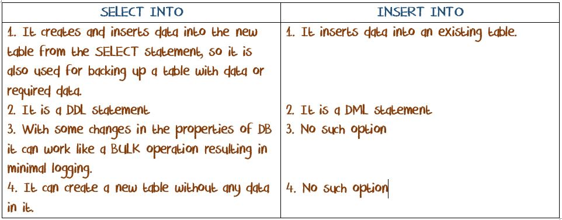
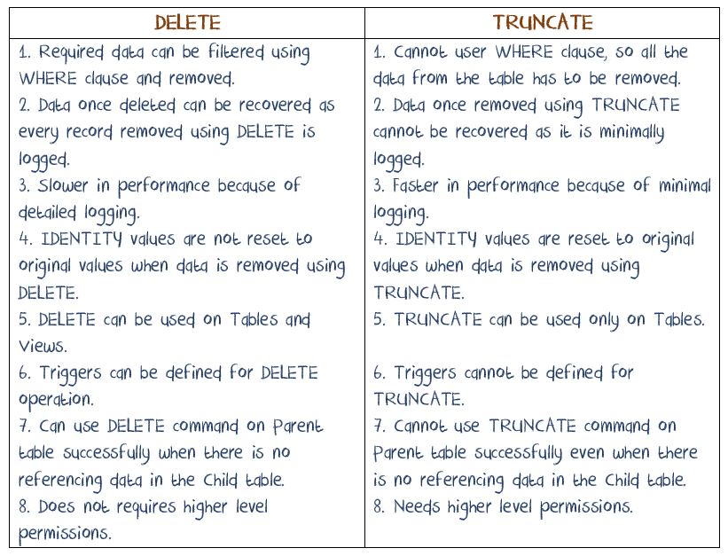
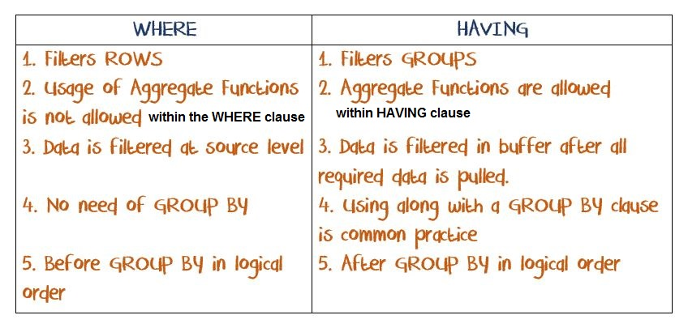
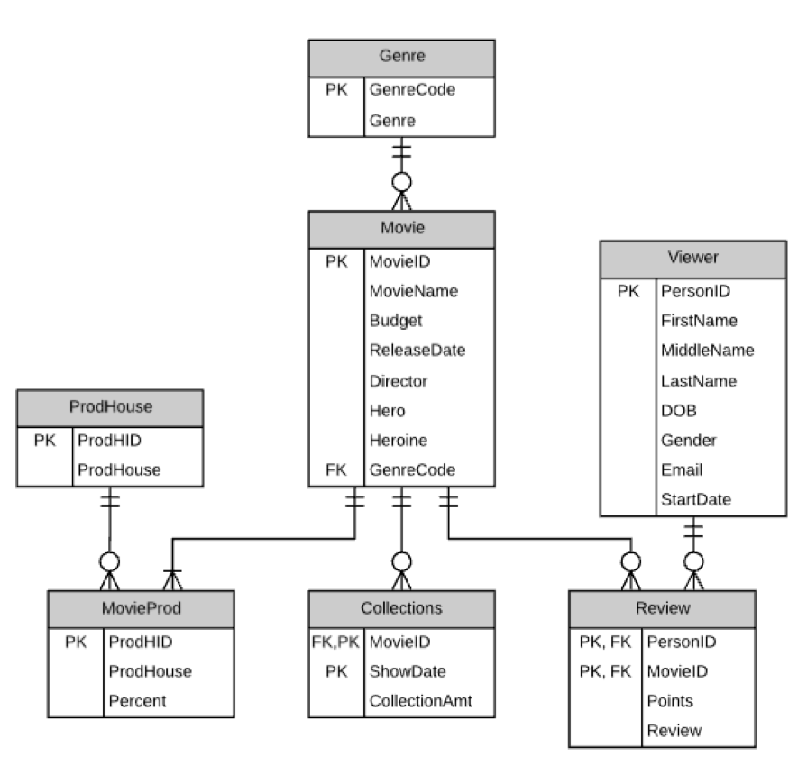

[TOC]
# SQL server environment and concepts

## Why use SQL server?
1. Security
2. Parallel access
3. Back up
4. History
5. Generate reports
6. Encryption
7. Masking

## Tools
- SQL Server Management Studio: Client tool to connect data server, mostly connect to development 

## Machine and environment
- Machine
	- OS
	- Processor
	- Memory
- Development Environment

## Basic Concepts
- Instance  
It is an installation of SQL Server on a machine (Windows/Linux).
	- 2 Types of Instances are possible 
		1. Default   
		Only 1 Default per machine  
		2. Named   
		Up to 50 instances per machine are possible   
	
- Session  
Session can be defined as an **interaction** of an application with SQL Server for a specific time (usually sessions time out if there is no activity after certain period) to perform an operation. User sessions start from 50 and above, system session will use SPID < 50.

- Authentication
1. Windows   
Use windows user who installed SQL to have access to the server as long as that acount is signed in . Information is passed from Windows system to SQL Server. This is most commonly used type.  
2. SQL Server   
Has to provide Login and Password		    

 - SCHEMA  
- It is a database **object**, which is a **subset of a database**. 
- Schema is like a container which **groups different objects** when they are created using a specific schema name (Ex: HumanResources, Person, Production etc), if a schema name is not used while creating object, object will be created under **default schema which is DBO**. 
- Schema provides more **granular control security** on the DB objects. **Every object needs a schema, object cannot created without a schema**. It provides convenience of more granular security than **at database level**. 
- When a table or other DBO is accessed using schema name and object name it is called 2 part naming convention  
2 Part	-	Schema.Object  
3 Part	-	Database.Schema.Object  
4 Part	-	LinkedServer.Database.Schema.Object  
	```sql
	ALTER TABLE [dbo].[B32_Candidates]
	ALTER COLUMN [Candidate_ID] INT

	ALTER TABLE [dbo].[B32_Candidates]
	ALTER COLUMN [Candidate_ID] INT NOT NULL
	```
- OLTP   
Online Transactional Processing, this DB is Normalized to 3NF or beyond. Purpose of this DB to handle day to day business process. Ex: In banking daily transactions like deposits, withdrawals, transfers etc goes to this DB   
 - OLAP   
Online Analytical Processing, this DB is used for decision and analyzing business needs by consuming large volume of data. Most of the times this DB is de-normalized. Ex: In a store environment analyzing sales over a period of 1 year or 2 years, analyzing complaints about a product etc.	  

- db\_test files
Every Database should have 2 mandatory data file types   
	.MDF - Primary Data File  
	.LDF - Log Data File  
and optionally it can have   
	.NDF - Secondary Data File
create two files:
1. db\_test.MDF 

2. db\_test.LDF
	- log shipping
	- improve only  perations for 
	- helps in back up
	- disastor recorvery

DML, DDL --> db\_test --> .LDF --> .MDF

in delete, each delete will create one .LDF
in truncate, only one or two .LDF (regarding to size)

- Computed column and Derived column
	- These columns are actually in the table and do not have any data in them, instead they compute results based on other columns; Examples: Age, Year Working,  Full Name
	- These are columns that don’t actually exist in the table, and are only formed for the duration of the syntax being performed; Derived columns can be anything, as long as you don’t need to keep the results of the string


## Connecting to different Server Categories
1. Local Server 
This is an instance of server that is installed on a local machine like laptop or desktop.
	- Default Local Instance 
		(local)  
		.   
(dot)  
		localhost  
		MachineName
	- Named Local Instance
		(local)\<Name of the Instance>  
		.\<Name of the Instance>  
		localhost\<Name of the Instance>  
			MachineName\<Name of the Instance>  
2. Remote Server 
This is an instance of server that is installed on a remote machine like a blade server, rack server etc. You would connect to it through network like Internet.
	- IP Address
	- Server Name Alias 

## Types of DBs
1. User Databases   
Created by user  
2. System Databases   
These are created when SQL Server is installed.	  

- Master   
It holds **security** related information and it is very important DB from migration and security perspective. It holds **server level information** such DB users, Server logins, passwords, server level settings. All user defined DBs are authenticated using this DB. It can be considered as heart of SQL Server.
- Model   
It is like a **template**, which is used by SQL server. When user creates a DB SQL server internally creates a copy of Model DB and renames to the name given by user. 
- MSDB   
**Schedules** used by or created for **SQL Job Agent** are **managed** and stored in MSDB. Developers can **store/deploy** their **SSIS** packages in MSDB.   
- TempDB   
It is used by SQL Server to handle/manage **temp objects** such as **Temp Tables, snapshots, cursors** etc.  
- Resource DB   
This is a **hidden** system DB. It holds all **meta data** and **resource management info**.

	
		
## Shortcuts for operation
C+n : open new query  
C+e : run  
A+x : run  
F5 : run  
		
## DB objects
- Store data:  
	- TABLE  
	- INDEXES  
- STORE SQL CODE:  
	- VIEW
	- PROCEDURES
	- FUNCTIONS
	- TRIGGERS

# Query
## DDL
These commands are used to create or modify or remove **structure** of a DB object
- CREATE  
To create a new **DB object** in a specified database
```sql
CREATE TABLE B32_Candidates
(
Candidate_ID NUMERIC(3, 0),
Candidate_Name VARCHAR(100)
)
```
- ALTER  
To modify the structure of an existing DB object in the database  
```sql
-- add constraints
ALTER TABLE sales
ALTER COLUMN salseID INT NOT NULL;

ALTER TABLE sales
ADD CONSTRAINT pk_sales PRIMARY KEY (SalesID)

ALTER TABLE sales
ADD CONSTRAINT fk_sales_clinet FOREIGN KEY (clientID) REFERENCES client(clientID)
```
- DROP  
To remove an existing DB object from the database  
```sql
ALTER TABLE client
DROP CONSTRAINT FK_Sales_Clinet
```
<a id="selectinto"></a>
- SELECT INTO
	- Developer can use this 1 command to create and load data from existing table/tables into 1 table. 
	- With a change in the properties of DB this command works as a BULK OPERATION, that means it minimizes logging and improves data loading process
	- DDL commonly to create a table and optional data entry to it
	- Can derive new columns and change columns names

	- Can only copy 3 properties: data type, NULL-Ability, IDENTITY (if source table have those properties)
	- [Different between SELECT INTO and INSERT INTO](#dsi)  
	 (4 part naming: LinkedServer.DB.SHEMA.OBJECT)
	 ```sql
	 SELECT * INTO Emplyee
	 FROM advanworks.humanresource.employee
		 
	 SELECT * INTO traning.dbo.employee
	 FROM h.humanresource.employee

	 SELECT gender as 'sex', title, COUNT(*) 'cnt'
	 INTO newtable
	 FROM oldtable
	 GROUP BY gender, title

	 ```
## CONSTRAINTS
They are used to enforce data integrity in the database. 
- KEY CONSTRAINTS
	- PRIMARY KEY  
		- Not NULL and unique
		- Only one PK
		- PK maintains **Entity** Integrity 
		- By default PK creates a Clustered Index on the table. This behavior can be changed to Non-Clustered Index 

	- UNIQUE KEY  
		- Allows 1 NULL value and rest of the values have to be unique. 
		- By default UK creates a Non-Clustered Index. This default behavior can be changed. 
		- Maximun 999 unique keys per table. 
		- A UK with NOT NULL is considered as light weight PK as it creates a Non-Clustered Index 
- UK and PK cannot be created without indexes. They have to have either clustered or non clustered indexes. pk/uk can be created using upto 16 columns.

	- FOREIGN KEY
		-It is a column that references a Unique value in another table or itself (self referencing EmpID - ManagerID). 
		- FK maintains **Referential Integrity**. 
 		- FK can have NULLs (online sales  and store sales) 
 		- FK allows duplicate values (1-Many relationship). 
		- must have unique key in parent and FK must have the same datatype
		- Can not exist before PK
		- Must be deleted before PK

- OTHER CONSTRAINTS
	- NULL-Ability (NULL, NOT NULL)
	Defining a column allow or does not allow NULL values. It maintains **portion of Domain Integrity**
	- CHECK  
		- It defines what values (domain) are accepted in a column. Ex: Date should be greater than today's date, email should have @ and . etc. 
		- It is used to maintain **Domain Integrity**
		
	```sql
	-- This is not work, because in columns level
	CREATE TABLE patient(
	patID INT NOT NULL,
	adminDate DATE NOT NULL,
	DischargeDate DATE CHECK( AdminDate <= DischargeDate)
	)

	-- Tihs will work
	CREATE TABLE patient(
	patID INT NOT NULL,
	adminDate DATE NOT NULL,
	DischargeDate DATE,
	CHECK( AdminDate <= DischargeDate)
	)
	```
	- DEFAULT    
		- If no values are provided by user, system can insert the DEFAULT value for a column. 
		- It maintains **portion of Domain Integrity**
		- only **one** default value 
			

- Method To creating/defining Constraints
There is a not a good or bad way of using above methods. 
	1. Defining Constraint next to a column, in this method constraints are created along with Table. Some constraints will not be able to create in 1 method then you have to use other method. Ex: AdmitDate and DischargeDate example for CHECK constraint with method 1 defined above. DEFAULT constraint with Method 2 discussed above.
	2. Defining Constraint after all the columns are defined in the table, in this method constraints are created along with Table.
	3. Defining them after table is created using ALTER statement.
	```sql
	CREATE TABLE test
	(salesID int PRIMAR KEU,
	prodID int UNIQUE,
	clientID int NOT NULL,
	qty INT DEFAULT 0,
	total MONEY);

	DROP TABLE test;

	CREATE TABLE test
	(salesID int CONSTRAINT pk_test PRIMAR KEY,
	prodID int CONSTRAINT uk_test UNIQUE,
	clientID int NOT NULL,
	qty INT DEFAULT 0,
	total MONEY)
	
	INSERT INTO test VALUES (1, 1, 1, null, 0)

	INSERT INTO test (salesID, prodID, clientID, Total)VALUES (2, 1, 1, 0)

	```
	3. create tables with contraints in different sentence
	```sql
	CREATE TABLE test
	(salesID INT NOT NULL,
	prodID INT NOT NULL,
	clientID INT NOT NULL,
	qty INT,
	total MONEY)

	CONSTRAINT pk_test PRIMARY KEY (salesID)
	CONSTRAINT fk_test FOREIGN KEY (prodID) REFERENCE prod(prodID)
	```

## DML  
These commands are used to **add or remove or modify** the **data** within a table
<a id = "delete"></a>
- DELETE  
To remove all data from a table or portion of the data from a table
	- [Difference between DELETE and TRUNCATE](#ddt)
	```sql
	DELETE FROM B32_Candidates
	WHERE Candidate_ID = 1 and Candidate_Name IS NULL

	-- Derived table
	DELETE A
	FROM (
		SELECT *, ROW_NUMBER() OVER ( PARTITION BY Did ORDER BY Did) AS 'R'
		FROM Dupes
		) A
	WHERE R > 1
	```
<a id = "insertinto"></a>
- INSERT  
To add data to a table
<a id="insertinto"></a>
- INSERT INTO 
	- copies data into a existing table  
	- [Different between SELECT INTO and INSERT INTO](#dsi)  

	<a id="dsi"></a>
	 
	Return to [SELECT INTO](#selectinto), [INSERT INTO](#insertinto)    

	```sql
	-- Method 1
	INSERT INTO B32_Candidates VALUES
	(1, 'Yiping'),
	(2, 'Mounir'),
	(3, 'Swornim')

	-- Method 2 ( when run to ' ; ', it will end
	INSERT INTO B32_Candidates VALUES (1, 'Yiping');
	GO
	INSERT INTO B32_Candidates VALUES ('A', 'Mounir');
	GO
	INSERT INTO B32_Candidates VALUES (3, 'Swornim')

	-- Method 3 (this way the number of value can less than number of columns, the columns not show here will be NULL or default.
	INSERT INTO B32_Candidates (Candidate_Name, Candidate_ID) VALUES ('Yiping', 1);

	-- Not work because number not match
	INSERT INTO B32_Candidates VALUES (1); 
	
	-- Work and if the not show columns can be NULL, and if so, the not show columns will be NULL
	INSERT INTO B32_Candidates(Candidate_ID) VALUES (1); 

	CREATE TABLE B32_Backup (ID INT, CName VARCHAR(100))

	INSERT INTO B32_Backup
	SELECT * FROM B32_Candidates

	SELECT * FROM B32_Candidates
	WHERE Candidate_ID = 1 and Candidate_Name IS NULL

	```
	```sql
	INSERT INTO newtale
	SELECT *
	FROM oldtable
	```

- UPDATE  
To modify data
```sql
UPDATE B32_Candidates
SET Candidate_Name = 'May'

-- Update with sub-query and derived talbe 
UPDATE DS
SET Total = (SELECT SUM(Amount)
			FROM DailyTrans DT
			WHERE DT.TranDate = DS.SalesDate) 
			-- Match the date from inner table and outer table
FROM DailySales DS


-- Update with deireved table and JOIN
UPDATE DS
SET DS.Total = A.Total
FROM
(SELECT DT.TranDate, SUM(Amount) AS Total
FROM DailyTrans DT
GROUP BY TranDate) A
JOIN DailySales DS
ON A.TranDate = DS.SalesDate

-- Three methods to multiply columns 
UPDATE Salary
SET Salary = Salary * 1.05

UPDATE Salary
SET Salary = Salary+(5/100) * Salary

UPDATE Salary
SET Salary += 0.05 * Salary
```

<a id = "truncate"></a>
- TRUNCATE  
To reomve all data from a table 

	- [Difference between DELETE and TRUNCATE](#ddt)
<a id = "ddt"></a>
 
Return to [DELETE](#delete),[TRUNCATE](#truncate)
```sql
TRUNCATE TABLE B32_Candidates
```

<a id="insertinto"></a>

		
## DQL
These commands are used to **retrieve data** from an existing table/tables from a DB
Data query language
- Precedence   
SQL Server order of execution of commands
	1. FROM
	2. WHERE
	3. GROUP BY
	4. HAVING
	5. SELECT 
	6. ORDER BY
- SELECT    
To list all columns or derived columns required from tables
	- Filter columns in SELECT statement
	- Column expressions in SELECT
	```sql
	SELECT E.Business_ID, 'I have to go home'
	FROM humanresource.Emplyee E
	/*
	1. select rows one by oneneeded E.Business_ID as one columns (select one row, do the logical in select, and then process next row)
	2. Each row, add another row as 'I have to go home'
	*/
	```
- TOP    
To filter/select specific number of rows from the result.	

- FROM  
To get data from required tables
<a id = "where"></a>
- WHERE  
To filter rows with some conditions. It validates for boolean 
	- row filters
	- logical operators: AND, OR, NOT, BETWEEN, IN
	- run conditions from left to right with same operators
		- For AND, if the first is not meet, will not go the second condition, thus well affect the **performance running time**
		- For OR, change the condition order will only impact the running time; The fisrt condition is meet ,the second one will not be went to
	- The most clear mothed is to use () brackets
	- [Difference between WHERE and HAVING](#dwh)
- GROUP BY    
To group data based on certain columns
	- use to show distinct values
	- NULLs are considered as same in GROUP BY
	- SELECT with group by, the columsn must be part of GROUP BY clause or aggregate functions

<a id = "having"></a>
- HAVING
	- Filter groups with conditions (must be able to compare)
	- Data is fultered in buffer after all required data is pulled
	- Commonly use with a group by clause, but can use without GROUP BY
	- After group by in logical order
	- Use columns in group by clause or aggregate funtion
	- [Difference between WHERE and HAVING](#dwh)
	<a id = "dwh"></a>
	 		
	Return to [WHERE](#where), [HAVING](#having)
- ORDER BY  
To sort data based on certain columns. Unless this command is used   
	- It is the only that guarantees a result set which sorted other wise the data is not guaranteed to be displayed  in sorted order
	- run after SELECT (so can and the only one clause use alias name in SELECT)
	- Use as less as possible for save resource
	- Default in ASC; DESC can be use
	- ORDER BY 1 (sort in the first column) (not recommend because databse can be edit)
	- The columns order in GROUP BY will not have any affect the result set
	- Be used in 2 scenarios:
		- Find duplicate
			- Get distinct 
- AS   
Following kind of code might cuase issues
	- only can be used in SELECT, FROM
- BETWEEN	
	- Can be used in int, charactor, date
	```sql
	SELECT *
	FROM person
	WHERE FirstName BETWEEN 'A' AND 'C'
	/*
	 will not show start with c
	 EX. only show till C ('C' is included)  but without any like Cadey
	 */

	 SELECT *
	 FROM test
	 WHERE testdate BETWEEN '01/01/1061' AND '12/31/1970'

	```
	- is included  
	```sql
	-- EX.
	SELECT * FROM TEST
	WHERE BETWEEN 1 and 100 == >=1 and <=100  
	>\>1 AND <100 == BETWEEN AND !=1 AND != 100 (just for INT)
	```
	- Not good to use in decimal
		
- IN	
```sql
-- When ths set after NOT IN, Ex. ID NOT IN (NULL, 1, 3), will give a emply result
if use sub-query to get the set after NOT IN, handle the NULL values first*(1. WHERE to limit NULL 2. Use co-related sub-query to limit) Or, use NOT EXISTS insead; 


MiddleName NOT IN ('A', 'B') --This will not includ NULL values in MiddleName
MiddleName IN ('A', 'B')
-- the two reults cannot union to full set because cannot compare NULL with other values
MiddleName NOT IN ('A', 'B') OR MiddleName IS NULL
-- NULL cannot compare with eqaul or uneqaul
```
		
- LIKE  
will internal convert to string to compare  
for like, SQL server cannot use index efficiently and thus for some case will use all records to compare if there is % at first, is not an efficient way
	- use to string
	- use to number
	```sql
	SELECT *
	FROM TestWC
	WHERE TotalDue NOT LIKE  '%.00'
	```
	- use to date (not recommended)
	```sql
	SELECT HireDate
	FROM Employee
	WHERE HireDate LIKE '2009%'
	```

- Wild Card      
These are used to search **fuzzy data** or **partially known data**.     
Wild cards are not recommended to use because it **cannot use indexes efficiently**. If the data size is small, it will not a problem.		  
	- % percentile   
	search operation can have 0 or more unknown characters. Ex: 'Alex%' gives out any thing starting with Alex such as Alexa, Alexandra, Alex, Alexia.  
	- ^ (carat) or ! (not)  
	It is used for NOT operator. Ex: '\^[ABC]%' this will retrieves all values except those are not starting with A or B or C.  
	- [] (Square brackets)  
	Used for Range of values or multiple values. Ex: '[ABC]%' here list of values specified, so this retrieves info for all those records which starts with A or B or C. '[A-K]%' here range is specified, this retrieves info for all those records which starts with A until K.  
		- ( LIKE '[afs]%',   
		- [a-m]% ,   
		- [a-M-]% the last one will inclueded ' - ')    
	- \- hyphen  
	- _  ( Underline/ under score  stands for any 1 charactor)  
	It is used to replace 1 character. Ex: '_lex' it gives all the values for which 2nd character is l and third character is e and fourth is x. But anything for first character. Such as Alex, Blex, Clex.
	- ESCAPE change the charactor sel meaning  
	Can sign any un special character as ESCAPE charactor
	> Not wild card for string but will use in SQL
	> - \* asterisk
	> - \# hash
	```sql
	SELECT *
	FROM wildcards
	WHERE descp LIKE '%*%%' ESCAPE '*'
	-- Here we want strings with ' % '
	
	-- Alternaltively, we can use  [ ]
	SELECT *
	FROM wildcards
	WHERE descp LIKE '%[%]%' ESCAPE '*'
	
	```
	
### JOIN
- They are used to **combine data from multiple tables on a horizontal plane** (side - side). While retrieving data from JOINing tables there should be a condition that needs to be satisfied (this does not happen for cross JOIN)
- SELECT should indicate the columns are in which table (mostly with ALIAS in FROM)
- Will not match NULL values at join
- Columns with **different data types** can be used for JOINING conditions as long as they are **compatible**. Ex: If table has a column with VARCHAR and stored all INT values this can be used to JOIN with a column (on another table) which is INT data type. So SQL Server will implicitly convert VARCHAR to INT.
- Can use metadata sys.foreign keys to find relationships
- When there are duplicates in tables for JOINING columns it works like a Cartesian product for those duplicate values.
- Multiple conditions can be used in ON clause. Ex: ON AID = BID AND AVAL = BVAL
- In ON condition if = is not used for comparison it is called non-equi join.
	- Equal join
	- Non-Equal Join  
	```sql
	SELECT *
	TABLE A JOIN B ON A.Date > B.Date
	```
- Type
	- INNER JOIN
	- OUTER JOIN  
	Display every possible combination of all values in the designated / Cartesian product
		- LEFT
		- RIGHT
		- FULL 
	- CROSS JOIN    
		- CARTESIAN PRODUCT  
		- Two tables need not be related
		- Joining columns need not to have same names
	The following are derived not a real JOIN type  
	- Restricted Left/Right Outer  
	Only unique left/right values (not match values)
	```sql
	-- Find movies without any reviews
	-- Restricted Left Outer Join
	SELECT *
	FROM Moive M
		LEFT JOIN Review R
		ON R.MovieID = M.MovieID
	WHERE R.MovieID IS NULL

	```
	- Self Join  
	join a table to itself in some regard
	```sql
	CREATE TABLE Eomployee(
	EmpID INT PRIMARY KEY,
	Name VARCHAR,
	ManagerID INT
	)

	-- By sub-query
		SELECT E.EmployeeID, E.FirstName,
			(SELECT E1.FirstName
			FROM Employees E1
			WHERE E.ManagerID = E1.EmployeeID
			) AS 'Manager Name'
	FROM Employees E
	WHERE MangerID IS NOT NULL

	-- Find who do not manage anyone

	SELECT E1.EmpID 'Manager", E1.Name "Manager Name" 
	FROM Employee E1
		LEFT JOIN Employee E2
		ON E1.EmpID = E2.MangagerID
		WHERE E2.EmpID is NULL

	```

	- Inner Join  
	No matter table order
	- Outer Join  
	' a LEFT JOIN b' == ' b RIGHT JOIN a'
		- LEFT JOIN  
		'LEFT JOIN' AND 'LEFT OUTER JOIN' are same
		- RIGHT JOIN
		- Full Join

		Ex:
		Find records in table A which are not available in B  
		Methods:
		1. OUTER JOINS (The best way, best performance)
		2. Sub queries
		3. Set operator

## Datatype
The right datatype will imporve the performance
- String
- NUMBERIC
NUMBERIC(8, 2) ~999999.99
- FLOAT(N)
Will round at the end
- REAL
Will round numbers
subset of float
- DATETIMEOFFSET
include the position about date zone
- XML
- IMAGE
- GEOGRAPHY
- VARBINARY
- USER DEFINED DATA TYPE
- DATE  
	'02/29/1961' as date will get erro because SQL will automatic convert string to date. This date is not exsist and thus cannot successfully internal convert to date.

|Category|Data Type|Size|Max Val|
|--------|---------|----|------|
String|
|CHAR|1 Byte Per Char|8000 CHARS|
|VARCHAR|1 Byte Per Char|8000 CHARS|
|NCHAR|2 Byte Per Char|4000 CHARS|
|NVARCHAR|2 Byte Per Char|4000 CHARS|
|NVARCHAR(MAX)|2147483648 (2 GB)|1073741824 CHARS|
|VARCHAR(MAX)|2147483648 (2 GB)|2147483648 CHARS|
Number|
|TINY INT|1|0-255|
|SMALL INT|2|
|INT|4|
|BIG INT|8|
|NUMERIC(P,S)|5, 9, 13, 17|
|FLOAT(N)|4,8|
|REAL|4|
|MONEY|8|
|SMALL MONEY|4|
|BIT\*|1 BIT|0/1|
Date|
|DATE|3|
|DATETIME|8|
|DATETIME2|6,7,8|
|DATETIMEOFFSET|10|
|SMALL DATETIME|4|
|TIME|5|


### DataType procedure
1. user-defined data types (highest)
4. datetimeoffset
5. datetime2
6. datetime
7. smalldatetime
8. date
9. time
10. float
11. real
12. decimal
13. money
14. smallmoney
15. bigint
16. int
17. smallint
18. tinyint
19. bit
20. ntext
25. nvarchar (including nvarchar(max) )
26. nchar
27. varchar (including varchar(max) )
28. char

# Functions
## Function Types
1. System Functions
	1. Conversion
	2. Date Functions
	3. String Functions
	4. Window Functions - Any functions that use OVER key word, it is called as Window Functions.
		- Ranking
			- Rank
			- Dense_Rank
			- Row_Number
			- NTile			
		- Aggregate   
		All Aggregate functions along with OVER clause
		- Analytical
			- LAG
			- LEAD
			- FIRST_VALUE
			- LAST_VALUE
	5. Mathematical
	6. Meta data Functions
	7. Aggregate Functions
	8. NULL Functions
2. User Defined Functions
3. CLR Functions (Common Language Runtime these are available from SS 2012 and later)

 
  
| Usage -> FunctionType | SELECT | FROM | WHERE | GROUP BY | HAVING | ORDER BY | Nesting|
| ------------- | ------ | ---- | ----- | -------- | ------ | -------- | -------|
| Aggreagate | YES | NO | NO | NO | YES | YES | NO|
| String | YES | NO | YES | YES | YES | YES | YES|
| Date | YES | NO | YES | YES | YES | YES | YES|
| Ranking | YES | NO | NO | NO | NO | YES | NO|
| NULL | YES | NO | YES | YES | YES | YES | YES|
| Conversion | YES | NO | YES | YES | YES | YES | YES|

## Aggregate Functions
	- AggF avoids or **ignores null values** in a column while calculating
	- AggF **cannot be nested** Ex: MAX(SUM(Sales))
	- While using AggF with GROUP BY, only non aggregated columns that are listed in the GROUP BY can be used in the SELECT
	- It is not mandatory to have AggF in SELECT if we use GROUP BY
		1 . When you want to identify duplicates
		2 . When you want distinct values in the result
	- Order of columns in GROUP BY will not have any affect on the number of rows in result
	- Other aggregate and non aggregate functionality columns listed in the SELECT has no affect on the number of rows returned
	- We can use HAVING without AggF as long as the columns used for filtering are part of GROUP BY
	- We can have multiple AggF in a single SELECT
	- All Aggregate Functions can be used on String and Date data type columns except for SUM and AVGA on STRING
	- Create derive column, should give name with AS alias (If not, will show no column name in display, but cannot be sub-query)
	- Can be used in ORDER BY clause but not recommanded (recommand to aggF in select and alias a name
	```sql
	-- Work but not recommand
	SELECT SalesPersonID
	FROM Sales.SalesOrderHeader H
	GROUP BY SalesPersonID
	ORDER BY SUM(TotalDue)

	-- recommand
	SELECT SalesPersonID, SUM(TotalDue) 'Total'
	FROM Sales.SalesOrderHeader H
	GROUP BY SalesPersonID
	ORDER BY Total
	```
	```sql
	-- in SELECT with out group by 
	SELECT MAX(TotalDue) as 'Max sales'
	FROM Sales;

	-- in SELECT with GROUP BY and HAVING
	SELECT custID, SUM(TotalDue)
	FROM Sales
	GROUP BY custID
	HAVING SUM(TotalDue) > 5000
	ORDER BY custID
	```
- Types
	- SUM
	- MIN  
	Can use ORDER BY and TOP to get the min and max result
	- MAX
	- AVG
	- COUNT    
	If have NULL values: AVG(Sales) != SUM(Sales)/COUNT(*). But AVG(Sales) == SUM(Sales)/COUnt(Sales)  
	If all columns are NULL values, COUNT(NullColumn) return 0. For other functions, SUM(NullColumn), return NULL  

## Date functions  
Can be nested
- Types
	- DATEADD(interval, number, date)
	- DATEDIFF(interval, date1, date2)
	```sql
	SELECT DATEDIFF(YY,'2019-12-31','2017-12-21') 'Date diff inYears',
	DATEDIFF(MM,'2015-8-16','2017-12-21') 'Date diff in Months',
	DATEDIFF(DD,'2015-8-16','2017-12-21') 'Date diff in Days',
	DATEADD(MM,12,GETDATE()) 'Adding Months',
	DATEADD(YY,-2,GETDATE()) 'Adding -ve Years'
	-- This add 10 days to the current day. Only add on days
	SELECT GETDATE() + 10
	```
	- DATEFROMPARTS(year, month, day)
	```sql
	--SQL Server 2012 and later versions
	SELECT DATEFROMPARTS(2012,2,28) 'Date from Parts'
	--DATETIMEFROMPARTS, SMALLDATETIMEFROMPARTS
	```
	- DATENAME(interval, date)
	- DATEPART(interval, date)
	```sql
	DATENAME(MONTH, DemoDate) 'Month Name',
	DATENAME(DD, DemoDate) 'Day of Month',
	DATENAME(WEEKDAY, DemoDate) 'Name of Day',
	DATENAME(DY, DemoDate) 'Day of Year',
	DATEPART(M, DemoDate) 'Month of Year',
	DATEPART(MI, DemoDate) 'Minutes of DateTime',
	DATEPART(WEEK, DemoDate) 'Week of the Year',
	```
	- DAY(date)
	- MONTH(date)
	- YEAR(date)
	```sql
	SELECT DemoDate 'Current Date',
	DAY(DemoDate) 'Day from Date',
	MONTH(DemoDate) 'Month from Date',
	YEAR(DemoDate) 'Year from Date'
	FROM DateFnDemo
	```
	- GETDATE()  
	MILLI (1/1000)
	- GETUTCDATE()
	- SYSDATETIME()  
	Get more precision than GETDATE(), MICRO (1/M)
	- ISDATE(expression)
	```sql
	SELECT
	ISDATE('2015-8-31') 'Validation Correct',
	ISDATE('2015-2-35') 'Validation Wrong'
	--SQL Server 2012 and later
	SELECT EOMONTH ('2015-8-16'), EOMONTH ('2015-8-16',-1)

	SELECT EOMONTH (GETDATE(), 12)
	--Gives the datetime value of server
	SELECT SYSDATETIME(), GETDATE()
	```
	- EOMONTH ( StartDate [, MonthToAdd ] )  
	```sql
	DECLARE @date DATETIME = GETDATE();
	SELECT EOMONTH ( @date ) AS 'This Month';
	SELECT EOMONTH ( @date, 1 ) AS 'Next Month';
	SELECT EOMONTH ( @date, -1 ) AS 'Last Month';
	```
## String Function  
Can be nested
- Types
	- LEN()  
	Will count the space before the last non character but not space after the last non-space charactor
	- UPPER()
	- LOWER()
	- LTRIM()
	- RTRIM() RTRIM( LTRIM() )
	- CONCAT() 
	- Difference between CONCAT() and +
		1. ++ will return NULL if any is NULL; CONCAT() will ignore NULL and retur other values
		2. ++ can not plus number and string (should conversion number to string first); CONCAT() will automatically convert number to string
	- SUBSTRING(string, start position, number of characters)
	- LEFT(string, number of character to be sub)  
	From left
	- RIGHT (String, number of character to be sub)  
	From right
	- REPLACE(String, OldString, NewString)
	```sql
	-- number of apperances of character(s)
	SELECT LEN('RAJA') - LEN( REPLACE('RAJA', 'A',''))
	```
	- CHARINDEX(character to be find, string, start position (optional,this position is included)  
	Return the first appearance of a character in string, if cannot find, return 0, will count space. If the start position is <= 0, looks as 0 to find from all;
	CHARINDEX('P',PerFName)  
	Return the index location (start with 1) of  
	```sql
	-- Find the second apperance of a character
	CHARINDEX('P', string, CHARINDEX('P', string)+1)
	```
	- PATINDEX(pattern, string)  
	Return the index of a pattern; Can use wild card
	- RVERSE(string)
	- REPLICATE(repeat string, times of repeat)
	- ASCII(character)  
	IF more than 2 characters, only return the ASCII value of 1st one
	- CHAR(ASCII value)
	- STUFF(string, start, length, NewString) 

## Window functions
OVER clause means using a window function
- Types
	- Ranking  
	It is a type of WINDOW functions and it uses OVER clause to generate windows and provide a numbers for the data based the function used. They cannot be used in WHERE clause. They cannot be nested.
	- Analytical (22 2012)
	- Aggregate
	- PARTITION BY 
	GROUP BY : Give pysical make groups, create groups
	PARTITION BY: In logical in buffer, create windows, will include non-group by and non-aggregate columns

- Ranking functions
	- ROW\_NUMBER()
	Provides a sequence of numbers starting from 1, based on sort columns, there will not be any gaps in numbers generated by this as it doesn't consider duplicate values for numbering. Used commonly for deleting duplicates.
		- Best way to use to delete duplicates
		- Give same rank number for duplicates
		- Most recent Activity Based on DATE ( depends on business requirements)
		- Without other ORDER BY columns, for duplicates, the order is random 
		```sql
		DELETE A
		FROM (
			SELECT *, ROW_NUMBER() OVER ( PARTITION BY Did ORDER BY Did) AS 'R'
			FROM Dupes
			) A -- A is referecing table, so the delete on A will also change on Dupes
		WHERE R > 1
		```

	- RANK()  
	Provides a sequence of numbers starting from 1, based on sort columns. If there are duplicates in sort column RANK gives same RANK value to duplicate values. There is a possibility of gaps in RANKs (numbers) generated.
		- Most recent Activity Based on DATE ( depends on business requirements)
		- Don't use much because it skips values and hard to search
	- DENSE\_RANK()  
	Provides a sequence of numbers starting from 1, based on sort columns. If there are duplicates in sort column DENSE_RANK gives same number to duplicate values. Unlike RANK there is no possibility of gaps in numbers (DENSE_RANK values) generated. Commonly used for nth highest Salary, Sales etc.
		- Most recent Activity Based on DATE ( depends on business requirements)
		- Firt/Secend Highest 
		- Do not skip ranks
		
## Conversion Functions  
- Types
	- CAST    
	It is universal, that means it is available in most of the databases such as Oracle, MySQL
	- CONVERT    
	Convert uses style parameter, it is a variation of CAST developed by MS; convert only in SQL server.
	```sql
	SELECT CAST('01/01/2017' AS DATE)
	SELECT CAST('01/33/2017' AS DATE)
	SELECT CONVERT(DATE, '01/01/2017')

	SELECT BusinessEntityID, HireDate, JobTitle,
	CONVERT(VARCHAR(100), BirthDate, 107), CONVERT(VARCHAR(100), BirthDate, 7)
	FROM HumanResources.Employee

	-- User try can avoid stop when have error when running
	SELECT TRY_CAST('01/33/2017' AS DATE)

	CREATE TABLE ConversionFNs 
	(BDay VARCHAR(25))
	GO

	INSERT INTO ConversionFNs values
	('01/15/2018'),('02/29/2019'),('05/15/2016'),('09/31/2019'),('2/15/2018')

	-- Use WHERE to avoid stop, same usage as TRY. Both are not good
	SELECT * FROM COnversionFNs
	WHERE ISDATE(BDay) = 1

	SELECT * FROM COnversionFNs
	WHERE TRY\_CAST(BDay AS DATE) IS NOT NULL

	SELECT *, CAST(BDay AS DATE)  
	FROM COnversionFNs

	SELECT BusinessEntityID, HireDate, JobTitle,
	TRY_CONVERT(VARCHAR(100), BirthDate, 117)
	FROM HumanResources.Employee
	```

## NULL Functions
- ISNULL  
	- ISNULL(Expression to be decided, default value if NULL)  
	- If ISNULL(NULL, NULL) return NULL, else return expression
	- Takes 2 parameters and if first parameter is NULL then returns 2nd parameter (value) as result. If both are NULL then returns NULL. First Parameter decides the data type and length of the output. This function is SQL Server function (not ANSI).  
- COALESCE  
	- COALESCE(val1, val2, ...., val_n)
	- returns the first non-null value in a list
	- This is an ANSI function
	```sql
	SELECT COALESCE(NULL, NULL, NULL, 'test1', NULL, 'Example.com');
	-- Return  'test1'
	```
- NULLIF 
	- NULLIF(expr1, expr2)
	-  Takes 2 parameters and returns NULL if both values are same, else returns first parameter value.  
	```sql
	SELECT NULLIF(10, 10)
	-- return NULL
	
	SELECT NULLIF(20, 10)
	-- return 20
	```

	
## Parent child
 - DELETE child first then DELETE parent

 - INSERT parent first then DELETE child
 - Change in both parent and child
 	1. DROP FK --> UPDATE parent --> UPDATE child --> RE-Create FK
	2. CASCADE function
	3. (recommanded)Insert new value in parent --> change child to new value --> delete old value in parent

	```sql
	-- Ex. macine, parts, machine-part question	
	-- must drop child table fisrt and then drop parent table
	DROP TABLE IF EXISTS machineparts
	GO
	DROP TABLE IF EXISTS machine
	GO
	DROP TABLE IF EXISTS parts
	GO
	CREATE TABLE machine
	CREATE TABLE parts
	(partID SMALLINT NOT NULL,
	part VHARCHAR(100) NOT NULL,
	partcat VHARCHAR(100),
	-- Define the unique with CLUSTERED INDEX`
	CONSTRAINT uk\_parts\_partID UNIQUE CLUSTERED(partID)
	)
	GO
	CREATE TABLE machineparts
	(machineID INT CONSTRAINT fk_machineparts_machineID FOREIGN KEY REFERENCES machine(machineID) ,
	(partID SMALLINT CONSTRAINT fk_machineparts_partID FOREIGN KEY REFERENCES part(partID) ,
	-- for foreign key, the datatype should be match

	ALTER TABLE machineparts
	ALTER COLUMN machineID INT NOT NULL,

	ALTER TABLE machineparts
	ALTER COLUMN partID SMALLINT NOT NULL,
	-- must change to not null and then change to primary key
	ALTER TABLE machineparts
	ADD CONSTRAINT pk_machinepart_machID_partID PRIMARY KEY (machineID, partID)

	-- must insert parent first and then insert child
	INTER INTO machine VALUES
	(1, 'laptop', '5/15/2019')

	GO
	INSERT INTO parts VALUES
	(101, 'mother board', '5/15/2019')

	GO
	INSERT INTO machineparts VALUES
	(1, 101)

	DELETE FROM machineparts
	```
## Sub-Query and View
### Sub-Query
- It is considered query within a query. For simple sub query will have 2 parts, Outer query and Inner query. 
- Sub queries can be **nested MAX up to 32 levels**
- In Inner Query ORDER BY cannot be used unless TOP clause is used 
- Usually performance of Sub Queries is low compared to JOINs.
- If in the SELECT use sub-query, keep the child table outer, and parent table inner query( because if child in inner, will return more than one value) (If both are not unique, cannot use sub-query in SELECT as JOIN)

1. Regular/General/Non-Co-related   
	- The Inner query is executed first and passes the **value** to outer query if sub query is used in WHERE clause 
	- Inner Query can be executed independently.   
	- It can be used in WHERE conditions, SELECT, FROM, HAVING, ORDER BY but not in GROUP BY
	- When used in WHERE clause 
		-Inner query should return only 1 value with "=" (and other comparison operators)
		-Can return only 1 column and can return multiple values if used with "IN", SOME, ALL, Any	
	- When used in SELECT should return only 1 value
	- When used with "FROM" sub query can return a table with 1 or more columns and 1 or more rows. (this is also called as derived table)		
1. Co-Related    
	Inner query **expects a value from outer query for each row of outer query**. Executes once for each row called by outer query. Usually it is not recommended to use because of its row by row retrieval and slows down the query.
	- For running totals (accumulate)
	```sql
	-- Accumulate/ runningTotals
	SELECT * (SELECT SUM(Sales)
			FROM RunningTotals R2
			WHERE R2.ID <= R1.ID
	FROM RunningTotals R1

	-- rank without ranking functions
	SELECT Sales, (SELECT COUNT(Sales)
			FROM RunningTotals R2
			WHERE R2.Sales > R1.Sales
			)
	FROM RunningTotals R1
	```
### Views
- Purpose
	- Security
	- Add INDEX to view to improve performance of QUERY with in View
	- Pysical table will not update, create view will update when underlying table changed
- Within the view
	1. Only DQL
	2. CREATE OR ALTER (avoid trigglers)
- Without the view
	1. Reusability
	2. Provide convenience in reporting & integration projects
	4. When the underlying table (data referecing by VIEW) change, the result set in VIEW also changed

# System Procedure
## Important
Retrieves the info about an object  
- EXEC SP\_HELP   
metadata for the table  
Gives out the definition of the user defined objects and system objects (Not for table and system functions); 
```sql
EXEC SP\_HELP '[dbo].[uspGetBillOfMaterials]'  
```
- EXEC SP\_HELPTEXT   
syntax for a saved object
```sql
EXEC SP\_HELPTEXT '[dbo].[uspGetBillOfMaterials]'
EXEC SP\_HELPTEXT 'SP\_HELP'
EXEC SP\_HELPTEXT '[HumanResources].[Employee]'
EXEC SP\_HELPTEXT '[dbo].[fnExtCharIndex]'
--Provides info about a specified database or all the databases (DB name is optional)
```
- EXEC SP\_HELPDB   
metadata fro database
```sql
- EXEC SP\_HELPDB 'Training\_SQL'
- EXEC SP\_HELPDB 'AdventureWorks2012'
```
- EXEC SP\_WHO2  
- EXEC SP\_WHO    
Information on users, sessions, and servers  
For SP\_WHO OR  SP\_WHO2, there is 'blk by' columns means for a session, it is block(wait other session to run and finished) by other session number. Can find the session need to kill.
- EXEC SP\_EXECUTESQL 
Dynamical execute query
```sql
EXEC SP\_EXECUTESQL N'SELECT * FROM Person'
```
- EXEC SP\_LOCK
- EXEC SP\_RENAME 
- EXEC SP\_RENAMEDB 
```sql
EXEC SP\_RENAME 'B27\_ColumnName.newid', 'ID', 'COLUMN';
EXEC SP\_RENAME 'Table', 'OldColumnName', 'NewColumnName'
EXEC SP\_RENAMEDB 'Training\_SQL', 'Training\_SQL2'
```
- EXEC SP\_DEPENDS 
What are the different objects that depend on a given object
```sql
EXEC SP\_DEPENDS '[dbo].[uspGetBillOfMaterials]'
```
## Good to remember
- EXEC SP\_WHO 'ACTIVE' --login' | session ID | 'ACTIVE'
- EXEC SP\_ADDTYPE PhoneNo, 'varchar(13)', 'NOT NULL'
- EXEC SP\_DROPTYPE 
- EXEC SP\_COLUMNS 'Emp'
- --Provides info about indexes on a Table or View
- EXEC SP\_HELPINDEX '[HumanResources].[Employee]'
- --To attch .df, .ldf and .ndf files to a server instance
- EXEC SP\_ATTACH\_DB @dbname=  'AdventureWorks2008', @filename1= 'C:\.........'
- EXEC SP\_DETACH\_DB
- --Provides the info about the files associated to DB .mdf, .ldf, .ndf
- EXEC SP\_HELPFILE
- --Provides the information about language, months, days, start of the week
- EXEC SP\_HELPLANGUAGE English;
- EXEC SP\_HELPSERVER
- EXEC SP\_HELPSORT
- EXEC SP\_BINDRULE
- EXEC SP\_UNBINDRULE
- EXEC SP\_HELPTRIGGER '[Person].[Password]'
- EXEC SP\_SPACEUSED 'Employee'

- Some more research
- EXEC SP\_CONFIGURE
- SP\_HELPCONSTRAINT 
```sql
-- Gives the info of all the constraints on a given object
EXEC SP\_HELPCONSTRAINT 'HumanResources.Employee'
```
- SP\_LOCK
rename column name

- SP\_DEPENDS
Find all tables depend (child table) on this table. Find what tables will be impact if change this table in structure change.


# Exercise
## LIKE
```sql

CREATE TABLE PERSON(
PERID INT CONSTRAINT PK_PERSON_PerID PRIMARY KEY,
PerName VARCHAR(25),
SSN CHAR(9) CONSTRAINT CK_SSN CHECK ( SSN LIKE '[0-9][0-9][0-9][0-9][0-9][0-9][0-9][0-9][0-9]')
-- Using CHAR because if use number, it chould be start with 0
EMAIL VHARCHAR(50)

ALTER TABLE PERSON
ADD CONSTRAINT CK_PerName CHECK (PerName LIKE '_____%, ___%')
ADD CONAT
GO
ALTER TABLE PERSON
ADD CONSTRAINT CK_Email CHECK (EMAIL LIKE '_____%@___%.___%')

--check invalid email for user name and rest are fine
--unit test, check every thing as design
INSERT INTO Person VALUES
(2, 'Yue, li' ')

```
```sql
SELECT PH.ProdHouse, 
	CASE 
		WHEN SUM(C.CollectionAmt)> SUM(M.Budget) THEN '2'
		ELSE 0,
		WHEN SUM(C.CollectionA
(SUM(C.CollectionAmt)> SUM(M.Budget)) AS 'IsProfitable'
FROM ProdHouse PH
	LEFT JOIN MovieProd MP
	ON PH.ProdHID = MP.ProdHID
	JOIN Movie M
	ON MP.MovieID = M.MovieID
	JOIN Collections C
	ON M.MovieID = C.MovieID
WHERE ReleaseDate BETWEEN '2018-01-01' AND '2018-12-31'
GROUP BY ProdHID, ProdHouse

```

## Others
```sql
--Find Employees who are retiring on Weekend assuming age of retirement is 60
--Using DATENAME function
SELECT BusinessEntityID, BirthDate, DATENAME(WEEKDAY, DATEADD(YY, 60, BirthDate)) 'Day of Retiring'
FROM AdventureWorks2012.HumanResources.Employee
WHERE DATENAME(WEEKDAY, DATEADD(YY, 60, BirthDate)) IN ('Saturday','Sunday')
--Using DATEPART function
SELECT BusinessEntityID, BirthDate, DATENAME(WEEKDAY, DATEADD(YY, 60, BirthDate)) 'Day of Retiring'
FROM AdventureWorks2012.HumanResources.Employee
WHERE DATEPART(WEEKDAY, DATEADD(YY, 60, BirthDate)) IN (1, 7)

--People hired on Monday
SELECT *
FROM AdventureWorks2012.HumanResources.Employee
WHERE DATENAME(WEEKDAY, HireDate) = 'Monday'

SELECT COUNT(DISTINCT GenreCode)
FROM Genre

SELECT PH.ProdHouse
FROM ProdHouse PH
	JOIN MovieProd
	JOIN Movie M

ON 
```	
## Past evaluation test
1.	Write code to create table for the Viewer in the model below. Use proper data types and constraints, some of the following business rules need to implement.  
a.	Email should be unique, email should be either gmail or yahoo and only .com is allowed. Length of username should be minimum of 5 characters and there should be a (.) after @. Also it should allow (.) before @  
b.	Gender should accept only M, F, N values  
c.	Last name should be longer than 1 character  
d.	DOB should be over 18 years  
```sql
CREATE TABLE Viewer(
PersonID INT CONSTRAINT pk_viewer PRIMARY KEY,
FirstName VARCHAR(100),
MiddleName VARCHAR(100),
LastName VARCHAR(100) CONSTRAINT lastname_check (LastName LIKE '_%'),
DOB DATE CONSTRAINT dob_check ( DATEDIFF ( YY, DOB, GETDATE()) )
Gender CHAR(1) CONSTRAINT gender_check CHECK (Gender IN ('M', 'F', 'N'),
Email VARCHAR(100) CONSTRAINT uk_viewer UNIQUE,
StartDate DATE,
CONSTRAINT Email_gmail_check CHECK( Email LIKE "_____%@gmail.com"),
CONSTRAINT Email_yahoo_check CHECK ( Email LIKE "_____%@yahoo.com"),

```
2.	Find Genres in which there are no movies
a.	Using JOINs
```sql
SELECT G.Genre
FROM Genre G LEFT JOIN Moive M ON G.GenreCOde = M.GenreCode
WHERE M.MovieID IS NULL
```
b.	Using Sub Queries
```sql
SELECT G.Genre
FROM Genre G
WHERE G.GenreCode NOT IN ( SELECT DISTINCT M.GenreCode FROM Movie M)
```
3.	Find Maximum and Minimum rating for each movie. Output should have MovieName, Max Rating and Minimum Rating
a.	Using JOINs
```sql
SELECT M.MovieName, MAX(Points) AS 'Max Rating', MIN(Points) AS 'Min Rating'
FROM Revies R JOIN Movie M ON M.MovieID = R.MovieID
GROUP BY MovieID
```

b.	Using Sub Queries
```sql
SELECT (SELECT M.MovieName
		FROM Movie M
		WHERE M.MovieID = R.MovieID),
		MAX(Points) AS 'Max Rating', MIN(Points) AS 'Min Rating'
FROM Review R
GROUP BY R.MovieID
```
4.	Find all reviews in which name of the hero is mentioned but not name of the heroine.
```sql
SELECT R.Review
FROM Review R JOIN Movie M ON R.MovieID = M.MovieID
WHERE R.Review LIKE CONCAT('%', M.Hero, '%') AND R.Review NOT LIKE CONCAT('%', M.Heroine, '%')
-- Can also use LIKE '%'+M.Hero+'%' or WHERE PATINDEX(M.Hero, R.review) != 0
```

5.	Find average rating given by Male and Female viewers. Output should have MovieName, MaleAvgRating, FemaleAvgRating
```sql
SELECT M.MovieName, AVG(Points) AS 'AvgRating'
FROM Movie M, JOIN Review R ON M.MovieID = R.MovieID
	JOIN Viewer ON R.PersonID = V.PersonID
GROUP BY Gender

SELECT (SELECT M.MovieName FROM Movie M WHERE R.MovieID = M.MovieID), AVG(Points) AS 'AvgRating'
FROM Review R JOIN Viewer ON R.PersonID = V.PersonID
GROUP BY Gender
```

6.	Find Name of Production House which made movie which generated highest total collections and lowest total collections. It should give 2 rows 1 for high value and another for low value.
```sql

SELECT ProdHouse
FROM (
	SELECT P.ProdHouse, 
		DENSE\_RANK() OVER ( ORDER BY SUM( ISNULL(CollectionAmt, 0) DESC) AS "Rank\_High",
		DENSE\_RANK() OVER ( ORDER BY SUM( ISNULL(CollectionAmt, 0) DESC) AS "Rank\_Low"
	FROM ProdHouse P LEFT JOIN MovieProd MP ON P.ProdHID = MP.ProdHID
		JOIN Movie M ON MP.ProdHID
		JOIN Collections C ON M.MovieID = C.MovieID
	GROUP BY P.ProdHouse
	)
WHERE Rank\_High = 1 OR Rank_Low = 1
```

7.	Rank (Dense Rank) all movies based on their second day collections.
```sql
SELECT M.MovieName, DENSE\_RANK() OVER ( ORDER BY ShowDate) AS 'Rank"
FROM Movie M JOIN Collections C ON M.MovieID = C.MovieID AND DATEDIFF(DD,ReleaseDate, ShowDate) = 1
```

R8.	Find top 10 best years based on collections generated by all movies, you should consider inflation factor of 3% for each year.
```sql
SELECT TOP 10 YEAR(ShowDate) AS "Yr"
	ROW\_NUMBER() OVER ( ORDER BY POWER(SUM(CollectionAmt), 1.03) ) AS "Rank"
FROM Collections
GROUP BY YEAR(ShowDate)

```
9.	Find all movies that generated revenue less than their budgets.
```sql
SELECT M.MovieName
FROM Movie M JOIN Collections C ON M.MovieID = C.MovieID
GROUP BY M.MovieID 
HAVING SUM(CollecionAmt) = MAX(Budget)
```

10.	Show all movies and how many days that movie is screened. Output should have MovieName, NumDaysScreened.
```sql
SELECT M.MovieID, DATEDIFF(DD, M.ReleaseDate, MAX( C.ShowDate) ) AS "NumDayScreened"
FROM Movie M JOIN Collections C ON M.MovieID = C.MovieID
GROUP BY M.MovieID

```


 
 
# Research Questions
1. Can you add a column in between existing columns.
	Default will add at the end
	EX. col1, col2, col3, ...etc. Can add like a col10 between col2 and col3.
	Answer: In MySQL, could
	``` SQL
	DROP TABLE IF EXISTS 'test';

	CREATE TABLE 'test' (
	'a' int NOT NULL,
	'b' varchar NOT NULL
	) ENGINE=InnoDB DEFAULT CHARSET=utf8;

	ALTER TABLE test ADD COLUMN c INT AFTER* a
	```
# Questions tO be solved:
	- Schreenshot TDP model P6 rules on google drive
	- Cascade TDP model function
	- Difference between PK and FK
	- WITH clause
