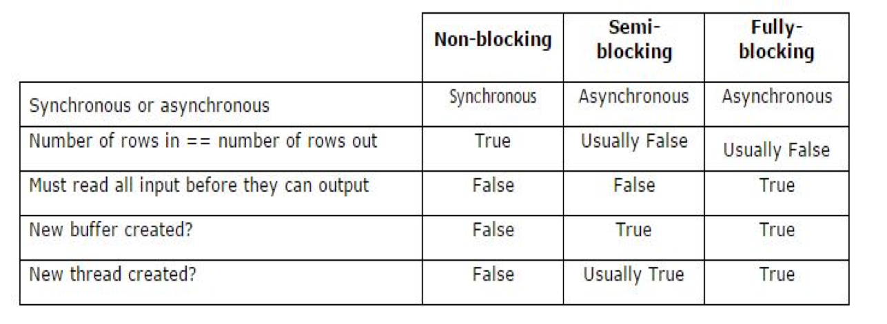
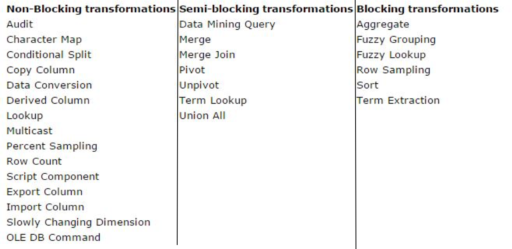
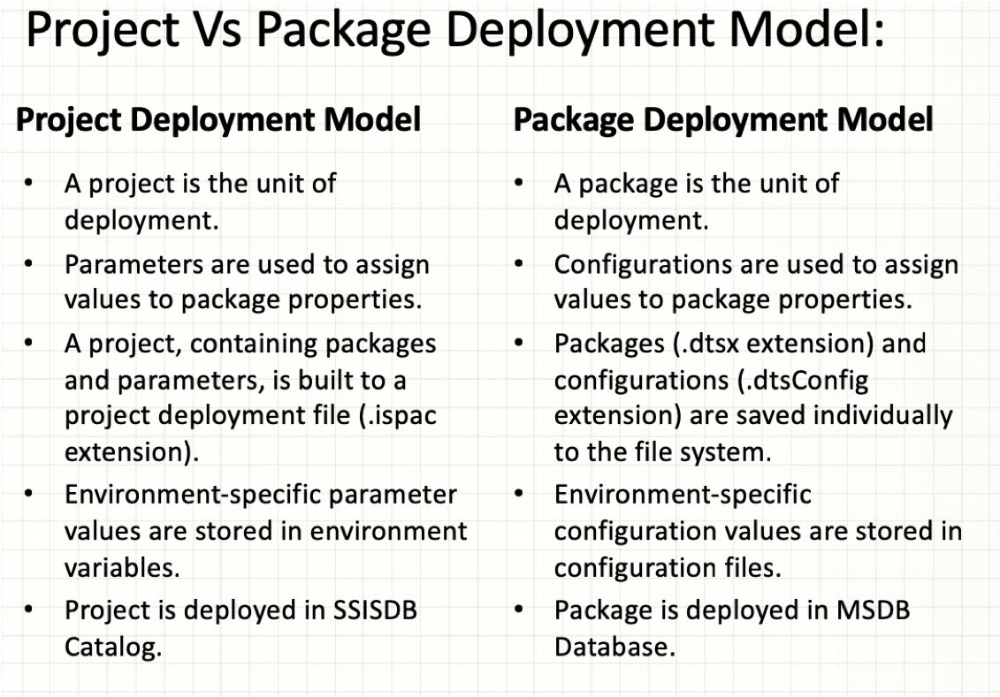

[TOC]
Why we need SSIS
Design, implement and manage complex & high performance Data Integration (ETL) applications
1. ETL
2. DB maintenaince
3. Processing ssis objects

# SSIS
## Scenarios
- Moving data between system
- Loading data warahouses/Data Marts
- Cleaning, formatting, or Standardizing data
- Identifying, Capturing and processing data changes

## XML Framework
- SSIS package and other object definitions are stored in standard XML format
- Extension of package is ".DTSX" data transformation services and XML
- We can edit the raw XML for an object or to use a graphical designer with ralted menus, toolbars, and dialog boxes

# Package

## Common Properties
- DelayValidation 
When we have need to create and use temp table in task, and during the validaton the temp table do not exists and thus may give an error. In this case we can use "DelayValidatin" to delay the validation during running and thus avoid this problem

## Event Handlers
- DisableEventHandles
- FailPackageOnFailure  
Whether the packages failes if an error occurs in the container
- FailParentOnFailure  
Whether the parent fails if an error occurs in the container
- ForeceExecutionResult  
For test and debug. Default "None", can set "Success", "Failure", "Completion"
- MaximumErrorCount  
The maximun number of errors that can occur before a container stops running. Default value "1"

## Transaction
- ACID
	- Atomicity
	- Consistency
	- Isolation
	- Durability

- Scope level
	- Package level
	- Container level
	- Task level
- Transactions properties
	- **"IsolationLevel"**
	Values are "Unspecified", "Chaos", "ReadUncommitted", "ReadCommitted", "RepeatableRead", "Serializable", "Snapshot". **Default is "Serializable"**
	- **"TransactionOption"**  
	The transactional participation of the container; Values "NotSupported", "Supported", "Required"; Default "Supported
		- NotSupported
		- Supported
		- Required

- Can be nested

## Checkpoints (XML file)
**Restart package from point of failure** in the package control flow instead of rerunning the package from the beginning of its control flow
- Usage
	- Avoid repeating downloading and uploading like FTP task
	- Avoid repeating loading of large amounts of data like build insert
	- Avoid repeating the aggregation of values 
- Properties
	- Package properties
		- **"CheckpointFileName"** (name of the check point file When the package finishes, this file is deleted, **XML file** )
		- **"CheckpointUsage"**
			- Never  (do not try to find checkpoint)
			Cannot restared 
			- IfExists (If have check point run; if not run from beginning)
			- Alwayes (If cannot file check point files will fails the package)
		- **"SaveCheckpoints"**  (Boolean, set true to save checkpoint)
	- ForceExecutionResult (both package and task)
	Force the execution to "Failure" and thus can test checkpoint 

- Steps
	- In package properties
	1. package properties "SaveCheckpoints" to TRUE
	2. use "CheckpointFileName" to specify address and name of checkpointfile
	3. Set "CheckpointUsage" to "IfExits" (reconmandded) or Always
	- in control flow level
	4. Config task or containers properties and set "FailPackageOnFailure" to TRUE (only can be appied in control flow level on executables)
	5. (Optional), set task properties "ForceExecutionResult" to "Failure" can test the checkpoint

## Logging
Use log providers to implement logging in packages, containers, and tasks

- Usage
	- Optimizing package performance
	- Troubleshooting 
	- Auditing specific operations performed by a package

- Logging Types
### SSIS logging (build-in)
- Steps of logging
	1. "SSIS" -\> "Logging"
	2. Select a ["provider type"](#provider) and click "Add", In "Configuration" select the connection manager of logging file
	3. Repeat 2 if have more than one provider
	4. (Optional) select package-level check box, select the logs to use for package-level logging and select ["Events"](#events) and in "Details"
	5. (Optional) in "Advanced" in "Details", select the [log schema](#logschema) to log 
	6. (Optional) in control flow level, choose **LoggingMode** properties choose one of the values "UseParentSetting", "Enabled", "Disabled" 

- Logging customization  
EX. Log computer and operator names for "PreExecute" event, log all available information for the "Error" event

	- **"LoggingMode"** (properties of control flow level such as container, task) 
	A value that specified the logging behavior of the package
		- Disabled
		- Enabled
		- UseParentSetting (default)
	<a name='provider'></a>

	- Providers
		- Text file (file connection manager)
		- XML file  (file connection manager)
		- SQL Server profiler (file connection manager)
		- SQL Server (OLEDB connection manager)
		- Windows event log (SSIS automatically creates the log)
		> Version of providers
		>- Before 2012, SSIS only have one type of logging -- SSIS built in logging (Flat file, XML file, SQL server table, SQL profiler (trace file), windows log provider)
		>- From 2012 onwards SSIS introduced SSISDB catalog, and after deploying packages in SSISDB catalog, we can also log the information for run time of the packages in logging called **SSISDB Catalog logging**

		<a name='logschema'></a>
		- Log schema 
			- Computer (name of computer)
			- Operator (identity of user who launched the package)
			- SourceName (name of the container or task in which the log event occurred)
			- SourceID (unique identifier of the package)
			- ExecutionID (GUID of the package execution instance
			- MessageText ( message associated with the log entry)
			- DataBytes (a byte array specific to the log entry)

			- StartTime (not in details tab of Configure SSIS logs dialog box)
			- EndTime(not in details tab of Configure SSIS logs dialog box)
			- DataCode(not in details tab of Configure SSIS logs dialog box)

		<a name='events'></a>
		- Log entries
			- OnError
			- OnExecStatusChanged
			- OnInformation
			- OnPostExecute
			- OnPreExecute
			- OnPreValidate
			- OnProgress
			- OnQueryCancel
			- OnTaskFail
			- OnVariableValueChanged
			- OnWarning
			- PiplineComponentTime
			- Diagnostic
			- DiagnosticEx

### Custom Logging by workflow at event handlers
- Execute SQL task
- Script Task

### (server level) SSIS catalog logging 
- LggingMode
	- None – No events will be captured.
	- Basic – All events are captured except OnProgress and OnCustomEvent.
	- Performance – OnError event is captured. Component phase information is captured
	- Verbose - All events are captured. Component phase and Component data statistics information is captured.
		1. All the errors and warnings
		2. Infromation about execution time for tasks
		3. Execution time for the transformations also

- SSIS catalog logging view
	- Catalog.event\_messages; All the captured logs are stored in this view
	- Catalog.event\_message\_context; More information about OnError event 

# Control Flow
## Containers
Provide structure in packages
### Foreach Loop Container
Run a control flow **repeatly by using an enumerator**

- Enumerators
	- Foreach ADO enumerator  
	Enumerate rows in tables
	- Foreach ADO.NET schema rowset enumrator  
	Enumerate the schema information about a data source ( list of tables if a database)
	- Foreach File enumerator  
	Enumerate files in a folder; Order of files cannot be specificed; Can traverse subfolders
	- Foreach from variable enumerator  
	Enumerate the enumerable object that a specified variable contains; Array, ADO.NET DataTable, Integration services enumerator; EX. Array that contains the name of servers
	- Foreach Item enumerator  
	Enumerate items that are collections EX. Name of executables and working directories that an Execute process task uses  
	Make collection of our choice  
	List of tables  
	List of schemas  
	List of packages  
	List of views
	- Foreach Nodelist enumerator  
	Enumerate the result set of an XML path Language (XPath) expression
	- Foreach SMO enumerate
	SQL server Management Objectcs (SML) objects, E.g. a list of views in the SQL Server database
	- Foreach HDFS files
	- Foreach Azure Blob enumerator
	- Foreach ADLS files
	Azure Data LakeSore
	- Foreach Data Lake Storage Gen2 File Enumerator

### For Loop Container
Runs a control flow **repeatedly by testing a condition**; Add iteration to a control flow 
	- Init Expression
	- EvalExpression
	- AssignExpression
	- Expression (Usage expresion to add iteration)

- Difference between for loop and for each loop
1. For loop use condition; for each loop base enumerate
2. We can no how many times the container will run; we cannot know how many times in advance.

### Sequence Container
**Groups tasks and containers** into control flow that are **subset** of the packages control flow
- Benefits
	- Disableing groups tasks to focues package debugging on one subset of the package control flow
	- Managing properties on multiple tasks in one location by setting properties on a sequence container instead of on the individual task
	- Provding scope for variables that a group of related task and container use
	- Grouping many tasks so you can more easily managed them by collapsing and expanding the sequence container
### Task Host Container
Encapsulates a single task  Extends the use of variables and event handlers to the task level

## Tasks
Provide functionality, define units of work that performed in a package control flow

### Bulk Insert Task
Efficient way to copy large amounts of data into a SQL Server table or view (EX. from tab-delimited format to SQL server table)
- Characters
	- Only from text file to SQL server table or view
	- Will append to the existing data of the destination table or view
	- Can use a format file ( created by the bcp utility, XML, nonXML format files)
	- Without batch size (batch size 0) is treated as one transaction; with batch size, each batch is a transaction
- Properties
	- Actions of destination table (check constraints, enable identity insert, keep nulls, fire triggers, lock the table)
	- batch size, first and last row, number of insert errors that can occure before the task stops inserting rows, name of columns

- Disadvantages
	- Cannot perform transformations between data source and destination table or view
	- Can only from text file into a SQL Server table or view. For other database, need to export as text file and then use bulk insert
	- Only members of the sysadmin fixed server role can run a package that contains a bulk insert task

### Data profiling Task and Viewer
Check data qulity of data in SQL server; collection of aggredate statistics about data 
- Usage
	- Number of rows
	- Number and sitribution of distinct values
	- Number of null or missing values
	- Strength of the functional dependency of (State column on the Zip)

- Options
	- Candidate key profile request options
	- Column length Profile Request Options
	- Column Null Ratio Profile Request Options
	- Column pattern Profile Request Options
	- Column statistic Profile Request Options
	- Column value Profile Request Options
	- Functional Dependency Profile Request Options
	- Value inclusion Profile Request Options (overlap in the values between two columns)

- Use Tempdb, use ADO.NET, written to file or a ssis variable in XML format
- convients configuration options
	- Wildcard columns
	- Quick profile

### \*Execute Package Task
Let packages run other packages as part of workflow
- Advantages
	- Modularity. Break down complex package workflow into multiple packages which are easier to read, test, and maintain
	- Resuability.  Reusing parts of packages. EX. Build data extraction module that can be called from different packages
	- Grouping work unit
	- Controll package security.Ex. grant an author access to only the relevant packages

- properties and settings
	- protection level
	- project reference (use package from same project)
	- external reference (use package from other projects)
	- **ExecuteOutOfProcess**  
	This property we can use for optimization purpose of exectepackagetask. by default both parent and chld package run in same memory space and this will down the performance if packages have to perform some heavy or lengthy activity. If we allocate seprate memory space for child process, both parent and child will run in their own memory space so this will enhance performance and will take less time

- Config
	- ReferenceType
		- Project Reference
		- External Reference
	- PackageNameFromProjectReference
	- Parameter bindings
	map a parameter or variable to a child package parameter

### Execute process Task
Runs an application or batch files as part of SQL server EX. expand a compressed text file, run custom visual basic application to generates a daily reports
- Config 
	- Executable 
	- Arguments
	- WorkingDirectory
	- StandardInputVariable
	- StandardOutputVariable
	- StandardErrorVariable


### \*Execute SQL task
Runs single or multiple SQL statements sequentially or stored procedures from a package 
- Usage
	- Truncate a table or view in preparation for inserting data
	- Creat, alter, or drop database objects such as table and vies
	- Re-create fact and dimension tables before loading data into them
	- Run store procedures
	- Save the rowset returned

- Support connection manager
	- Excel
	- OLEDB
	- ODBC
	- ADO and ADO.NET
	- SQLMOBILE

- config properties
	- Connection
	- SQL statement (can have multiple statements and batches seperated by GO
	- ResultSet
		- None (insert)
		- Single row (single row select, procedure always return single row)
		- Full result set
		- XML
	- Timeout (defult 0 means infinite time; the maximun number of seconds the task will run before timing out). The number of seconds before a command times out. A value of 0 indicates an infinite time-out. TimeOut = 30 means if within 30 second, and the task still not performed, time out
	- QueryIsStoredProcedure (only when use ADO connection)
	- BypassPreapre (only for OLEDB)
	Whether prepares the SQL statement before running it; reduce the parsing and compiling overhead asscociated with repeatedly executing a SQL statements

### Execute T-SQL statement task
- Difference
	- Execute T-SQL statement task supports only ADO.NET
	- Execute T-SQL statement task cannot be used fore 
		- Running parameterized queires
		- Saving the qeury results to varialbes
		- Using property expressions
	- Execute T-SQL statement task only support the transac-SQL bersion of SQL language
	- Execute T-SQL statement task take less memory, parse time (SQL compatable with other SQL like Excel, other database, parsing is a translation from SQL to all other compatable language; T-SQL is only for T-SQL and and do not need to translation), and CPU than Execute SQL task do
### File System Task
Performs opertions on files and directories in the file system
- Properties
	- Copy, create, delete, move
	- file, directory
	- IsDestinationPathVariable
	- IsSourcePathVarable

### FTP task
Downloads and uploads data files and manages directories on servers

### SFTP task
Send or receive files using secure connection

### Script task
Provides code to perform functions that are not available in the build-in task and transformations that SSIS provides
- Usage
	- Access data (JSON)
	- Create package-specified performance counter
	- Iddentify whether specified files are empty or not

### Send Mail Task
Sends e-mail message in plain text format (EX. nofity a DB administrator about the sucess or failure of the backup database task)

- config
	- message text (only text without format)
	- subject line
	- priority level of message
	- Recipients To, Cc,
	- Include attachments
	- SMTP connection manager 

	- procedence (importance of email)

<a name='precedence'></a>
## Precedence Constraints
Link executables, containers, and tasks in packages in a control flow, and specify conditions that determine whether executables run
Executables (For loop, foreach loop, sequence container; task; an event handler)
- Evaluation Operation
	- Constrain
	- Expression  
	Give an expression to determine the whether go next excutables. E.g. @x >== @z
	- Expression and Constraint
	E.g. Success and @x >== @y
	- Expression or Constraint
- Constraint Value
	- Success
	- Failure
	- Completion
- Multiple constraints
	- Logical AND (all true)
	- Logical OR (one true)
Connect the executables, containers and tast into an ordered control flow


# Data Flow Task
## Sources
### OLEDB source
OLEDB (Object Linking and Embedding Database)

- Suppport data database
	- MS Access
	- SQL Server
	- Oracle (not for some datatype such as BLOB, CLOB, NCLOB, BFILE, UROWID)
	- IBM DB2, MS OLEDB DB2 do not support using an SQL command

- Access mode
	- table or view
	- table or view from variable
	- SQL statement
		- SELECT statement
		- EXEC statement
		- Parameterized SQL statement
		- Locate the file of query text

	- SQL statement from variable

### ADO.NET source
- Support relational database and nonrelational database
- Data access mode
	- Table or view
	- SQL command
- Performance is worse than OLEDB source
### Excel source
- Issues of excel file:
	1. "32-bit drivers" in "64-bit Environment" excel driver is 32-bit driver. 
	Solution: run package in 32 bit mode; project properties, set "Run64BitRuntime" to "False" and select "Use32bitRuntime"
	2. Hidden data  
	Solution: before running package ensure Hidden columns in excel sheet are accessible (not necessary to make it visible)
	3. Incorrect Datatype  
	Dataset depending on first 8 rows data type decided in excel  
	Solution: under "Regedit"(win+r) change "TypeGuessGows" 8 ->0
	4. Mixed data type  
	mixed data type like numbers, dates, strings  
	Solution: "IMEX=1" add property to connection manager; with this setting, the driver will read  "intermixed" data columns as text

### ODBC source
- load mode
	- Row by row
	- Batch
- Acess mode
	- Table
	- SQL command

### Row file source
The Raw File source reads raw data from a file. Because the representation of the data is native to the source, the data requires **no translation and almost no parsing**. This means that the Raw File source can read data **more quickly** than other sources such as the Flat File and the OLE DB sources.
- Acess mode
	- Name of the file
	- File name from variable

- Write option
	- Create alway
	- create once
	- append
	- truncate and append

- Do not need any connection

## Destination adapters
### SQL server compact destination
- Load data to SQL server compact database
- use SQL server compact connection manager
- have one input and does not support and error output
- SQL server compact 4.0 dose not support SSIS
- SQL server compact 4.0 does not support SQL server management studio
### SQL server destination
- Bulk load data
- use OLEDB connection manager
- cannot connnect to a remote server
- use fast load
- one input and dose not support error output
- Use for loading data into SQL server

### OLEDB destination

- data access modes
	- table or view
	- table or view - Fast load  
	- Table name or view name variable
	- Table name or view name variable - fast load
	- SQL command

- Common options
	- Table lock (default TRUE)  
	Without this, the SSIS will lock row by row which is very unefficient, with this on will lock whole table
	- check constraints
	- Rows per batch
- Fast load options
	- Keep identity
	- Keep nulls
	- Maximun insert commit size  
		Default 0 for all data
- Issues
	- For all string data types (VARCHAR, CHAR, NVARCHAR) Fast load will load part of data if destination column has shorter length and will not give an error (normal mode will give an error)

### ADO.NET destination

- Access Mode
	- Table or view


## Transformation
### Row transformation
#### Character map
- Uppercase or lowercase of string data
- new column or in place
- One input, one output, one error output
#### Copy column
- Create one or more copy of column
- One input, one output
#### Data conversion
- Data conversion
- Change the data type ( including length of string and precision and scale of numeric
- Code page
- One input, one output, one error output
- **Can only create a new column (cannot inplace)**
#### Derived Columns
- Create new columns values by applying expresions (function, variables, opertors)
- In place or new column
- One input, one output, one error output
- Usage
	- Concatenate data from different columns
	- Extract characters
	- Apply mathematical functions to numeric data
	- Compare input columns and variables
	- Extracnt parts of datatime value
#### OLEDB command

### Split and Join transformations
#### Conditional split 
	- Route data rows to different outputs depending on the expressions
	- Config
		- expression
		- Order which the conditions are evaluated
		- Default output
	- One input, one or more outputs and one error output

#### Multicast
	- Distributes its input to one or more outputs
	- One input multiple outputs
#### Union All
	- Comine multiple inputs into one output
	- Inputs are added to the transformation output one after the other )no reordering of row occrus)
	- At least one input must be mapped to each output columns
	- Metadata of the columns must match
	- Columns that are not mapped will be setted to null values in output
	- Multiple inputs and one output
	
#### Merge 
- Combine two **sorted** dataset into a single dataset based on values in key columns
- [Two methods to sort data](#sortdata) 
- Inputs have matching metadata
- Usage
	- Merge data from two data sources
	- Create complex dataset by nesting Merge transformations
	- Remerger rows after correcting errors in the data

- Two inputs and one output


#### Merge Join
- Combine two sorted dataset into a single dataset by using FULL, LEFT or INNER join
- joining columns have matching metadata
- config
	- type of join: FULL, LEFT, INNER
	- Columns used to join
	- whether handles null values as eqaul to other nulls
	<a name= 'sortdata'></a>
	- Two methods to sort 
		1. Sort tranformation
		2. Sort in provider (recommand, better performance because sort is full blocking, sorting in provider is sort in SQL server which performance is much higher)
			1. Use SQL command with ORDER BY 
			2. Advance of scource--Input and output properties-- Source output -- IsSorted True; 
			3. Sortkeyposition(Advance, input and output properties, output columns, choose column) do define order, posive for ascending, negtive for descending. If if sort on one column, EX -1, if two columns firts ascending, second descending, +1, -1

#### \*Lookup
Compare input and reference

- Usage
	- Validate data between OLTP and OLAP for checking whether data is rpesent or not (whether all data load to OLAP system succuessfully)
	- For lookup, when reference data have duplicate (OLAP), look up will not consider thoose duplicate. In this part, the performance of look up is better

- Components
	- Source (Input can be a Flat file, table or  etc)
	- Reference dataset
		- table or view (OLEDB connection manager)
		- cache file (cache connection manager, **.caw** , except sql server table, other data source like XML, flat file, Excel, have to use cache transform and use cache connection manager to be a reference data)
			- Only one cache transform can write data to the samecache connection manager
		
- Datatype
	All datatype except DT\_R4, DT\_R8, DT\_TEXT, DT\_NTEXT, DT\_IMAGE
- equal join
	- No matching entry
	- Matching entry
- Options
	- Cache modes
	- **Full** (best performanc)  
	When the reference table can be totally load to buffer
	- **Partial**  
	When we cannot use full cache, and there are duplicates in the look up input column. For partial cache, the match records will saved in cache. For the senerio that data for source table will repeat. If we cannot use full cache, and there are duplicates in resource, do partial cache
	- **No cache**
	Cannot use full, and input do not have duplicates. The no cache setting requires row-by-row processing of all of the data in the pipeline.
	- Usage
		- Comparison of two dataset
		- Used in ETL strategy for performing incremental load ???

	- two input (input, reference), 3 output(match, no match, error)
#### Cache transform
The Cache Transform transformation generates a reference dataset for the Lookup Transformation by writing data from a connected data source in the data flow to a Cache connection manager.
- Why we want to save cache
	- SQL is expensive, when we use SQL, they need to check authentication
	- Reuse
	- For source except sql server table, other sources such as flat file, Excel, XML file, have to be transformed to cache and then be used as reference dataset

- configs
	- use file cache
	- Refresh metadata
	- Index Position
- In a package, only one cache transformation can be used
- When the cache outdated and want to update, return and use "Refresh metadata"

### Rowset transformation
#### Aggregate
- Operations
	- Group by
	- Using aggregate we can calculate SUM,AVG,COUNT and COUNT DISTINCT of a column or columns. 
	- The comparion options of the aggregation
- Handles null values as SSMS
- **IsBig** property use to handle big(like more than 4 billion) or high-precision numbers  
Advanced editor -- Input and Output Propeties -- Aggregate output1 (many other name) -- TotalSalary (Other specificy operation) -- Custom Properties -- Isbig 1
- how to improve performance
	- Set "Keys" or "keyScale" properites when performing a group by operation
		- Key scale( Low-Medium-High )
			- Low 500,000
			- Medium 5,000,000
			- Hight 25,000,000
	- Number of keys (number of keys will overwrite key scale)
	- Set "CountDistinctKeys" or "CountDistinctScale" while performing distinct count operation
		- Count distinct Scale:(distinct value in groups) Approximate number of unique values aggregation can write
		- Count distinct keys: Exact number of distinct values aggregation can write
		
- One input and one or more outputs

#### Sort
- Positive number means ascending and negative number means descending
- Sorts and use multiple columns, column with lowest number sort first
- One input and one output
- remove duplicate rows
- One input one output

### Business intelligence transformation
#### Slowly Changing Dimension (SCD)
- Stpes
	1. choose destination table and choose "business key"
	2. choose columns to be tracked and the change type (Fixed attribute type 0, Changing Attribute Type 1, Historical Attribute Type 2
	3. (For historical) choose flag methods or start and end dates 
	4. indicate reffered columns
	5. Automatically create data flow for SCD based on look up and merge

- For date, by default use DateTime datatype (do not miss time information)
- Is SCD transformation in SSIS have every good profermance? No.
	- SCD is a row by row have bed profermance
	- Have problem in Type2
	- How to solve? Build procedure to apply this logic
#### \*Fuzzy lookup
The Fuzzy Lookup transformation performs data cleaning tasks such as standardizing data, correcting data, and providing missing values.
- ETI (Error Tolerence index) ???

- Reference table only support OLEDB connection, **SQL server database**

- Datatype: Only use for DT\_WSTR and DT\_STR

- Look up type
	- Fuzzy
	- Exact
- Additional columns  
	- **\_Similarity**, a column that describes the similarity between values in the input and reference columns.
	- **\_Confidence**, a column that describes the quality of the match.
- index
	- GenerateAndMaintainNewIndex	Create a new index, save it, and maintain it. The transformation installs triggers on the reference table to keep the reference table and index table synchronized.
	- GenerateAndPersistNewIndex	Create a new index and save it, but do not maintain it.
	- GenerateNewIndex	Create a new index, but do not save it.
	- ReuseExistingIndex	Reuse an existing index.
- OLEDB 
- Properties
	- **Warmcaches** (When TRUE, the index and reference table are loaded into memory before the transformation does its work)
	- **Exhaustive** ( if set the Exhaustie property to TRUE means transformation 
		- False (when find the first record, stop)
		- True (when referenced table is not every big)
	- **MaxMemoryUsage** (specifies the maximum amount of memoery (in MB) that instance of Fuzzy lookup/grouping will use. Default is 0 means memory is dynamically adjust
	
- Custermize/ advanced settings
	- **Maximun number of matches to output per lookup**
	- **Similarity threshold**
	- **Token delimiters**
#### Fuzzy group
Performs data cleaning tasks by identifying rows of data that are likely to be duplicates and selecting a canonical(most duplicates) row of data to use in standardizing the data
- Do not have reference table (do not have standard correct item to compaire)
- Cluster and choose the one with most duplicate to be correct

- Return columns
	- **\_key\_in** ( a column that uniquely identifies each row)
	- **\_key\_out** ( a column that identifies a group of duplicate rows. rows with same value in \_key\_out are part of the same group
	- **\_socre** (from 0-1 indicates the similarity of the input row)

- Properties
	- **Exhaustive** ( if set the Exhaustie property to TRUE means transformation 
	- **MaxMemoryUsage** (specifies the maximum amount of memoery (in MB) that instance of Fuzzy lookup/grouping will use. Default is 0 means memory is dynamically adjust
	
- Custermize/ advanced settings
	- **Similarity threshold**
	- **Token delimiters**
- Properties

### Auditing transformation
#### Audit ???
The Audit transformation enables the data flow in a package to include data about the environment in which the package runs. For example, the name of the package, computer, and operator can be added to the data flow. Microsoft SQL Server Integration Services includes system variables that provide this information.

- System variables
	- ExecutionInstanceGUID
	- PackageID
	- PackageName
	- VersionID
	- ExecutionStartTime
	- MachineName
	- UserName
	- TaskName
	- TaskI

- Row count
	- count the number of rows and pass through a data flow and stores the final count in a **existing variable**   
	- Variable must be scope of Data flow task
	- One input and one output


### Synchronous (Non-blokcing transformations)
- pass one row at a time
- to process a given row, do not need information about other rows in the data set
- In actual implementation, rows are grouped and each row is processed seperately
- Synchronous (non-blocking) transformations always offer the highest performance.
- Destination are synchronous
- Use same buffer
- Number of input = Number of output

### Asynchronous (semi-blocking and full-blocking transformation)
- Does not process rows independently in the dataset
- Rather than output rows as they are processed, the transformation must output data asynchronously, or at a different time
- Record counts usually change from input to output
- Must create a new buffer upon the output of the transformation
- Generally poorer performance than synchronous transformation
- Typically a Semi-Blocking or Blocking Transformation
- scenarios of asynchronous transformation:
	- The component has to acquire multiple buffers of data before it can perform its processing. E.g.Sort transformation, where the component has to process the complete set of rows in a single operation.
	- The component has to combine rows from multiple inputs. E.g.Merge transformation, where the component has to examine multiple rows from each input and then merge them in sorted order.
	- Output of an asynchronous component uses new buffers (Data from different and more than one data sources)
	- Number of output may different from number of input
	- Semi-Blocking Asynchronous Transformations require a subset of the data to be collected before they can be sent to the destination(s). The shape of the data can change. A subtotal or sampling of data may be extracted from the source(s).
	- Fully Blocking Asynchronous Transformations are the slowest transformations. They require all the data to be pulled from the source(s) before they can be sent to the destination(s). All source data must be loaded into memory first ! As much as we should try to avoid these, they can sometimes still be required, such as sorting data pulled from a flat-file source.
	- If there is more data than the memory available, it will use the %TEMP% directory to cache some of the data. If you want to use a different location, you can set the BufferTempStoragePath property of the Data Flow Task to point to a different folder location. (Full blocking)
	- All the source adaptors are asynchronous, as they create one output and one error output buffer

- Thread
 	Multithreading is an activity of OS
	Behind every activity, a thread is allocated by operating system which allows to perform parallaly
	Settings: set EngineThread 


- Cache
The full cache mode setting is the default cache mode selection in the SSIS lookup transformation. Like the name implies, full cache mode will cause the lookup transformation to retrieve and store in SSIS cache the entire set of data from the specified lookup location. As a result, the data flow in which the lookup transformation resides will not start processing any data buffers until all of the rows from the lookup query have been cached in SSIS.

The most commonly used cache mode is the full cache setting, and for good reason. The full cache setting has the most practical applications, and should be considered the go-to cache setting when dealing with an untested set of data. With a moderately sized set of reference data, a lookup transformation using full cache mode usually performs well. Full cache mode does not require multiple round trips to the database, since the entire reference result set is cached prior to data flow execution.

- Whether create new buffer
- Whether number of rows input equals to Number of row out
- Whether read all input to buffer
 

- Transformation mode
 

#### How to received multiple values from SQL task?
1. Use Object data type variable
2. set full result set
3. Set result name to 0


<a name= 'error'></a>
# Error Handling

## At control flow level
1. [Event handler](#eventhandler) (Recommended)
	- Why Event handler better than  procedentce
		1. More function 
		2. can log error at On error; Precedence have to wait the task fail and don't know the previous error
		3. Better profermance; Precedence have wo valid every time, event handler works like trigger and thus do not need to validate every time
	- Properties
		- Package/control flow properties
			- **"MaximunErrorCount"**
			- **"FailParentOnFailure** 
			- **"FailPackageOnFailure** 

	- **"Propagate"** (event handler system variable)  
	Indicates whether the event is propagated to a higher level evet handler
2. On Failure [precedence](#precedence)

## At data flow level
3. Error data pipline
	- Ignore failure
	- redirect row (redicrect error data to error output)
	- fail component (default)

<a name='eventhandler'></a>
# Event Handlers
At run time, executables(packages, containers, tasks) raise events. Create event handlers for events to **extend package functionality** and make packages easier to manage at run time
- Usage
	- [Error handling](#error)
	- Clean up temporary data storage when a package or task finishes running
	- Retrieve system information to access resource availability before a package runs
	- Refresh data in a table when a lookup in a reference table failes
	- Send e-mail message when an error or a warning occurs or when a task fails
- Run-time envents
	- **OnError (events raised by an executable when error occurs)**
	- OnExecStatusChanges 
	- OnInformation 
	- OnPostExecute 
	- OnPreExecute
	- OnPreValidate 
	- OnProgress
	- OnQueryCancel
	- **OnTaskFailed (when a task fails)**
	- OnVariableValueChanged
	- OnWarning
	- Properties
		- **"Propagate"** 

	

# SSIS Catalog
## Folders
## Environment
## References
- Relative
- Absolute

- Properties
	- Only 1 instance in one system
	- Names 
		- DTS (Data transformation services, 2000
		- SSIS 2005-2017
	- Tools
		- BIDs 2000-2008
		- SSDT 2012

Relational engin (estimate plan)
Store engin (execution plan)


- Command line utilieteis
- SSIS Designer (Visual studio)
- SSIS wizards
Constrol flow (can exists alone)
	- Enumerator (loop)
	- Connection managers
	- Event handlers  (handling certain events )
	- Log providers (log running files)
	- Variables and expressons
	Case sensitive
		- Syster variable
		- User defined variable
		- Name space
		UInt (unsigned int (do not have negative))


data flow (subset of control flow)
Only place in SSIS to implement business logic (change data)
	- Source
	- Transformation
	- Destination
	- Data pipelines (arror --> )(data path)
Executable
	- PKG
	- container
	- Task
# SSIS Catalog
## Folders
## Environment
## References
- Relative
- Absolute

- Properties
	- Only 1 instance in one system
	- Names 
		- DTS (Data transformation services, 2000
		- SSIS 2005-2017
	- Tools
		- BIDs 2000-2008
		- SSDT 2012

Relational engin (estimate plan)
Store engin (execution plan)


- Command line utilieteis
- SSIS Designer (Visual studio)
- SSIS wizards
Constrol flow (can exists alone)
	- Enumerator (loop)
	- Connection managers
	- Event handlers  (handling certain events )
	- Log providers (log running files)
	- Variables and expressons
	Case sensitive
		- Syster variable
		- User defined variable
		- Name space
		UInt (unsigned int (do not have negative))


data flow (subset of control flow)
Only place in SSIS to implement business logic (change data)
	- Source
	- Transformation
	- Destination
	- Data pipelines (arror --> )(data path)
Executable
	- PKG
	- container
	- Task

### Precedense constraint

1. Provider
connect between source and SSIS system; Go to the source and read data to SSIS
2. Connection manager
The server and database is connnected
3. Source adapter
What kinds of column data is used


- OLEDB (object linking and Embedding) 
- ODBC (open Database Connectivity)
	- Old, cannot support many functions
- ADO (Active x data object)
- ADO.Net (2001)  
Provider to connect to many more sources

- Settings of OLEDB (object linking and Embedding) destination

- Flat file
	{CR}{LF}
	Carriage return (Return \r)
	Line feed  (new line \n)
	If not define the data type, will always to 50 length
	If do not have header, set header in (Advanced)

	If the delimiter is in the data, and may be mix up. How to solve?
		- Text qualifier ", "col1","col2"
		- Use another delimiter (in column)
		- Use fixed width


- Procedure
	SQL commond set Paremeters input the variable of parameter to SSIS parameter

- load fast default do not fire trigger, need to set advanced settings to component properties-- FastLoadOptions -- add 'FIRE\_TRIGGERS'

		


		
# Deployment
## Project Doployment Model

- Features of Project deployment Model
	- Parameters  
	A parameter specifies the data that will be used by a package
	- Environments  
	A environment is a container of variables that can be referenced by SSIS projects. Each project can have multiple environment references. E.g. name of environment named "Dev", "test", and "Production"
	- Environment variables  
	An environment variable defines a literal value that can be assigned to a parameter during package execution
	- SSISDB catalog  
	All SSIS objects are stored and managed on an instance of SQL Server in database referred to as the SSISDB catalog. The catalog allows you to **use folders to organize your projects and environments**. Each instance of SQL Server can have one catalog
	- Catalog stored procedures and views. A large number of stored procedures and views can be used to manage SSIS objects in catalog.

- Methods of Project deployment  
	1. Project deployment file (.ispac file which includes only the essential information about the packages and parameters in the project
	2. Deploy projects to SSIS server
		-steps
		1. create an SSISDB catalog
		2. Make sure project is project deployment model. If not, convert
	3. Deploy projects from SSIS catelog to other place
	4. call catalog.deploy\_project
	```sql
	DECLARE @ProjectBinary as varbinary(max)  
	DECLARE @operation_id as bigint  
	Set @ProjectBinary = (SELECT * FROM OPENROWSET(BULK 'C:\MyProjects\ SSISPackage_ProjectDeployment.ispac', SINGLE_BLOB) as BinaryData)  

	Exec catalog.deploy_project @folder_name = 'SSIS Packages', @project_name = 'DeployViaStoredProc_SSIS', @Project_Stream = @ProjectBinary, @operation_id = @operation_id out
		```

	

## Package Deployment Model
**Incremental package** deployment feature introduced in SQL Server **2016** SSIS. 
- Deploy one or more pakcages to an existing or new project without deploying the whole project

- Methods of packages deployment
	- use "isdeploymentwizard.ext" 
		1. run "isdeploymentwizard.ext" from %ProgramFiles%\Microsoft SQL Server\130\DTS\Binn. On 64-bit computers, there is also a 32-bit version of the tool in %ProgramFiles(x86)%\Microsoft SQL Server\130\DTS\Binn
		2. on the select source page, switch to package deployment model. Then, select the folder that contains source packages and configure the packages.
		3. Complete the wizard

	- Using SQL Server Management Studio
		1. in SQL Server Management Studio, expand the SSIS catalog -\> SSISDB node 
		2. Right-click Projects folder, then click Deploy Projects
		3. On select source page, switch to Package deployment model. Then select folder that contains source packages and configure the packages
		4. Complete the wizard

	- Using SQL Server Data Tools (Visual Studio)
		1. In VS, with project open, select pakcage
		2. Right-click and select deploy package. The deployment wizard opens with the select packages configured as source packages
		3. Complete the wizard

	- Using deploy\_packages stored procedure  
		1. use [catalog].[deploy_packges]
		```sql
		[catalog].[deploy_packages]     [ @folder_name = ] folder_name,    [ @project_name = ] project_name,    [ @packages_table = ] packages_table,     [ @operation_id OUTPUT ] operation_id OUTPUT ]`  
		```
	- Using .dtsx file
	- Deploy packages using the Management Object Model APIS

# Configuration, Deployment and Security in Package Deployment Model
## Configuration
- Steps
	1. SSIS
	2. PackageConfiguration  
	3. Configuration Wizard 
	4. Configuration type
		- (multiple config) XML configuration file -\> Configuration file name -\> browse (by default in project; extension is ".dtsConfig)
		- (multiple config) SQL server -\> connection (database of configuration stored) -\> table name of config stored -> Configuration filter
		- Environment variable (work for only simple configurations)
		- Registry  
		a registry entry contains the configurations (many key information os OS, do not change if don't know)
		- Parent package variable
		Pass the value from parent package to child and the value need to be changed at runtime in production or testing system; If we wanto to pass the value from mster package to child package for parentpackage configuration, the name of variable must be **same** in both master and child ???; the configuration need to be added in child package

	6. Choose check boxes of the component and properties want do included in the 
	7. Will use the config in the run time
	
- Multiple Configuration
	- If have muptiple configuration, the last one will be apply
	- If we have multiple configuration and the last one config file missing, go with the next last configuration
	- If cannot find any configuration file we design, countinue without config

- Types of configuration 
	- XML configuration (one of the best way, automatically copy with project, low space)
	- Environment variable
	- Registry entry
	- Parent package variable
	- SQL server table

- Type2
	- Direct
	- Indirect  
	Use Environment to change the configuration file (XML, SQL, PPV)

		We should be using indirect configuration to make things more dynamic. Suppose if we have to change the location of .dtsconfig file in different server, it is better to use indirect option. If location of .dtsconfig file need not to be changed, it is better we can use direct configuration.

- Process of run package with configuration
	1. Execute package
	2. In pre execution, the package check whether this contain configuration or not
	3. If package contain configuration, it check the property values inside the configuration file, or table or environment variable or parent package variable
	4. The property values are replacing actual value at run time

- Usage/ benifit
	- Improve the portability of package
	- Make migration easier from development to a production environment
	- deploy packages to different servers
	- Make pacages more flexible
	

## Deoplyment
- Version
	before and included 2008/2008 R2 only have package deployment (the unit of deployment is package)
	Included and after 2012 have project deployment(the unit of deployment is project, default, can right click the project name in solution explorer)/ Package Depolyment 

- Types
	- Project Deployment model
	- Package deployment model
 

- Steps for package deployment
1. project property, change "createDeploymentUnit" to true
2. Build project, and a '.dtsx' file will created; a '.dtsconfig" file will also created if with configuration
3. Install
4. Run 

- When there is error, a **dump** file will be generated to help understand the problem of package that why package failed. The dump file also contain the variable and parameter value

- Types
	- Package delopyment
	Stored in MSDB
	- Project deployment (new, default)
	Stored in SSIS catalog

- Types 2
	- Pull depolyment (install packges in file system)
	- push depolyment (install packages into MSDB database of SSMS)
Two different Deployment model

- Steps of project deployment with project mode
	1. Create SSISDB catalog (skip if exists)
	2. (Optional) create package configurations using parameters
	3. Build SSIS project to create a project deployment file ".ispac"
	4. (between local)right click SSIS solution and choose deploy option
	4. (between different system)Copy the development folder created in bin to target and run 


- version
	- Up to SQL 2014, we can can onlhy deploy project as a single unit to SSISDB; 
	- From 2016 can deploy project or package to SSIDB catalog (when we add new package to project, we can deploy newly added package to SSIDB. And do not need to overwrite whole project)


- Steps in develop SSIS projects with package model
1. Develop SSIS projects base on simple data and SampleDW
2. Migrate the project to production server (maybe also have testing stage)
3. Configuration Solve the inconsistency properties between migration (Machine name, server name, data path, destination, connection, password)

- Environment 

	- Steps
	1. Create environment in SSIS catalog 
	2. Create new vairables in environment
	3. Add reference to package
		- Relative (reference environment in own project)
		- Absolute (reference environment from other project)
	4. Configuration the environment of package binding the variable and environment variable
	5. Execute with the environment used


Secure socket Layer (SSL)

## Project Security (before deployment)
- In project level and package level, the security level must be same (the password also have to be same)

- Security in SSISDB catalog on three level. Roles can be defined  on 3 level (right click open properties
	1. Folder
	2. Project 
	3. Environment
	- SSIS catalog (project) ???
		- public role
		- SSIS andministrators
- Project / package Encryption
	- **"PackagePassword"** 
	- **ProtectionLevel** 
		- Do not save sensitive
		- Encrypt sensitive with user key (login information of the user)
		- Encrypt sensitive with passward
		- Encrypt all with user key
		- Encrypt all with password
	- Steps
		1. **Package property** -\> "PackagePassword"
		2. **"ProtectionLevel"**, such as "EncryptAllWithPassword"
		3. Rebuild

- Variable securty properties
	- **"IncludeInDebugDump"** with TRUE will included in dump file and may declose sensitive informatons. "FALSE" will not included the varaible to dump; set this to FALSE if this is sensitive
	- Set vairable to **"Sensitive"**


- Digital Signing (some specical scenerio, report to other company, encrypt information before I want , ??? lock(hide) all information before I need
	SSIS -\> Digital Singing -/> Sign... -/> select Certificate

- Package roles (MSDB Database)  
Control users should read or write 

	- db\_dtsoperator (old)
	- db\_dtsItduer (old)
	- db\_dtsAdmin (old)

	- db\_ssisoperator (new) (read, write, modify, execute, iterate, import in their owen package)
	- db\_ssisItduer (new) (lowest, read, execute, iterate)
	- db\-ssisAdmin (new) (highest enventually everything on their an others packages)


# Mock
1. Execute SQL task
2. Execute package task
3. Control flow purpose


# ETL
Extraction, transformation, loading
- concepts
	- Extraction  
	Extract data from operational sources or archive systems
	- Transforming  
		- Cleaning (mapping NULL to 0, Male to 'M', misspellings)
		- Validation (validate address fields zip codes)
		- Filtering (selecting certain columns)
		- Joining data from multiple sources (lookup, merge)
		- Applying business rules (deriving new calculated values, sorting, generating aggregations, applying advance validation rules)
	- Loading  
	Load data into data warehouse, data mart, or data repository

- Types
	- Top Down  
	The client already has DW and have to create new mart from a business process from existing DW
	- Bottom Up
	Client do not have only OLTP system and need to create a OLAP system
	
- Components in ETL process
	- OLTP sources
		- Structured data (oracle, Access, DB2, SQL Server)
		- Unstructured data (flat file, excel)
	- Pre-Staging DB
		- Data profiling is done
		- Data mapping document is prepared
	- Staging DB
		- Data transformation takes place (cleaning, aggregation, validation)
	- Data Warehouse/ Data Mart
		- Data population takes place (inital and incremental load)

- Verification and validation
	- Data Validation    
	It is a process of ensuring that data loaded to DWH/DM (destination)is valid or according the data guidelines provided by business. **Data validation rules (from business requirements**)are used in data validation processes to ensure the validity of the data loaded. After data is loaded it should be meaningful and correct. Data integrity constraints can be used in data validation process. If the data validation is not correct it can impact the business decision making based on the data loaded. Data that should be validated includes dimension member completeness, base measure accuracy, and business calculations. Ex: Price of a product should be always greater than 0, discount percent should be between 0 and 100, out patient visits should happen in weekdays (M-F), phone numbers should have 10 digits (need more validation based on country code), ZIP code in US should be 5 digits or 9 digits. 
	- Data Verification    
	It is the process of checking copy of a delta (modified/inserted) loaded into pre-staging is exactly the **same as the source data** (OLTP) and complete. This is an important process as it ensures that the data loaded is exactly the same as the source. So this aids in proper data and complete data load for correct decision making. Ex: Assume there are 2 tables Claims Header and Claims Details maintaining Parent-Child relationship (1:M), when we load the data from child to Pre-Stage we need to make sure referenced Parent data should be retrieved too.

- Inital and Incremental Load
# Inital
(full load) load all the records fro the very first time

## Incremental load
Delta (difference) between target and source data is dumped at regular intervals
- Types
	- Checksum
	- CDC
	- Timestamp
	- Triggers
	- Joins
	- Merge
	- MD#2, MD#4, MD#5, own algorithms


### Checksum (return the hash code)

- checksum()
	- Support all data types except of text, ntext, image, XML, cursor ???
	- generate fix lenght number hash code (so will have collision)
	- checkum(null) will give error

- Other hash function
	- hashbytes()
```sql
SELECT CHECKSUM('AAA', 234)

SELECT CHECKSUM(\*)
SELECT CHECKSUM(NULL, '111') -- give an error
```

- Steps of incremental loading with checksum
	1. Create computed columns as Checksum() to track for delta operation
	2. Create tracking table with Business key and checksum
	3. For inital load, 
		- populate destination table for all records
		- and populate tracking table for business key and checksum values for all records
	4. For incremental load
		- Compare business key of tracking table with source talbe to find new business key to be inserted into destinationtable
		- For matching business key, compare checksum values to find the changes which need to be updated

- Pros
	- Fast and easy to implement
	- Good for small and mid size databases
- Cons
	- Probability of collision is high
	- Checksum will be different if order of column or expression is different for two checksum that are being compared
	- Some data types are not supported

### Timestamp
- Timestamp
Timestamp is a data type that exposes automatically generated, unique binary numbers within a database
	- size 8 bytes
	- Does not preserve a data or a time
	- When a row with timestamp modified or inserted a column, the incremented value is inserted in the timestamp column

- Steps of inplementing
	1. Add a column with timestamp in source table
	2. Create tracking table to store latest timestamp for inital or incremental load
	3. Add a column with "Varbinary" data type in destination table to set expiry of a deleted rocrds
	4. Create a stored procedure to perform inital or incremental load

- Pros
	- Good performance
	- Guarantees unique binary number for every insertion or modification
	- No collision, good for large database as well
- Cons
	- Procedure may become complex if the number of tables are increased

```sql
CREATE PROCEDURE Time_ETL
AS
BEGIN
DECLARE @LastRev varbinary(15);
SELECT @LastRev=max(LatestRevision) from revisiontrack
if @Lastrev is null----initial load
begin
select @LastRev=max(revision) from sourcetable
insert into revisiontrack values(getdate(),@LastRev)

insert into Desttable(AlternateID,Fname,address,startdate,enddate,revision)
select Id,fname,address,getdate(),null,revision from sourcetable
end
else----incremental load
begin
declare @TempTable table(id int,fname varchar(20),address varchar(20),revision varbinary(15))
insert into @Temptable
select ID,fname,address,revision from sourcetable where revision>@LastRev

declare @count int;
select @count=count(*) from @Temptable;

if @count!=0
begin
declare @CurrLastRev varbinary(15);
select @CurrLastRev=Max(revision) from @TempTable
insert into revisiontrack values(getdate(),@CurrLastRev)

merge into desttable dest using(
select * from @Temptable
) as src
on dest.AlternateID=src.ID	
when matched then
update set
dest.fname=src.fname,
dest.address=src.address,dest.startdate=getdate(),
dest.enddate=null,
dest.revision=src.revision
when not matched then
insert(AlternateID,fname,address,startdate,enddate,revision) values(src.ID,src.fname,src.address,getdate(),null,src.revision);
end
end
end
```


### CDC
CDC (change data capture) introduced in SQL Server 2008

- steps
1. Run SQL sever Job Agent.
2. Enable CDC on database. by executate "sys.sp\_cdc\_enable\_db
	Once we enable CDC on database, it created some tables for us which are used to tracking the operations on database level:
		- cdc.capture\_columns: Contains the details of all the columns that are the part of CDC enabled table,
		- cdc.change\_tables: It contains the information about which tables have been enabled for CDC.
		- cdc.ddl\_history: It contains the details of all the DDL operations executed on CDC enabled tables.
		- cdc.index\_conlumns: It contains the detail of all the indexes associated with the tables on which you have enabled CDC.
		- cdc.lsn\_time\_mapping(Log Sequence Number): It contains details of transactions, like begin and end time and other information on the tables where you have enabled CDC. It has a close association with change table.

3. Enable CDC on table which you want to track with sys.sp\_cdc\_enable\_table
```sql
exec sys.sp_cdc_enable_table
@source_schema = 'dbo',
@source_name= 'empdata', -- table name
@role_name = NULL
@supports_net_changes = 1; -- Optional, use one row to present all operation

-- Check whether database cdc enable
SELECT Name, database_id, is_cdc_enable FROM sys.databases;
-- Check whether table enable cdc
SELECT name, is_tracked_by_cdc from sys.tables
```

4. For inital load
	1. Config "CDC contral task" to "Mark inital load start"
	2. Specify variables and tables to store CDC state
	3. Configure "data flow task" to load all the records
	4. Re-configure the "CDC control task" to mark "Inital load end" cdc state and table sotring CDC state

5. For incremental load
	1. Config "CDC control task" to "Get processing range"
	2. Specify variable and table to store CDC state
	3. Configure "CDC source" in data flow task for source table, capture instance, and CDC state variable
	4. Configure "CDC splitter" to identify DML operation
	5. Re-configure the "CDC control task" to "Mark processed range", CDC state and table storing CDC state
6. for autdit
7. for cleaning
8. real time ETL
9. for small data


- Procs
	-  Can be configured to only track certain tables or columns
	- It is able to handle model changes to certain degree
	- It dose not affect performance as heavily as triggers because it works with the transaction logs
	- It is easily enable and disable and does not require additional columns on the table taht should be tracked

- Cons
	- Consume time and resources
	- The amount of history data can become huge fast
	- The history data takes some time to catche up, because it is based on the transaction logs
	- It depends on the SQL Server Agent

- not good change 
- not good for big table

- Optiimization
Capture
cleanup ???
	- stop capture job  ???
	- use merge
# Execute package

- Execute package utility (file syste,)
- Execute in SSISDB 
- Command line (use dtexec.exe)
```command
dtexec /option [value] [/option [value] ]...

-- Example
EXEC xp_cmdshell 'dtexec /f "C:\UpsertData.dtsx"'

dtexec /f "c:\pkgOne.dtsx" /conf "c:\pkgOneConfig.cfg"
-- /F means file system
-- /SQL MSDB database


```

# Optimization
What are some ways to optimize SSIS packages on the Control Flow level?

1.	Use parallel execution by changing precedence constraints. If there are two executables that can be executed independently, don't connect them using a precedence constraints. In order to make more executable get executed parallel, increase the value of the property of the package named '**MaxConcurrentExecutables**'. The default value of MaxConcurrentExecutables = -1 (i.e. max limit)

2.	Use the Event Handler instead of failure precedence constraints (the red arrows). It is because all the executable, even the ones red arrows point to, in the package will be validated and compiled and the executable in the Event Handler won't be unless the event is triggered. So try to use as much as event handlers.

3.	Avoid 'Bulk Insert Task'. Use 'Data Flow Task' with fast load access mode instead because Bulk Insert Task doesn't have data pipelines.

4.	Use master-child packages using '**Execute Package Tasks**'. You can also change the property of **ExecuteOutOfProcess**, to true so that the master and child packages will be a separate process and gets separate RAM space for the faster performance.

5.	Use '**Execute SQL Task**' instead of doing everything on the SSIS level.

6.	Use Execute T SQL Task where ever it makes sense

7.	If you have the **logging configured**, log only things that are necessary instead of everything.

8.	Avoid unnecessary redundant event handlers.

9.	Set the Propagate variable value to false at event handler for control flow executable raising error to avoid error escalation since the event gets escalated from child executable to the parent executable.
10.	If it is possible use Execute T SQL Task

11.	Lastly, optimize each component of the Control Flow.


What are some ways to optimize SSIS packages on the Data Flow level?

1.	Optimize the sources. Use SQL command for the OLE DB Source and use JOINs and ORDER BY here instead of doing them using the SSIS transformations. Use procedures if possible. Don't select unnecessary columns because SSIS validates external meta data.

2.	Avoid the blocking transformations.

3.	Avoid the Merge Join and Merge Transformations because the inputs of them must be sorted.
4.	Avoid using SORT by chaning the IsSorted, SortKeyColumn properties

5.	When you do the Lookup Transformation, use the Caching based on data size in the reference data.
6.	And if your refrence data does not change very frequently use cache transform

7.	When you use the Fuzzy Lookup Transformation, use the ETI (Error Tolerance Index) and maintain if it is required, set Exhaustive Match to False, Warm Caches to True and set up MaxMemoryUsage as per the requirements.

8.	You can increase the buffer size of the data pipelines (Default = 10MB). Max it can be 100MB and Min it can be 64KB.

9.	You can also increase the size of the DefaultBufferMaxRows.

10.	Use SQLServerDestination since it's specifically for the local server.

11.	If you have a flat file source that loads huge flat file, use 'Fast Parse' in the Advanced Options in the columns where you are sure of the data integrity.

12.	Increase the value of EngineThreads, which is the same as MaxConcurrentExecutables in the Control Flow level.

13.	Use Temp Tables (Global) to perform bulk update in place of OLEDB command as it updates one record at a time.

14.	Avoid using SCD transform as it does row by row operation

15.	When it is required to use aggregate using Key range and number of key values, distinct keys and distinct key range

16.	Lastly, choose right method of execution and optimize individual components.


Optimizing Data Mart/Data warehouse Performance/Best Practices:

1.	Consider dropping indexes before data loads into your data mart or data warehouse:
With your data warehouses and data marts, which are essentially read-only, having as many indexes as necessary for covering virtually any query is not normally a problem. The only major disadvantage of having lots of indexes in your data warehouse or data mart is that it increases the load time of data into your databases.
So, consider dropping the indexes on the applicable tables before starting the data load. In most cases, it is faster to drop indexes, insert the data, and re-add the indexes, than it is to import bulk data into tables that have pre-existing indexes.

2.	Consider adding a clustered index to any table in a data warehouse/data mart that needs to produce sorted results. This way, the data is already pre-sorted (by the clustered index key), saving a lot of time when the query is actually run. This becomes more important as huge numbers of rows are returned from your data mart.

3.	Consider adding a ColumnStore index on data mart/warehouse tables to improve the read operation. SQL Server 2012 has a new method of storing nonclustered indexes. In addition to regular row storage, SQL Server 2012 can store index data column by column, in what's called a ColumnStore index. ColumnStore indexes can speed up data warehousing queries by a large factor, from 10 to even 100 times! When a query references a single column that is a part of a ColumnStore index, then SQL Server fetches only that column from disk; it doesn't fetch entire rows as with row storage. This also reduces disk IO and memory cache consumption. ColumnStore indexes use their own compression algorithm.

4.	When you create indexes on your data warehouses and data marts, use a FILLFACTOR of 100 to ensure that the index pages are as full as possible. This reduces unnecessary I/O, speeding up performance.

5.	Consider using the star schema design for your data mart/warehouse in case of large LOB (Line of Business) or long-term projects, because the Star schema is simpler than a Snowflake schema, it is also easier to maintain. Queries on a Star schema are simpler and faster than queries on a Snowflake schema, because they involve fewer joins. The Snowflake schema is more appropriate for short POC projects, because it is closer to an LOB normalized relational schema and thus requires less work to build.

6.	Consider Simple recovery model for data mart/warehouse as it is useful for development, test, and read-mostly databases. Because in a data warehouse you use data primarily in read-only mode, the Simple model is the most appropriate for a data warehouse. If you use Full or Bulk Logged recovery models, you should back up the log regularly, because the log will otherwise constantly grow with each new data load.

7.	Schedule large data imports or exports on your production servers during less busy periods of the day to reduce the impact on your users.

8.	Always select the smallest data type you can when building data warehouses and OLAP cubes. This reduces the amount of storage required, reducing server I/O and boosting performance.

9.	When it comes to choosing between CHAR and VARCHAR data types, use CHAR when the data length is predictable, and use VARCHAR when data length will have a standard deviation of over 2 characters. This is because VARCHAR data types require 2 bytes of overhead, and if the standard deviation of the average length of expected data is less than 2, then the CHAR data type can be more efficient of storing data.
Also avoid the text and NCHAR and NVARCHAR data types. These generally waste valuable space.


Destination: 
1. SQL destination advantages


Raw file source: data can only understande by machine, like binary data, the only one do not use any connection manager
if have some error in running package, semi process data (do not down)  will be save in a raw file destination; we can in the future read this file with raw file source to read those raw file sources and go continue


copy column transformation

data conversion (inplace or new)???
1. only 1. only create a new column

different union and merge, merge join task
union multiple input and single output, merge 2 input
unnion do not need sort, merge should sort

different conditional split and multicast?

different betweenronous and Asynchronous
	- Synchronous ( Non-Blocking transformation (row by row, not need put all records to buffer))
			- Output data use the same buffer as input
					- The output is synchronous with the input and Number of recourds IN == Number of records Output
							- Does not need information about any other rows inside the data set
									- Synchronous (non-blocking) transformations always offer the highest performance.
											- Destination are synchronous
												- Asynchronous (semi blocking and full blocking transformation)
														- We can summarize Asynchronous Transformations as below
																- Does not process rows independently in the dataset
																		- Rather than output rows as they are processed, the transformation must output data asynchronously, or at a different time
																				- Record counts usually change from input to output
																						- Must create a new buffer upon the output of the transformation
																								- Generally poorer performance than synchronous transformation
																										- Typically a Semi-Blocking or Blocking Transformation
																											You might decide that your design requires an asynchronous transformation when it is not possible to process each row independently of all other rows. In other words, you cannot pass each row along in the data flow as it is processed, but instead must output data asynchronously, or at a different time, than the input. For example, the following scenarios require an asynchronous transformation:

																											The component has to acquire multiple buffers of data before it can perform its processing. An example is the Sort transformation, where the component has to process the complete set of rows in a single operation.

																											The component has to combine rows from multiple inputs. An example is the Merge transformation, where the component has to examine multiple rows from each input and then merge them in sorted order.
																													- Output of an asynchronous component uses new buffers (Data from different and more than one data sources)
																															- Number of output may different from number of input
																																	- Semi-Blocking Asynchronous Transformations require a subset of the data to be collected before they can be sent to the destination(s). The shape of the data can change. A subtotal or sampling of data may be extracted from the source(s).
																																			- Fully Blocking Asynchronous Transformations are the slowest transformations. They require all the data to be pulled from the source(s) before they can be sent to the destination(s). All source data must be loaded into memory first ! As much as we should try to avoid these, they can sometimes still be required, such as sorting data pulled from a flat-file source.
																																						- If there is more data than the memory available, it will use the %TEMP% directory to cache some of the data. If you want to use a different location, you can set the BufferTempStoragePath property of the Data Flow Task to point to a different folder location. (Full blocking)
																																								- All the source adaptors are asynchronous, as they create one output and one error output buffer

																																								- Thread
																																								 	Multithreading is an activity of OS
																																										Behind every activity, a thread is allocated by operating system which allows to perform parallaly
																																											Settings: set EngineThread 


																																											- Cache
																																											The full cache mode setting is the default cache mode selection in the SSIS lookup transformation. Like the name implies, full cache mode will cause the lookup transformation to retrieve and store in SSIS cache the entire set of data from the specified lookup location. As a result, the data flow in which the lookup transformation resides will not start processing any data buffers until all of the rows from the lookup query have been cached in SSIS.

																																											The most commonly used cache mode is the full cache setting, and for good reason. The full cache setting has the most practical applications, and should be considered the go-to cache setting when dealing with an untested set of data. With a moderately sized set of reference data, a lookup transformation using full cache mode usually performs well. Full cache mode does not require multiple round trips to the database, since the entire reference result set is cached prior to data flow execution.

																																											fuzzy look up fuzzy grouping?
new columns names???

Can use other file as reference in Lookup???


access mode of OLEDB()

XML source  XSD file (XML shcema definition, the file to understand XML data by SSIS engine)
modes to XML sources


customize fuzzy lookup
3 proerties; max merrory, exhausted, warmcache

supported connection for EXec SQL task
1. sql query, 2 varaible conatin sql .3 file
1. create table , create, stored procedures, truncate table


vsta (visual studio must be installed for script task, truncate table


vsta (visual studio must be installed for script task

disadvant of profiling
1. can only analysis SQL server table, no other sources
2. profiling is returned by XML files


Containers, transactions in SSIS, loggings 

SSIS catelog


configuration, deployment, security, checkpointk, error handling
Questions:
What is semi bloking???
why must sort???
